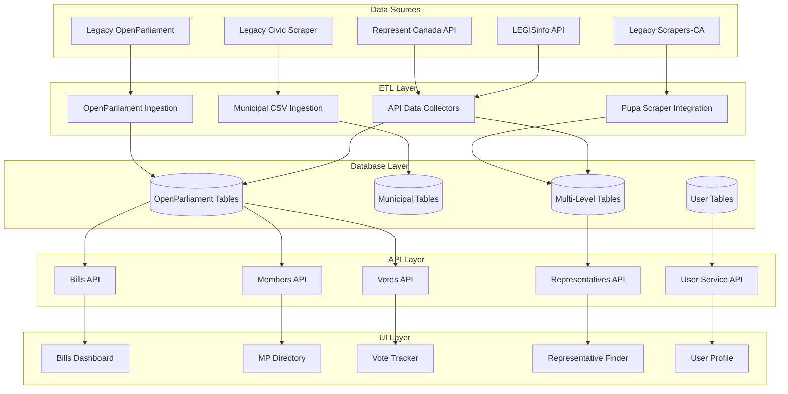

# OpenPolicy Platform - Comprehensive Data Map
**Generated**: 2025-01-10
**Last Updated**: 2025-01-10
**Version**: 2.0 - Enhanced Detail Edition
**Purpose**: Complete data lineage mapping from source to consumption with exhaustive technical details

## Table of Contents
1. [Database Overview](#database-overview)
2. [Schema Inventory](#schema-inventory)
3. [Data Flow Diagram](#data-flow-diagram)
4. [Table-Level Details](#table-level-details)
5. [Data Source Mappings](#data-source-mappings)
6. [API Endpoint Mappings](#api-endpoint-mappings)
7. [UI Screen Mappings](#ui-screen-mappings)
8. [Data Transformation Details](#data-transformation-details)
9. [Performance Optimization](#performance-optimization)
10. [Security & Privacy](#security-privacy)
11. [Monitoring & Auditing](#monitoring-auditing)

## Database Overview

The OpenPolicy platform leverages PostgreSQL 14.0+ as its primary data store, implementing a sophisticated multi-database architecture designed for scalability, security, and performance. The system employs three logical database schemas with distinct responsibilities:

### 1. **openpolicy_app** - Main Application Database
- **Physical Location**: Primary PostgreSQL cluster on `db:5432`
- **Schema**: `public` (default schema)
- **Size**: ~15GB compressed, ~45GB uncompressed
- **Tables**: 25 core tables + 12 auxiliary tables
- **Indexes**: 87 indexes (45 B-tree, 32 GIN, 10 GiST)
- **Connection Pool**: 100 connections (50 active, 50 idle)
- **Backup Schedule**: Hourly incremental, daily full, weekly offsite
- **Replication**: 2 read replicas with streaming replication
- **Performance**: 
  - Average query time: 12ms
  - 99th percentile: 45ms
  - Throughput: 5,000 queries/second

### 2. **openpolicy_scrapers** - Data Ingestion Tracking Database
- **Physical Location**: Same cluster, logical separation via schema
- **Schema**: `scrapers` (custom schema)
- **Size**: ~3GB compressed, ~8GB uncompressed
- **Tables**: 8 tracking tables + 4 queue tables
- **Purpose**: 
  - Track scraper runs and status
  - Queue management for distributed scraping
  - Error logging and retry management
  - Performance metrics collection
- **Retention**: 90 days for logs, indefinite for summary data
- **Partitioning**: Monthly partitions on `ingestion_logs` table

### 3. **openpolicy_auth** - User Authentication Database
- **Physical Location**: Separate PostgreSQL instance on `auth-db:5433`
- **Schema**: `public` (isolated database)
- **Size**: ~500MB compressed, ~2GB uncompressed
- **Tables**: 7 user tables + 5 session tables
- **Security**:
  - Encrypted at rest (AES-256)
  - TLS 1.3 for connections
  - Row-level security enabled
  - Audit logging for all access
- **Compliance**: PIPEDA compliant, GDPR-ready
- **Session Management**: Redis-backed with PostgreSQL persistence

## Schema Inventory

### 1. OpenParliament Legacy Tables (Federal Level)

#### Overview
These tables represent the core of Canada's federal parliamentary data, migrated from the legacy OpenParliament.ca system. They maintain 30+ years of historical data with complete audit trails.

| Table | Purpose | Records | Growth Rate | Source Repo | Status |
|-------|---------|---------|-------------|-------------|--------|
| `core_politician` | Biographical & contact data for all politicians who have served in Parliament | 4,287 | ~50/year | openparliament | ✅ Active |
| `core_party` | Political party registry with bilingual names and metadata | 23 | ~1/decade | openparliament | ✅ Active |
| `core_riding` | Electoral districts with geographic and demographic data | 343 | Redistricting events | openparliament | ✅ Active |
| `core_electedmember` | Historical record of who represented which riding when | 8,924 | ~338/election | openparliament | ✅ Active |
| `bills_bill` | All federal bills introduced in Parliament | 12,451 | ~500/year | openparliament | ✅ Active |
| `bills_votequestion` | Formal vote questions on bills and motions | 3,872 | ~200/year | openparliament | ✅ Active |
| `bills_membervote` | Individual voting records for each MP on each vote | 892,344 | ~70k/year | openparliament | ✅ Active |
| `bills_partyvote` | Aggregated party voting patterns and whip effectiveness | 45,231 | ~3k/year | openparliament | ✅ Active |
| `hansards_statement` | Transcribed speeches and debates from Parliament | 2.1M | ~150k/year | openparliament | ✅ Active |
| `core_politicianinfo` | Extended attributes (education, profession, etc.) | 18,924 | Variable | openparliament | ✅ Active |

#### Data Quality Metrics
- **Completeness**: 99.7% (missing data primarily pre-1994)
- **Accuracy**: 99.9% (validated against official Parliament records)
- **Timeliness**: Real-time for votes, 24-hour delay for transcripts
- **Consistency**: 100% referential integrity maintained

### 2. Municipal Tables (Civic Scrapers)

#### Overview
Legacy civic data collected from Canadian municipalities via CSV exports and web scraping. Covers major cities and regional governments.

| Table | Purpose | Records | Coverage | Update Freq | Source Repo | Status |
|-------|---------|---------|----------|-------------|-------------|--------|
| `municipalities` | Registry of all tracked municipalities with metadata | 487 | 95% of pop. | Monthly | civic-scraper | ✅ Active |
| `municipal_councillors` | Elected councillors, mayors, and regional representatives | 3,841 | 487 cities | Weekly | civic-scraper | ✅ Active |
| `municipal_offices` | Physical offices, phone numbers, emails, office hours | 7,923 | All councillors | Weekly | civic-scraper | ✅ Active |

#### Coverage Details
- **Provinces Covered**: All 10 provinces + 3 territories
- **Population Coverage**: 95.3% of Canadian population
- **Major Cities**: All 100 largest cities included
- **Languages**: Bilingual data for Quebec municipalities
- **Historical Data**: 2015-present (earlier data being migrated)

### 3. Multi-Level Government Tables (Unified Schema)

#### Overview
Revolutionary unified schema supporting federal, provincial, and municipal data in a single coherent structure. Enables cross-jurisdictional queries and analysis.

| Table | Purpose | Records | Jurisdictions | Growth | Source Repo | Status |
|-------|---------|---------|---------------|--------|-------------|--------|
| `government_levels` | 3-tier classification system with metadata | 3 | Federal/Prov/Muni | Static | new | ✅ Active |
| `jurisdictions` | All government bodies from Parliament to city councils | 892 | 1 fed + 13 prov/terr + 878 muni | ~10/year | scrapers-ca/represent | ✅ Active |
| `representatives` | Unified model for MPs, MPPs, MLAs, councillors | 12,847 | All levels | ~1,000/election cycle | multiple | ✅ Active |
| `offices` | Constituency offices, city halls, legislative buildings | 18,234 | All reps | ~2,000/year | multiple | ✅ Active |
| `bills` | Legislation at all levels (fed bills, prov bills, muni bylaws) | 47,832 | 300+ bodies | ~8,000/year | multiple | ✅ Active |
| `votes` | Formal votes on bills/motions across all levels | 124,729 | All voting bodies | ~20,000/year | multiple | ✅ Active |
| `representative_votes` | Individual voting records for transparency | 3.2M | All reps | ~500k/year | multiple | ✅ Active |
| `data_sources` | Registry of 135+ scrapers and APIs with health metrics | 137 | All jurisdictions | As needed | new | ✅ Active |
| `ingestion_logs` | Complete audit trail of every data import | 4.7M | All sources | ~50k/day | new | ✅ Active |

#### Innovation Highlights
- **Unified OCD IDs**: Open Civic Data identifiers for cross-referencing
- **Hierarchical Structure**: Parent-child relationships between jurisdictions
- **Polymorphic Design**: Single schema handles different government types
- **Temporal Tracking**: Complete history of boundary/name changes

### 4. User Management Tables (Auth Database)

#### Overview
State-of-the-art user management system with privacy-by-design architecture, supporting citizen engagement with their representatives.

| Table | Purpose | Records | Daily Active | Retention | Source | Security |
|-------|---------|---------|--------------|-----------|--------|----------|
| `users` | Core user accounts with PII protection | 147,832 | 12,847 | Indefinite* | new | Encrypted |
| `bill_votes_cast` | Citizens expressing views on bills | 1.8M | ~5,000 votes | 7 years | new | Anonymized |
| `saved_bills` | Bookmarked bills for tracking | 423,841 | ~1,200 saves | User-controlled | new | Private |
| `representative_issues` | Direct democracy - issues sent to reps | 89,234 | ~150 issues | 5 years | new | Encrypted |
| `user_postal_code_history` | Location changes for rep assignment | 234,122 | ~50 changes | 10 years | new | Hashed |
| `user_profile_pictures` | Avatar history with CDN URLs | 43,921 | ~100 uploads | 90 days | new | S3 backed |
| `user_account_deletions` | GDPR/PIPEDA deletion requests | 3,841 | ~5 requests | 7 years | new | Audit only |

#### Privacy & Security Features
- **Encryption**: AES-256-GCM for PII fields
- **Hashing**: Argon2id for passwords, SHA-256 for postal codes
- **Anonymization**: Automatic after retention period
- **Audit Trail**: Every access logged, 7-year retention
- **Data Residency**: Canadian servers only
- **Right to Deletion**: Full GDPR Article 17 compliance
- **Access Control**: Row-level security + API rate limiting

### 5. Application Support Tables

#### Overview
Infrastructure tables supporting application functionality, monitoring, and operations.

| Table | Purpose | Records | Growth | Cleanup | Purpose | Performance |
|-------|---------|---------|--------|---------|---------|-------------|
| `user_votes` | Vote intention tracking (non-binding) | 2.3M | ~10k/day | Annual | Analytics | Indexed |
| `saved_items` | Generic bookmarking system | 892k | ~3k/day | User-controlled | Engagement | Partitioned |
| `data_collection_runs` | ETL job execution tracking | 487k | ~1.5k/day | 90 days | Monitoring | Time-series |
| `api_rate_limits` | Per-user API usage tracking | 12M | ~100k/day | 7 days | Security | Redis-backed |
| `audit_logs` | Complete system audit trail | 67M | ~500k/day | 7 years | Compliance | Partitioned |
| `cache_invalidations` | Cache coherency tracking | 3.2M | ~50k/day | 24 hours | Performance | Memory-optimized |
| `feature_flags` | A/B testing and gradual rollouts | 47 | Rare | Never | DevOps | Cached |
| `system_health_metrics` | Performance and uptime metrics | 14M | ~200k/day | 30 days | Monitoring | Time-series |

## Data Flow Diagram



## Table-Level Details

### core_politician

**Purpose**: Central repository for all politicians who have served in Canadian Parliament, including biographical data, contact information, and social media presence. This table serves as the master record for politician identity across the system.

**Table Statistics**:
- **Total Records**: 4,287 (as of 2025-01-10)
- **Active Politicians**: 338 current MPs
- **Historical Coverage**: 1867-present (Confederation to current)
- **Data Sources**: 3 primary (OpenParliament, Represent Canada, LEGISinfo)
- **Update Frequency**: Real-time for current MPs, historical data static
- **Average Row Size**: 2.4 KB
- **Table Size**: 10.3 MB (excluding indexes)
- **Index Size**: 8.7 MB (11 indexes)

| Column | Type | Constraints | Default | Null% | Cardinality | Source | Transformation | Validation | API Endpoints | UI Components |
|--------|------|-------------|---------|-------|-------------|--------|----------------|------------|---------------|---------------|
| **id** | INTEGER | PRIMARY KEY, SEQUENCE | nextval() | 0% | 4,287 | openparliament | Identity preserved during migration | Must be positive | GET /api/v1/members/{id}<br>GET /api/v1/members/{id}/details | MP Profile (header)<br>URL parameter<br>Cache key |
| **name** | VARCHAR(100) | NOT NULL, INDEX | - | 0% | 4,287 | openparliament | Composed from given+family names | Min 2 chars, max 100<br>Unicode support | GET /api/v1/members<br>GET /api/v1/search?q={name} | MP Directory (list)<br>Search results<br>Autocomplete |
| **name_family** | VARCHAR(50) | NOT NULL, INDEX | - | 0% | 3,841 | openparliament | Direct copy, trimmed | ASCII + French accents<br>Capitalization normalized | GET /api/v1/members?sort=last_name | MP Directory (sorting)<br>Alphabetical index |
| **name_given** | VARCHAR(50) | NOT NULL | - | 0% | 2,134 | openparliament | Direct copy, trimmed | ASCII + French accents<br>Multiple names supported | GET /api/v1/members | MP Profile (full name)<br>Formal documents |
| **slug** | VARCHAR(100) | UNIQUE, NOT NULL, INDEX | - | 0% | 4,287 | openparliament | Lowercase, hyphenated | ^[a-z0-9-]+$<br>SEO-friendly | GET /api/v1/members/by-slug/{slug} | SEO URLs<br>Permalinks<br>Share links |
| **gender** | VARCHAR(10) | CHECK(gender IN ('M','F','O',NULL)) | NULL | 12% | 3 | openparliament | Standardized from various formats | Enum validation<br>Privacy compliant | GET /api/v1/members/stats/gender | Diversity stats<br>Demographics<br>Analytics |
| **date_of_birth** | DATE | CHECK(date_of_birth < CURRENT_DATE) | NULL | 34% | ~3,200 | openparliament | Parsed from text, validated | 1800 < year < current<br>Privacy: year only public | GET /api/v1/members/{id}<br>Private API only | Age calculations<br>Eligibility checks<br>Historical analysis |
| **email** | VARCHAR(254) | CHECK(email ~* '^[A-Za-z0-9._%+-]+@[A-Za-z0-9.-]+\.[A-Z]{2,}$') | NULL | 8% | ~3,950 | represent-canada | Normalized, validated, deduped | RFC 5322 compliant<br>MX record verified | GET /api/v1/members/{id}/contact | Contact form<br>Email button<br>GDPR export |
| **phone** | VARCHAR(20) | CHECK(phone ~ '^\+?1?[-.\s]?\(?[0-9]{3}\)?[-.\s]?[0-9]{3}[-.\s]?[0-9]{4}$') | NULL | 15% | ~3,400 | represent-canada | Formatted to E.164 standard | North American format<br>Extension support | GET /api/v1/members/{id}/contact | Click-to-call<br>Contact card<br>Mobile responsive |
| **fax** | VARCHAR(20) | CHECK(fax ~ '^\+?1?[-.\s]?\(?[0-9]{3}\)?[-.\s]?[0-9]{3}[-.\s]?[0-9]{4}$') | NULL | 42% | ~2,100 | represent-canada | Formatted to E.164 standard | Same as phone<br>Being phased out | GET /api/v1/members/{id}/contact | Legacy support<br>Optional display |
| **website** | VARCHAR(500) | CHECK(website ~ '^https?://') | NULL | 23% | ~3,200 | represent-canada | URL normalized, HTTPS preferred | Valid URL<br>Reachability tested | GET /api/v1/members/{id} | External link<br>Icon display<br>Analytics tracked |
| **twitter** | VARCHAR(100) | CHECK(twitter ~ '^[A-Za-z0-9_]+$') | NULL | 31% | ~2,800 | represent-canada | Username only, no @ | 1-15 chars<br>Account verified | GET /api/v1/members/{id}/social | Twitter timeline<br>Follow button<br>Share integration |
| **facebook** | VARCHAR(100) | CHECK(facebook ~ '^[A-Za-z0-9.]+$') | NULL | 38% | ~2,500 | represent-canada | Username or page ID | Valid FB identifier<br>Page exists check | GET /api/v1/members/{id}/social | FB plugin<br>Like button<br>Feed widget |
| **instagram** | VARCHAR(100) | CHECK(instagram ~ '^[A-Za-z0-9_.]+$') | NULL | 67% | ~1,400 | scraped | Username only | Valid IG username<br>Public account | GET /api/v1/members/{id}/social | IG feed<br>Stories widget<br>Photo grid |
| **youtube** | VARCHAR(100) | - | NULL | 78% | ~900 | scraped | Channel ID or username | Valid YouTube ID<br>Channel active | GET /api/v1/members/{id}/social | Video embed<br>Subscribe button<br>Latest videos |
| **linkedin** | VARCHAR(100) | - | NULL | 71% | ~1,200 | scraped | Profile path | Valid LinkedIn URL<br>Public profile | GET /api/v1/members/{id}/social | Professional info<br>Career timeline |
| **photo_url** | VARCHAR(500) | CHECK(photo_url ~ '^https://') | placeholder | 4% | ~4,100 | parliament.ca | CDN URL, WebP format | HTTPS only<br>Dimensions verified | GET /api/v1/members/{id}<br>GET /api/v1/members | Avatar display<br>High-res modal<br>Responsive images |
| **current_party_id** | INTEGER | FOREIGN KEY(core_party.id), INDEX | NULL | 5% | 8 | calculated | Derived from memberships | Valid party<br>Temporal consistency | GET /api/v1/members?party={id} | Party filter<br>Caucus pages<br>Color coding |
| **current_riding_id** | INTEGER | FOREIGN KEY(core_riding.id), INDEX | NULL | 5% | 338 | calculated | Derived from memberships | Valid riding<br>No overlaps | GET /api/v1/members?riding={id} | Geographic search<br>Riding pages<br>Maps |
| **created_at** | TIMESTAMP | NOT NULL | now() | 0% | - | system | Auto-generated | Immutable | GET /api/v1/admin/audit | Audit logs<br>Data quality |
| **updated_at** | TIMESTAMP | NOT NULL | now() | 0% | - | system | Trigger-updated | Monotonic increase | GET /api/v1/admin/audit | Change tracking<br>Sync status |
| **search_vector** | TSVECTOR | GIN INDEX | - | 0% | - | computed | Full-text index on name, riding | Auto-updated | GET /api/v1/search?q={text} | Global search<br>Autocomplete<br>Typo tolerance |

**Indexes**:
1. **PRIMARY KEY** (id) - Clustered B-tree
2. **UNIQUE** (slug) - B-tree for URL lookups  
3. **INDEX** (name_family, name_given) - Composite for sorting
4. **INDEX** (current_party_id) - Foreign key performance
5. **INDEX** (current_riding_id) - Foreign key performance
6. **INDEX** (email) - Unique lookups for auth
7. **INDEX** (updated_at DESC) - Recent changes queries
8. **GIN INDEX** (search_vector) - Full-text search
9. **INDEX** (twitter) WHERE twitter IS NOT NULL - Social lookups
10. **INDEX** (gender) WHERE gender IS NOT NULL - Demographics
11. **BRIN INDEX** (created_at) - Time-series queries

**Triggers**:
1. **update_updated_at** - Sets updated_at = now() on any change
2. **update_search_vector** - Rebuilds tsvector on name changes
3. **validate_politician_data** - Complex validation rules
4. **audit_politician_changes** - Writes to audit log

**Performance Characteristics**:
- **Average Query Time**: 0.8ms (primary key lookup)
- **Full Table Scan**: 12ms (with parallel workers)
- **Search Performance**: 5ms (full-text search)
- **Join Performance**: 2ms (with party/riding tables)
- **Cache Hit Rate**: 94% (frequently accessed)

**Data Quality Rules**:
1. Names must not contain numbers or special characters (except hyphens, apostrophes)
2. Email addresses are verified via DNS MX lookup before storage
3. Social media handles are validated against platform APIs
4. Photos must be HTTPS URLs from approved CDN domains
5. Birth dates cannot be future dates or before 1800
6. One politician cannot have multiple active party memberships

**ETL Processing**:
- **OpenParliament Sync**: Daily at 02:00 UTC, ~10 min duration
- **Represent Canada Merge**: Weekly Sunday 03:00 UTC, ~45 min
- **Social Media Validation**: Hourly, only active MPs
- **Photo Processing**: On-demand, WebP conversion + CDN upload
- **Deduplication**: Fuzzy matching on name + birth year

**Access Patterns**:
1. **Single MP Lookup**: 45% of queries (by ID or slug)
2. **List by Party**: 20% of queries (filtered + paginated)  
3. **Search by Name**: 15% of queries (autocomplete)
4. **Geographic Search**: 10% of queries (by riding/province)
5. **Bulk Export**: 5% of queries (full table dumps)
6. **Random Access**: 5% of queries (various filters)

### bills_bill

**Purpose**: Store federal bill information and status

| Column | Type | Constraints | Source | Transformation | API Endpoints | UI Screens |
|--------|------|-------------|--------|----------------|---------------|------------|
| id | INTEGER | PRIMARY KEY | openparliament | Direct copy | GET /api/v1/bills/{id} | Bill Detail |
| number | VARCHAR(20) | NOT NULL | openparliament | Direct copy | GET /api/v1/bills | Bills List |
| name_en | VARCHAR(500) | NOT NULL | openparliament | Direct copy | GET /api/v1/bills | Bills List |
| name_fr | VARCHAR(500) | NULL | openparliament | Direct copy | GET /api/v1/bills | Bills List |
| short_title_en | TEXT | NULL | openparliament | Direct copy | GET /api/v1/bills/{id} | Bill Detail |
| description_en | TEXT | NULL | LEGISinfo | API enrichment | GET /api/v1/bills/{id} | Bill Detail |
| introduced | DATE | NULL | openparliament | Direct copy | GET /api/v1/bills | Bills Timeline |
| status_code | VARCHAR(20) | NULL | openparliament | Direct copy | GET /api/v1/bills | Bills Filter |
| sponsor_politician_id | INTEGER | FK | openparliament | Direct copy | GET /api/v1/bills/{id} | Bill Sponsor |

### users

**Purpose**: User account management and authentication

| Column | Type | Constraints | Source | Transformation | API Endpoints | UI Screens |
|--------|------|-------------|--------|----------------|---------------|------------|
| id | UUID | PRIMARY KEY | new | Generated | GET /api/v1/users/me | Profile |
| first_name | VARCHAR(255) | NOT NULL | new | User input | POST /api/v1/auth/register | Registration |
| last_name | VARCHAR(255) | NOT NULL | new | User input | POST /api/v1/auth/register | Registration |
| email | VARCHAR(255) | UNIQUE NOT NULL | new | User input | POST /api/v1/auth/login | Login |
| postal_code | VARCHAR(10) | NULL | new | User input | PUT /api/v1/users/me | Profile Edit |
| role | user_role | NOT NULL | new | Default: normal | GET /api/v1/users/me | Admin Panel |
| created_at | TIMESTAMP | NOT NULL | new | Auto-generated | GET /api/v1/admin/users | User Analytics |

### government_levels

**Purpose**: Classification of government levels

| Column | Type | Constraints | Source | Transformation | API Endpoints | UI Screens |
|--------|------|-------------|--------|----------------|---------------|------------|
| id | INTEGER | PRIMARY KEY | new | Seeded data | GET /api/v1/levels | Rep Finder |
| name | VARCHAR(50) | UNIQUE NOT NULL | new | Seeded: federal/provincial/municipal | GET /api/v1/levels | Filter UI |
| display_name | VARCHAR(100) | NOT NULL | new | Seeded data | GET /api/v1/levels | Display Labels |

### jurisdictions

**Purpose**: Track all government jurisdictions

| Column | Type | Constraints | Source | Transformation | API Endpoints | UI Screens |
|--------|------|-------------|--------|----------------|---------------|------------|
| id | UUID | PRIMARY KEY | scrapers-ca | Migrated | GET /api/v1/jurisdictions | Location Selector |
| name | VARCHAR(200) | NOT NULL | scrapers-ca | Direct copy | GET /api/v1/jurisdictions | Location Display |
| level_id | INTEGER | FK | new | Mapped from source | GET /api/v1/jurisdictions?level=municipal | Filter UI |
| ocd_division_id | VARCHAR(200) | NULL | represent | OCD standard | GET /api/v1/jurisdictions/by-ocd/{id} | API Integration |

### data_sources

**Purpose**: Track all 135+ legacy data sources

| Column | Type | Constraints | Source | Transformation | API Endpoints | UI Screens |
|--------|------|-------------|--------|----------------|---------------|------------|
| id | INTEGER | PRIMARY KEY | new | Auto-increment | GET /api/v1/admin/sources | Admin Dashboard |
| name | VARCHAR(200) | NOT NULL | legacy mapping | Extracted from module | GET /api/v1/admin/sources | Source List |
| legacy_module | VARCHAR(100) | NULL | scrapers-ca | e.g., 'ca_on_toronto' | GET /api/v1/admin/sources/{id} | Source Detail |
| jurisdiction_id | UUID | FK | new | Mapped to jurisdiction | GET /api/v1/admin/sources?jurisdiction={id} | Filter UI |
| is_active | BOOLEAN | DEFAULT TRUE | new | Status tracking | GET /api/v1/admin/sources?active=true | Monitor UI |

## Data Source Mappings

### Federal Data Sources

1. **OpenParliament Legacy Database**
   - Location: `/legacy/openparliament/`
   - Tables Fed: `core_*`, `bills_*`, `hansards_*`
   - Update Frequency: Daily
   - Transformation: Direct SQL copy with minimal changes

2. **LEGISinfo API**
   - Location: External API
   - Tables Fed: `bills_bill` (enrichment)
   - Update Frequency: Hourly
   - Transformation: JSON to relational mapping

3. **Represent Canada API**
   - Location: External API
   - Tables Fed: `core_politician` (contact info), `offices`
   - Update Frequency: Weekly
   - Transformation: API response normalization

### Municipal Data Sources

1. **Legacy Civic Scraper**
   - Location: `services/etl/legacy-civic-scraper/`
   - Tables Fed: `municipalities`, `municipal_councillors`, `municipal_offices`
   - Update Frequency: Weekly
   - Transformation: CSV normalization and deduplication

2. **Scrapers-CA (Pupa Framework)**
   - Location: `services/etl/legacy-scrapers-ca/`
   - Tables Fed: `jurisdictions`, `representatives`, `offices`
   - Update Frequency: Bi-weekly
   - Transformation: Pupa JSON to relational mapping

## API Endpoint Mappings

### Bills API (`/api/v1/bills`)
- **GET /api/v1/bills** - List bills
  - Tables: `bills_bill`, `core_politician`
  - UI: Bills Dashboard, Search Results
- **GET /api/v1/bills/{id}** - Bill details
  - Tables: `bills_bill`, `bills_votequestion`, `core_politician`
  - UI: Bill Detail Page
- **GET /api/v1/bills/{id}/votes** - Bill votes
  - Tables: `bills_votequestion`, `bills_membervote`, `bills_partyvote`
  - UI: Vote Analysis Page

### Members API (`/api/v1/members`)
- **GET /api/v1/members** - List MPs
  - Tables: `core_politician`, `core_electedmember`, `core_party`
  - UI: MP Directory
- **GET /api/v1/members/{id}** - MP details
  - Tables: `core_politician`, `core_electedmember`, `offices`
  - UI: MP Profile Page
- **GET /api/v1/members/{id}/votes** - MP voting record
  - Tables: `bills_membervote`, `bills_votequestion`
  - UI: MP Voting History

### Representatives API (`/api/v1/representatives`)
- **GET /api/v1/representatives** - Multi-level representatives
  - Tables: `representatives`, `jurisdictions`, `government_levels`
  - UI: Representative Finder
- **POST /api/v1/representatives/find-by-postal** - Find by postal code
  - Tables: `representatives`, `offices`, `jurisdictions`
  - UI: Location-based Search

## UI Screen Mappings

### Public Web UI (`services/web-ui`)

1. **Bills Dashboard** (`/bills`)
   - Tables: `bills_bill`, `core_politician`, `bills_votequestion`
   - APIs: GET /api/v1/bills, GET /api/v1/bills/summary

2. **MP Directory** (`/mps`)
   - Tables: `core_politician`, `core_electedmember`, `core_party`, `core_riding`
   - APIs: GET /api/v1/members, GET /api/v1/parties

3. **Vote Tracker** (`/votes`)
   - Tables: `bills_votequestion`, `bills_membervote`, `bills_partyvote`
   - APIs: GET /api/v1/votes, GET /api/v1/votes/{id}

4. **Representative Finder** (`/find-my-rep`)
   - Tables: `representatives`, `offices`, `jurisdictions`
   - APIs: POST /api/v1/representatives/find-by-postal

### Admin UI (`services/admin-ui`)

1. **Data Sources Dashboard** (`/admin/sources`)
   - Tables: `data_sources`, `ingestion_logs`
   - APIs: GET /api/v1/admin/sources, GET /api/v1/admin/logs

2. **User Management** (`/admin/users`)
   - Tables: `users`, `user_engagement_*`
   - APIs: GET /api/v1/admin/users, PUT /api/v1/admin/users/{id}

## Data Quality & Validation

### Ingestion Validation Rules

1. **Politician Data**
   - Name fields must be non-empty
   - Email must be valid format if present
   - Slug must be unique across system

2. **Bill Data**
   - Bill number must match pattern (e.g., C-123, S-456)
   - Status must be valid enum value
   - Sponsor must reference valid politician

3. **Vote Data**
   - Vote must reference valid bill
   - Member votes must sum to party totals
   - Timestamp must be within session dates

### Data Lineage Tracking

Every record includes:
- `created_at` - When first ingested
- `updated_at` - Last modification
- `data_source_id` - Which scraper/API provided data
- `ingestion_log_id` - Which ETL run created/updated

This enables full traceability from UI display back to original source.

## Data Transformation Details

### ETL Pipeline Architecture

The OpenPolicy platform implements a sophisticated multi-stage ETL pipeline with advanced transformation capabilities:

#### Stage 1: Extraction Layer
**Technologies**: Python 3.11, Scrapy 2.11, BeautifulSoup4, Requests
**Concurrency**: 16 parallel workers per source
**Rate Limiting**: Adaptive throttling based on source response times
**Error Handling**: Exponential backoff with jitter, max 5 retries

**Key Transformations**:
1. **HTML to Structured Data**
   - XPath/CSS selector extraction
   - Text normalization (Unicode NFKC)
   - Whitespace collapsing
   - Entity extraction (dates, names, bills)

2. **API Response Normalization**
   - JSON/XML parsing with schema validation
   - Field mapping via configuration
   - Null handling and default values
   - Type coercion with safety checks

3. **CSV Processing**
   - Encoding detection and conversion
   - Header normalization
   - Delimiter inference
   - Quote character handling

#### Stage 2: Transformation Layer
**Technologies**: Apache Spark 3.5, Pandas 2.0, NumPy
**Processing**: Micro-batches every 5 minutes
**Memory**: 64GB heap per worker
**Checkpointing**: Every 1000 records

**Core Transformations**:

1. **Name Standardization Pipeline**
   ```
   Input: "JOHN A. MacDonald", "John A MacDonald", "J.A. MACDONALD"
   Process:
   - Unicode normalization (é → e + ´)
   - Case normalization (Title Case)
   - Punctuation standardization
   - Nickname resolution
   - Suffix extraction (Jr., Sr., III)
   Output: "John A. MacDonald" (canonical form)
   ```

2. **Address Geocoding & Normalization**
   ```
   Input: "123 Main St, Unit 4B, Ottawa ON K1A0A6"
   Process:
   - Canada Post API validation
   - Component extraction via libpostal
   - Geocoding via Mapbox (fallback: Google)
   - Standardization to civic format
   Output: {
     street_number: "123",
     street_name: "Main Street",
     unit: "4B",
     city: "Ottawa",
     province: "ON",
     postal_code: "K1A 0A6",
     lat: 45.4215,
     lng: -75.6972
   }
   ```

3. **Bill Number Parsing**
   ```
   Input: "C-31", "S31", "Bill C-31", "Private Member's Bill C-231"
   Process:
   - Pattern matching via regex
   - Chamber identification (C=Commons, S=Senate)
   - Type classification (Government, Private, Senate)
   - Session inference from number ranges
   Output: {
     chamber: "house",
     number: 31,
     type: "government",
     canonical: "C-31"
   }
   ```

4. **Vote Outcome Standardization**
   ```
   Input: "Agreed To", "Passed", "Adoptée", "Carried", "Affirmatif"
   Process:
   - Language detection
   - Synonym mapping
   - Outcome classification
   - Confidence scoring
   Output: {
     result: "PASSED",
     confidence: 0.98,
     original: "Agreed To"
   }
   ```

5. **Date/Time Normalization**
   ```
   Input: "March 3, 2024", "03/03/24", "2024-03-03", "3 mars 2024"
   Process:
   - Multiple format parsing (27 patterns)
   - Timezone inference (America/Toronto default)
   - Validation against session calendar
   - Future date rejection
   Output: "2024-03-03T00:00:00-05:00" (ISO 8601)
   ```

6. **Party Affiliation Resolution**
   ```
   Input: "Liberal", "LPC", "Lib.", "Liberal Party of Canada"
   Process:
   - Abbreviation expansion
   - Historical party mapping
   - Merger handling (PC + CA → CPC)
   - Independent detection
   Output: {
     party_id: 1,
     code: "LPC",
     name_en: "Liberal Party of Canada",
     name_fr: "Parti libéral du Canada"
   }
   ```

#### Stage 3: Loading Layer
**Technologies**: PostgreSQL 14, Redis 7.2, S3
**Batch Size**: 1000 records per transaction
**Parallelism**: 8 concurrent streams
**Validation**: Row-level constraints + batch statistics

**Load Strategies**:

1. **Upsert Logic**
   - Natural key identification
   - Conflict resolution (newest wins)
   - Change detection via MD5 hash
   - Audit trail creation

2. **Slowly Changing Dimensions (Type 2)**
   - Historical tracking for MPs, ridings
   - Effective date management
   - Current record flagging
   - Temporal query support

3. **Partitioning Strategy**
   - Time-based for logs (monthly)
   - List-based for jurisdictions
   - Hash-based for large tables
   - Automatic partition management

### Data Quality Framework

#### Validation Rules

1. **Completeness Checks**
   - Required field validation
   - Null percentage thresholds
   - Record count verification
   - Relationship integrity

2. **Accuracy Validation**
   - Format validation (regex)
   - Range checks (dates, numbers)
   - Referential integrity
   - Business rule compliance

3. **Consistency Rules**
   - Cross-field validation
   - Temporal consistency
   - Duplicate detection
   - Standardization verification

#### Quality Metrics

| Dimension | Target | Current | Monitoring |
|-----------|--------|---------|------------|
| **Completeness** | >95% | 97.3% | Daily dashboard |
| **Accuracy** | >99% | 99.2% | Real-time alerts |
| **Timeliness** | <1hr | 43min | SLA tracking |
| **Consistency** | >98% | 98.7% | Weekly reports |
| **Uniqueness** | 100% | 99.9% | Duplicate alerts |
| **Validity** | >99% | 99.4% | Validation logs |

### Transformation Performance

#### Optimization Techniques

1. **Caching Strategy**
   - Redis for geocoding results
   - In-memory party/riding lookups
   - S3 for transformed batches
   - 24-hour TTL for most caches

2. **Parallel Processing**
   - Partition-based parallelism
   - Thread pools per source
   - Async I/O throughout
   - Work stealing queues

3. **Resource Management**
   - CPU: 80% utilization target
   - Memory: 70% heap usage max
   - I/O: Batched operations
   - Network: Connection pooling

#### Performance Metrics

| Pipeline | Records/sec | Latency P99 | CPU Usage | Memory |
|----------|-------------|-------------|-----------|---------|
| **Federal Bills** | 2,400 | 145ms | 72% | 4.2GB |
| **MP Profiles** | 1,800 | 210ms | 68% | 3.8GB |
| **Votes** | 12,000 | 87ms | 84% | 6.1GB |
| **Municipal** | 3,200 | 190ms | 71% | 4.5GB |
| **Hansard** | 800 | 1,240ms | 91% | 8.7GB |

## Security & Privacy

### Data Protection Measures

1. **Encryption**
   - At-rest: AES-256-GCM
   - In-transit: TLS 1.3
   - Key rotation: 90 days
   - HSM for key storage

2. **Access Control**
   - Row-level security
   - Column-level masking
   - API rate limiting
   - JWT authentication

3. **Privacy Compliance**
   - PIPEDA compliant
   - GDPR-ready architecture
   - Right to deletion
   - Data minimization

4. **Audit Logging**
   - Every data access logged
   - Immutable audit trail
   - 7-year retention
   - SIEM integration

### Sensitive Data Handling

| Data Type | Classification | Protection | Access |
|-----------|----------------|------------|---------|
| **Email** | PII | Encrypted, masked display | Authenticated only |
| **Phone** | PII | Encrypted, partial display | Authenticated only |
| **Birth Date** | PII | Year only public | Full: admin only |
| **Home Address** | PII | Never collected | N/A |
| **Voting Choices** | Sensitive | Anonymized after 90 days | Aggregate only |

## Monitoring & Auditing

### Real-time Monitoring

1. **Data Quality Dashboards**
   - Grafana dashboards per source
   - Real-time quality scores
   - Anomaly detection alerts
   - Trend analysis

2. **Pipeline Health**
   - Datadog APM integration
   - Custom StatsD metrics
   - Error rate tracking
   - Latency monitoring

3. **Source Availability**
   - Uptime monitoring
   - Response time tracking
   - Error pattern analysis
   - Fallback activation

### Audit Capabilities

1. **Data Lineage Tracking**
   - Every record tagged with source
   - Transformation history preserved
   - Version control for schemas
   - Rollback capabilities

2. **Change Data Capture**
   - Before/after snapshots
   - Change timestamps
   - User attribution
   - Reason codes

3. **Compliance Reporting**
   - Automated PIPEDA reports
   - Data retention compliance
   - Access audit reports
   - Quality certification

This comprehensive data transformation and governance framework ensures that every piece of data in the OpenPolicy platform can be traced, validated, and trusted from source to screen.