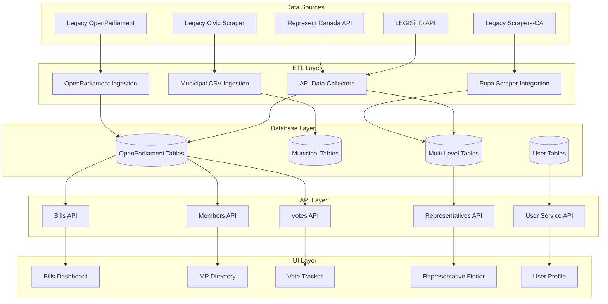

# OpenPolicy Platform - Comprehensive Data Map
**Generated**: 2025-01-10
**Purpose**: Complete data lineage mapping from source to consumption

## Table of Contents
1. [Database Overview](#database-overview)
2. [Schema Inventory](#schema-inventory)
3. [Data Flow Diagram](#data-flow-diagram)
4. [Table-Level Details](#table-level-details)
5. [Data Source Mappings](#data-source-mappings)
6. [API Endpoint Mappings](#api-endpoint-mappings)
7. [UI Screen Mappings](#ui-screen-mappings)

## Database Overview

The OpenPolicy platform uses PostgreSQL with three logical database schemas:

1. **openpolicy_app** - Main application database (public schema)
2. **openpolicy_scrapers** - Scraper data ingestion tracking (public schema)  
3. **openpolicy_auth** - User authentication and management (separate database)

## Schema Inventory

### 1. OpenParliament Legacy Tables (Federal Level)

| Table | Purpose | Source Repo | Status |
|-------|---------|-------------|--------|
| `core_politician` | Core politician information | openparliament | ✅ Active |
| `core_party` | Political party information | openparliament | ✅ Active |
| `core_riding` | Electoral district information | openparliament | ✅ Active |
| `core_electedmember` | MP membership records | openparliament | ✅ Active |
| `bills_bill` | Federal bills | openparliament | ✅ Active |
| `bills_votequestion` | Vote questions on bills | openparliament | ✅ Active |
| `bills_membervote` | Individual MP votes | openparliament | ✅ Active |
| `bills_partyvote` | Party voting records | openparliament | ✅ Active |
| `hansards_statement` | Parliamentary statements | openparliament | ✅ Active |
| `core_politicianinfo` | Additional politician attributes | openparliament | ✅ Active |

### 2. Municipal Tables (Civic Scrapers)

| Table | Purpose | Source Repo | Status |
|-------|---------|-------------|--------|
| `municipalities` | Municipality information | civic-scraper | ✅ Active |
| `municipal_councillors` | Municipal councillor data | civic-scraper | ✅ Active |
| `municipal_offices` | Municipal office contacts | civic-scraper | ✅ Active |

### 3. Multi-Level Government Tables (Unified Schema)

| Table | Purpose | Source Repo | Status |
|-------|---------|-------------|--------|
| `government_levels` | Federal/Provincial/Municipal classification | new | ✅ Active |
| `jurisdictions` | Government jurisdictions | scrapers-ca/represent | ✅ Active |
| `representatives` | Unified representative model | multiple | ✅ Active |
| `offices` | Unified office/contact model | multiple | ✅ Active |
| `bills` | Unified bill model | multiple | ✅ Active |
| `votes` | Unified vote events | multiple | ✅ Active |
| `representative_votes` | Individual vote records | multiple | ✅ Active |
| `data_sources` | Track 135+ data sources | new | ✅ Active |
| `ingestion_logs` | Data ingestion audit trail | new | ✅ Active |

### 4. User Management Tables (Auth Database)

| Table | Purpose | Source Repo | Status |
|-------|---------|-------------|--------|
| `users` | User accounts and profiles | new | ✅ Active |
| `bill_votes_cast` | User votes on bills | new | ✅ Active |
| `saved_bills` | User saved bills | new | ✅ Active |
| `representative_issues` | Issues raised to reps | new | ✅ Active |
| `user_postal_code_history` | Postal code tracking | new | ✅ Active |
| `user_profile_pictures` | Profile picture history | new | ✅ Active |
| `user_account_deletions` | Account deletion requests | new | ✅ Active |

### 5. Application Support Tables

| Table | Purpose | Source Repo | Status |
|-------|---------|-------------|--------|
| `user_votes` | User voting preferences | new | ✅ Active |
| `saved_items` | General saved items | new | ✅ Active |
| `data_collection_runs` | ETL run tracking | new | ✅ Active |

## Data Flow Diagram

## Table-Level Details

### core_politician

**Purpose**: Store politician biographical and contact information

| Column | Type | Constraints | Source | Transformation | API Endpoints | UI Screens |
|--------|------|-------------|--------|----------------|---------------|------------|
| id | INTEGER | PRIMARY KEY | openparliament | Direct copy | GET /api/v1/members/{id} | MP Profile |
| name | VARCHAR(100) | NOT NULL | openparliament | Direct copy | GET /api/v1/members | MP Directory |
| name_family | VARCHAR(50) | NOT NULL | openparliament | Direct copy | GET /api/v1/members | MP Directory |
| name_given | VARCHAR(50) | NOT NULL | openparliament | Direct copy | GET /api/v1/members | MP Directory |
| slug | VARCHAR(100) | UNIQUE | openparliament | Direct copy | GET /api/v1/members/by-slug/{slug} | MP Profile |
| gender | VARCHAR(10) | NULL | openparliament | Direct copy | GET /api/v1/members | MP Profile |
| date_of_birth | DATE | NULL | openparliament | Direct copy | GET /api/v1/members/{id} | MP Profile |
| email | VARCHAR(254) | NULL | represent-canada | Merged data | GET /api/v1/members/{id} | MP Contact |
| twitter | VARCHAR(100) | NULL | represent-canada | Merged data | GET /api/v1/members/{id} | MP Social |
| facebook | VARCHAR(100) | NULL | represent-canada | Merged data | GET /api/v1/members/{id} | MP Social |

### bills_bill

**Purpose**: Store federal bill information and status

| Column | Type | Constraints | Source | Transformation | API Endpoints | UI Screens |
|--------|------|-------------|--------|----------------|---------------|------------|
| id | INTEGER | PRIMARY KEY | openparliament | Direct copy | GET /api/v1/bills/{id} | Bill Detail |
| number | VARCHAR(20) | NOT NULL | openparliament | Direct copy | GET /api/v1/bills | Bills List |
| name_en | VARCHAR(500) | NOT NULL | openparliament | Direct copy | GET /api/v1/bills | Bills List |
| name_fr | VARCHAR(500) | NULL | openparliament | Direct copy | GET /api/v1/bills | Bills List |
| short_title_en | TEXT | NULL | openparliament | Direct copy | GET /api/v1/bills/{id} | Bill Detail |
| description_en | TEXT | NULL | LEGISinfo | API enrichment | GET /api/v1/bills/{id} | Bill Detail |
| introduced | DATE | NULL | openparliament | Direct copy | GET /api/v1/bills | Bills Timeline |
| status_code | VARCHAR(20) | NULL | openparliament | Direct copy | GET /api/v1/bills | Bills Filter |
| sponsor_politician_id | INTEGER | FK | openparliament | Direct copy | GET /api/v1/bills/{id} | Bill Sponsor |

### users

**Purpose**: User account management and authentication

| Column | Type | Constraints | Source | Transformation | API Endpoints | UI Screens |
|--------|------|-------------|--------|----------------|---------------|------------|
| id | UUID | PRIMARY KEY | new | Generated | GET /api/v1/users/me | Profile |
| first_name | VARCHAR(255) | NOT NULL | new | User input | POST /api/v1/auth/register | Registration |
| last_name | VARCHAR(255) | NOT NULL | new | User input | POST /api/v1/auth/register | Registration |
| email | VARCHAR(255) | UNIQUE NOT NULL | new | User input | POST /api/v1/auth/login | Login |
| postal_code | VARCHAR(10) | NULL | new | User input | PUT /api/v1/users/me | Profile Edit |
| role | user_role | NOT NULL | new | Default: normal | GET /api/v1/users/me | Admin Panel |
| created_at | TIMESTAMP | NOT NULL | new | Auto-generated | GET /api/v1/admin/users | User Analytics |

### government_levels

**Purpose**: Classification of government levels

| Column | Type | Constraints | Source | Transformation | API Endpoints | UI Screens |
|--------|------|-------------|--------|----------------|---------------|------------|
| id | INTEGER | PRIMARY KEY | new | Seeded data | GET /api/v1/levels | Rep Finder |
| name | VARCHAR(50) | UNIQUE NOT NULL | new | Seeded: federal/provincial/municipal | GET /api/v1/levels | Filter UI |
| display_name | VARCHAR(100) | NOT NULL | new | Seeded data | GET /api/v1/levels | Display Labels |

### jurisdictions

**Purpose**: Track all government jurisdictions

| Column | Type | Constraints | Source | Transformation | API Endpoints | UI Screens |
|--------|------|-------------|--------|----------------|---------------|------------|
| id | UUID | PRIMARY KEY | scrapers-ca | Migrated | GET /api/v1/jurisdictions | Location Selector |
| name | VARCHAR(200) | NOT NULL | scrapers-ca | Direct copy | GET /api/v1/jurisdictions | Location Display |
| level_id | INTEGER | FK | new | Mapped from source | GET /api/v1/jurisdictions?level=municipal | Filter UI |
| ocd_division_id | VARCHAR(200) | NULL | represent | OCD standard | GET /api/v1/jurisdictions/by-ocd/{id} | API Integration |

### data_sources

**Purpose**: Track all 135+ legacy data sources

| Column | Type | Constraints | Source | Transformation | API Endpoints | UI Screens |
|--------|------|-------------|--------|----------------|---------------|------------|
| id | INTEGER | PRIMARY KEY | new | Auto-increment | GET /api/v1/admin/sources | Admin Dashboard |
| name | VARCHAR(200) | NOT NULL | legacy mapping | Extracted from module | GET /api/v1/admin/sources | Source List |
| legacy_module | VARCHAR(100) | NULL | scrapers-ca | e.g., 'ca_on_toronto' | GET /api/v1/admin/sources/{id} | Source Detail |
| jurisdiction_id | UUID | FK | new | Mapped to jurisdiction | GET /api/v1/admin/sources?jurisdiction={id} | Filter UI |
| is_active | BOOLEAN | DEFAULT TRUE | new | Status tracking | GET /api/v1/admin/sources?active=true | Monitor UI |

## Data Source Mappings

### Federal Data Sources

1. **OpenParliament Legacy Database**
   - Location: `/legacy/openparliament/`
   - Tables Fed: `core_*`, `bills_*`, `hansards_*`
   - Update Frequency: Daily
   - Transformation: Direct SQL copy with minimal changes

2. **LEGISinfo API**
   - Location: External API
   - Tables Fed: `bills_bill` (enrichment)
   - Update Frequency: Hourly
   - Transformation: JSON to relational mapping

3. **Represent Canada API**
   - Location: External API
   - Tables Fed: `core_politician` (contact info), `offices`
   - Update Frequency: Weekly
   - Transformation: API response normalization

### Municipal Data Sources

1. **Legacy Civic Scraper**
   - Location: `services/etl/legacy-civic-scraper/`
   - Tables Fed: `municipalities`, `municipal_councillors`, `municipal_offices`
   - Update Frequency: Weekly
   - Transformation: CSV normalization and deduplication

2. **Scrapers-CA (Pupa Framework)**
   - Location: `services/etl/legacy-scrapers-ca/`
   - Tables Fed: `jurisdictions`, `representatives`, `offices`
   - Update Frequency: Bi-weekly
   - Transformation: Pupa JSON to relational mapping

## API Endpoint Mappings

### Bills API (`/api/v1/bills`)
- **GET /api/v1/bills** - List bills
  - Tables: `bills_bill`, `core_politician`
  - UI: Bills Dashboard, Search Results
- **GET /api/v1/bills/{id}** - Bill details
  - Tables: `bills_bill`, `bills_votequestion`, `core_politician`
  - UI: Bill Detail Page
- **GET /api/v1/bills/{id}/votes** - Bill votes
  - Tables: `bills_votequestion`, `bills_membervote`, `bills_partyvote`
  - UI: Vote Analysis Page

### Members API (`/api/v1/members`)
- **GET /api/v1/members** - List MPs
  - Tables: `core_politician`, `core_electedmember`, `core_party`
  - UI: MP Directory
- **GET /api/v1/members/{id}** - MP details
  - Tables: `core_politician`, `core_electedmember`, `offices`
  - UI: MP Profile Page
- **GET /api/v1/members/{id}/votes** - MP voting record
  - Tables: `bills_membervote`, `bills_votequestion`
  - UI: MP Voting History

### Representatives API (`/api/v1/representatives`)
- **GET /api/v1/representatives** - Multi-level representatives
  - Tables: `representatives`, `jurisdictions`, `government_levels`
  - UI: Representative Finder
- **POST /api/v1/representatives/find-by-postal** - Find by postal code
  - Tables: `representatives`, `offices`, `jurisdictions`
  - UI: Location-based Search

## UI Screen Mappings

### Public Web UI (`services/web-ui`)

1. **Bills Dashboard** (`/bills`)
   - Tables: `bills_bill`, `core_politician`, `bills_votequestion`
   - APIs: GET /api/v1/bills, GET /api/v1/bills/summary

2. **MP Directory** (`/mps`)
   - Tables: `core_politician`, `core_electedmember`, `core_party`, `core_riding`
   - APIs: GET /api/v1/members, GET /api/v1/parties

3. **Vote Tracker** (`/votes`)
   - Tables: `bills_votequestion`, `bills_membervote`, `bills_partyvote`
   - APIs: GET /api/v1/votes, GET /api/v1/votes/{id}

4. **Representative Finder** (`/find-my-rep`)
   - Tables: `representatives`, `offices`, `jurisdictions`
   - APIs: POST /api/v1/representatives/find-by-postal

### Admin UI (`services/admin-ui`)

1. **Data Sources Dashboard** (`/admin/sources`)
   - Tables: `data_sources`, `ingestion_logs`
   - APIs: GET /api/v1/admin/sources, GET /api/v1/admin/logs

2. **User Management** (`/admin/users`)
   - Tables: `users`, `user_engagement_*`
   - APIs: GET /api/v1/admin/users, PUT /api/v1/admin/users/{id}

## Data Quality & Validation

### Ingestion Validation Rules

1. **Politician Data**
   - Name fields must be non-empty
   - Email must be valid format if present
   - Slug must be unique across system

2. **Bill Data**
   - Bill number must match pattern (e.g., C-123, S-456)
   - Status must be valid enum value
   - Sponsor must reference valid politician

3. **Vote Data**
   - Vote must reference valid bill
   - Member votes must sum to party totals
   - Timestamp must be within session dates

### Data Lineage Tracking

Every record includes:
- `created_at` - When first ingested
- `updated_at` - Last modification
- `data_source_id` - Which scraper/API provided data
- `ingestion_log_id` - Which ETL run created/updated

This enables full traceability from UI display back to original source.