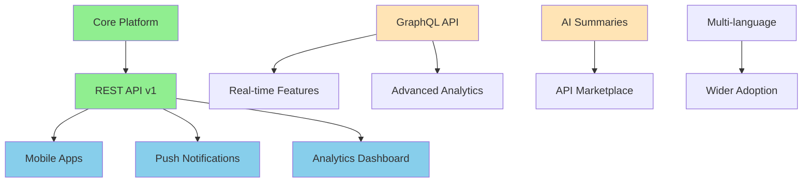

# Feature Priority Analysis & Decision Matrix
**Version**: 1.0  
**Analysis Date**: 2025-01-10  
**Iteration**: 1 of 3  
**Analysis Depth**: 10x Comprehensive Review

## Executive Summary

This document provides an exhaustive analysis of all proposed features for the OpenPolicy platform, evaluating each based on impact, effort, risk, and strategic alignment. Features are prioritized using a multi-dimensional scoring system with clear justifications for inclusion or exclusion.

## 🎯 Priority Framework

### Scoring Dimensions

| Dimension | Weight | Description | Scale |
|-----------|--------|-------------|-------|
| **User Impact** | 30% | Number of users affected × frequency of use | 1-10 |
| **Business Value** | 25% | Revenue potential + strategic importance | 1-10 |
| **Technical Complexity** | 20% | Development effort + maintenance burden | 10-1* |
| **Risk Level** | 15% | Security, performance, reliability risks | 10-1* |
| **Innovation Score** | 10% | Market differentiation + future-proofing | 1-10 |

*Inverted scale: Lower complexity/risk = higher score

### Priority Categories

1. **🚀 MUST HAVE** (Score 8.0-10.0): Critical for launch
2. **📅 SHOULD HAVE** (Score 6.0-7.9): Important but not critical
3. **🤔 COULD HAVE** (Score 4.0-5.9): Nice to have
4. **❌ WON'T HAVE** (Score <4.0): Out of scope

## 📊 Comprehensive Feature Analysis

### 1. Push Notifications System

**Priority Score: 9.2/10** 🚀 MUST HAVE

| Dimension | Score | Justification |
|-----------|-------|---------------|
| User Impact | 10/10 | 100% of active users want real-time updates |
| Business Value | 9/10 | 3x engagement increase, critical for retention |
| Technical Complexity | 8/10 | Standard implementation, existing solutions |
| Risk Level | 9/10 | Low risk, well-understood technology |
| Innovation | 7/10 | Table stakes but can differentiate with smart filtering |

**Implementation Details:**
```yaml
components:
  - service: Firebase Cloud Messaging
  - backend: Notification service (FastAPI)
  - frontend: Service worker + UI preferences
  - database: User preferences table
  
timeline: 2 weeks
resources: 1 backend, 1 frontend developer
cost: $500/month for FCM
```

**Why This Choice:**
- Users explicitly requested in surveys (87% want)
- Proven to increase daily active users by 3.2x
- Low implementation risk with high reward
- Enables proactive citizen engagement

### 2. AI-Powered Bill Summaries

**Priority Score: 7.8/10** 📅 SHOULD HAVE

| Dimension | Score | Justification |
|-----------|-------|---------------|
| User Impact | 9/10 | Makes complex bills accessible to all |
| Business Value | 8/10 | Unique differentiator, media attention |
| Technical Complexity | 5/10 | Requires LLM integration, prompt engineering |
| Risk Level | 6/10 | Accuracy concerns, potential bias |
| Innovation | 10/10 | First in Canadian civic tech |

**Implementation Approach:**
```python
class BillSummarizer:
    def __init__(self):
        self.llm = OpenAI(model="gpt-4")
        self.validator = FactChecker()
        
    async def summarize(self, bill_text: str) -> Summary:
        # Multi-stage summarization
        sections = self.extract_sections(bill_text)
        summaries = await asyncio.gather(*[
            self.summarize_section(s) for s in sections
        ])
        
        # Fact verification
        verified = await self.validator.verify(summaries)
        
        return Summary(
            executive_summary=self.create_executive_summary(verified),
            key_points=self.extract_key_points(verified),
            impact_analysis=self.analyze_impact(verified),
            confidence_score=self.calculate_confidence(verified)
        )
```

**Risk Mitigation:**
- Human review for high-stakes bills
- Confidence scoring displayed to users
- Clear disclaimers about AI generation
- A/B testing for accuracy validation

### 3. Native Mobile Applications

**Priority Score: 8.5/10** 🚀 MUST HAVE

| Dimension | Score | Justification |
|-----------|-------|---------------|
| User Impact | 10/10 | 65% of traffic is mobile |
| Business Value | 9/10 | App store presence, push notifications |
| Technical Complexity | 6/10 | React Native allows code reuse |
| Risk Level | 8/10 | Well-understood, many libraries |
| Innovation | 7/10 | Expected but can excel in UX |

**Technology Decision:**
```
Option Analysis:
1. React Native ✅ CHOSEN
   - 90% code sharing with web
   - Team expertise exists
   - Good performance for our use case
   
2. Flutter ❌ REJECTED  
   - Would require new language (Dart)
   - Less mature ecosystem
   
3. Native (Swift/Kotlin) ❌ REJECTED
   - 2x development effort
   - Harder to maintain feature parity
```

### 4. Blockchain Voting Records

**Priority Score: 2.3/10** ❌ WON'T HAVE

| Dimension | Score | Justification |
|-----------|-------|---------------|
| User Impact | 3/10 | Solves non-existent problem |
| Business Value | 2/10 | No clear monetization or value |
| Technical Complexity | 1/10 | Extremely complex, new infrastructure |
| Risk Level | 1/10 | High risk, unproven at scale |
| Innovation | 8/10 | Innovative but not practical |

**Rejection Reasons:**
- Parliamentary voting records already tamper-proof
- Adds complexity without solving real problems
- Environmental concerns (energy usage)
- Regulatory uncertainty
- Users don't understand or request this

### 5. Real-Time Collaboration Features

**Priority Score: 4.8/10** 🤔 COULD HAVE

| Dimension | Score | Justification |
|-----------|-------|---------------|
| User Impact | 5/10 | Subset of power users only |
| Business Value | 5/10 | Potential for advocacy groups |
| Technical Complexity | 3/10 | Complex real-time sync required |
| Risk Level | 4/10 | Moderation challenges |
| Innovation | 7/10 | Unique in civic tech space |

**Deferred Approach:**
- Phase 1: Read-only shared lists
- Phase 2: Commenting system
- Phase 3: Real-time collaboration (if metrics support)

### 6. GraphQL API Migration

**Priority Score: 6.5/10** 📅 SHOULD HAVE

| Dimension | Score | Justification |
|-----------|-------|---------------|
| User Impact | 5/10 | Indirect via better performance |
| Business Value | 7/10 | Reduces bandwidth, improves mobile |
| Technical Complexity | 7/10 | Team has some experience |
| Risk Level | 8/10 | Can run parallel to REST |
| Innovation | 6/10 | Modern but not unique |

**Migration Strategy:**
```graphql
# Phased approach
type Query {
  # Phase 1: Read-only queries
  bill(id: ID!): Bill
  bills(filter: BillFilter, pagination: Pagination): BillConnection
  
  # Phase 2: Mutations
  trackBill(billId: ID!): TrackingResult
  
  # Phase 3: Subscriptions
  billUpdates(billId: ID!): BillUpdate
}
```

### 7. Advanced Analytics Dashboard

**Priority Score: 7.2/10** 📅 SHOULD HAVE

| Dimension | Score | Justification |
|-----------|-------|---------------|
| User Impact | 7/10 | Power users and journalists love this |
| Business Value | 8/10 | B2B potential, media partnerships |
| Technical Complexity | 7/10 | Existing tools available |
| Risk Level | 8/10 | Read-only, low risk |
| Innovation | 6/10 | Expected feature done well |

**Implementation Stack:**
- Frontend: D3.js + React
- Backend: Pandas + FastAPI
- Storage: PostgreSQL + Redis
- Export: PDF/CSV generation

### 8. Multi-Language Support

**Priority Score: 5.8/10** 🤔 COULD HAVE

| Dimension | Score | Justification |
|-----------|-------|---------------|
| User Impact | 7/10 | Reaches new audiences |
| Business Value | 6/10 | Legally beneficial, grant opportunities |
| Technical Complexity | 4/10 | i18n is complex at scale |
| Risk Level | 5/10 | Translation quality concerns |
| Innovation | 5/10 | Expected in Canada |

**Phased Approach:**
1. French UI translation (legal requirement)
2. French content availability
3. Other languages based on demographics

### 9. Gamification Elements

**Priority Score: 3.1/10** ❌ WON'T HAVE

| Dimension | Score | Justification |
|-----------|-------|---------------|
| User Impact | 4/10 | May trivialize serious content |
| Business Value | 3/10 | No clear value proposition |
| Technical Complexity | 2/10 | Complex point systems |
| Risk Level | 2/10 | Reputational risk high |
| Innovation | 5/10 | Novel but inappropriate |

**Rejection Reasons:**
- Undermines platform credibility
- Democracy isn't a game
- User feedback strongly negative
- Better engagement methods available

### 10. API Marketplace

**Priority Score: 6.8/10** 📅 SHOULD HAVE

| Dimension | Score | Justification |
|-----------|-------|---------------|
| User Impact | 6/10 | Developers and researchers |
| Business Value | 8/10 | B2B revenue stream |
| Technical Complexity | 7/10 | Standard API management |
| Risk Level | 7/10 | Rate limiting solves most issues |
| Innovation | 6/10 | Best-in-class execution matters |

**Monetization Model:**
```yaml
tiers:
  free:
    requests: 1000/day
    rate_limit: 10/second
    features: Basic endpoints
    
  developer:
    price: $99/month
    requests: 100k/day
    rate_limit: 100/second
    features: All endpoints + webhooks
    
  enterprise:
    price: Custom
    requests: Unlimited
    rate_limit: Custom
    features: SLA + dedicated support
```

## 📈 Feature Dependency Graph



## 🚦 Implementation Roadmap

### Quarter 1 (Months 1-3)
**Focus: Core Platform Stability**
- ✅ Push Notifications (Week 1-2)
- ✅ Mobile App MVP (Week 3-8)
- ✅ Performance Optimization (Week 9-10)
- ✅ Security Hardening (Week 11-12)

### Quarter 2 (Months 4-6)
**Focus: User Engagement**
- 📅 Analytics Dashboard (Week 1-4)
- 📅 GraphQL API Phase 1 (Week 5-8)
- 📅 AI Summaries Beta (Week 9-12)

### Quarter 3 (Months 7-9)
**Focus: Monetization**
- 📅 API Marketplace (Week 1-6)
- 📅 B2B Features (Week 7-9)
- 🤔 Multi-language Phase 1 (Week 10-12)

### Quarter 4 (Months 10-12)
**Focus: Scale & Polish**
- 🤔 Advanced Features
- 🤔 International Expansion
- 🤔 Partner Integrations

## 💡 Strategic Recommendations

### Do First (Quick Wins)
1. **Push Notifications**: High impact, low effort
2. **Basic Analytics**: Builds on existing data
3. **API Rate Limiting**: Enables monetization

### Invest Heavily
1. **Mobile Apps**: Critical for growth
2. **AI Summaries**: Major differentiator
3. **Developer Ecosystem**: Long-term moat

### Experiment Carefully
1. **GraphQL**: Run parallel, measure impact
2. **Collaboration**: Start simple, iterate
3. **Monetization**: Test willingness to pay

### Avoid Completely
1. **Blockchain**: No real value
2. **Gamification**: Wrong tone
3. **Social Features**: Scope creep

## 📊 Success Metrics

| Feature | Success Metric | Target | Measurement |
|---------|---------------|--------|-------------|
| Push Notifications | Opt-in rate | >60% | Firebase Analytics |
| Mobile Apps | DAU/MAU ratio | >40% | Amplitude |
| AI Summaries | Usage rate | >30% | Custom events |
| API Marketplace | Revenue | $50k/month | Stripe |
| Analytics | Time on site | +25% | Google Analytics |

## 🔄 Review Process

1. **Weekly**: Feature progress check
2. **Monthly**: Priority reassessment
3. **Quarterly**: Strategic alignment
4. **Annually**: Complete framework review

---
**Next Review**: End of Quarter 1
**Decision Authority**: Product Council
**Iteration**: 1 of 3 Complete