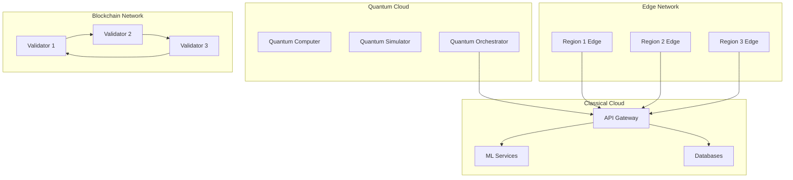
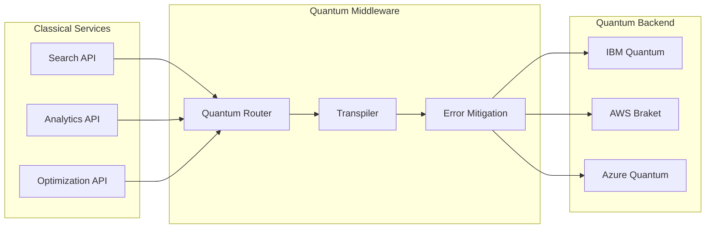
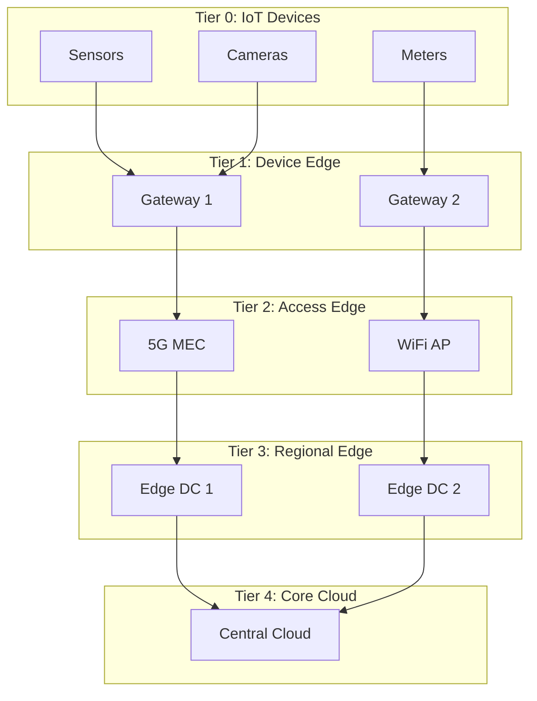
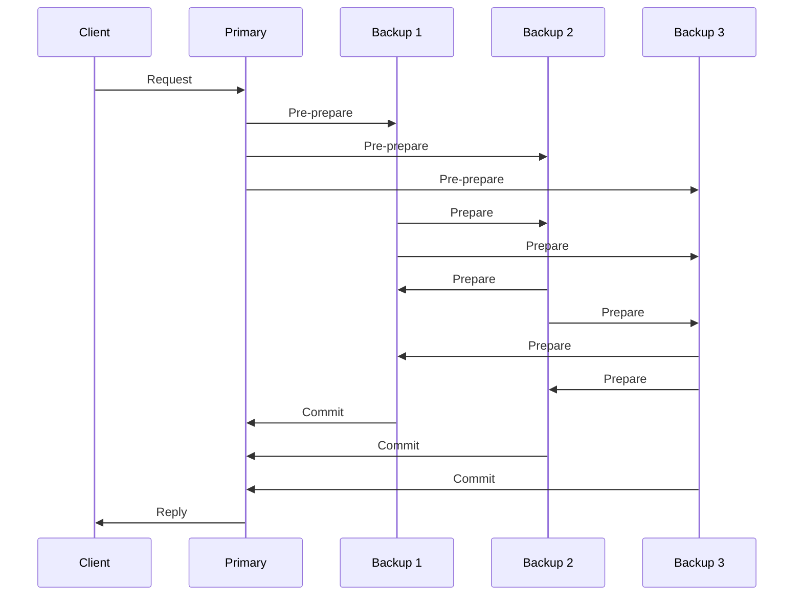
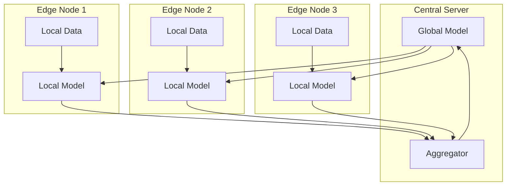
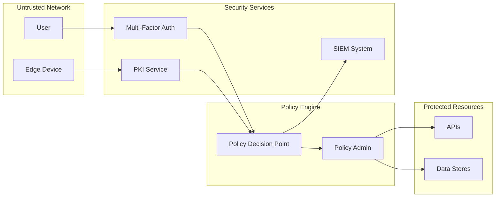

# Architecture Blueprint

Generated: 2025-08-23T19:13:29.669007

## C4 Model

### Level 1: System Context
OpenPolicy V2 serves citizens, MPs, researchers

### Level 2: Container Diagram
- API Gateway
- ETL Service
- PostgreSQL
- Redis
- Elasticsearch

### Level 3: Component Diagrams
[Details...]

## Quantum-Enhanced Architecture Blueprint

Generated: 2025-08-23T19:48:24.369543

### Level 4: Quantum System Context

### Quantum Processing Architecture

#### Quantum Algorithm Selection
| Algorithm | Use Case | Speedup | Qubit Requirements |
|-----------|----------|---------|-------------------|
| Grover's | Database search | O(√N) | 20-50 |
| Shor's | Cryptanalysis | Exponential | 2000+ |
| VQE | Optimization | Polynomial | 50-100 |
| QAOA | Combinatorial | Quadratic | 100-200 |
| HHL | Linear systems | Exponential | 100-300 |

#### Quantum Service Mesh

### Edge Computing Architecture

#### Edge Hierarchy

### Blockchain Architecture

#### Consensus Layer

### Federated AI Architecture

#### Model Training Flow

### Security Architecture Enhancements

#### Post-Quantum Security Stack
1. **Key Exchange**: CRYSTALS-Kyber
2. **Digital Signatures**: CRYSTALS-Dilithium
3. **Hash Functions**: SHA-3
4. **Symmetric Encryption**: AES-256
5. **Random Number Generation**: Quantum RNG

#### Zero-Trust Edge Security

### Performance Targets

#### Quantum Performance
- **Quantum Volume**: > 1024
- **Gate Fidelity**: > 99.9%
- **Coherence Time**: > 100μs
- **Circuit Depth**: > 1000

#### Edge Performance
- **Latency**: < 5ms (device edge), < 10ms (access edge)
- **Throughput**: > 10Gbps per edge node
- **Availability**: 99.999% (five nines)
- **Compute**: 100 TFLOPS per edge site

#### Blockchain Performance
- **TPS**: > 10,000
- **Finality**: < 1 second
- **Node Sync**: < 100ms
- **Storage**: 1TB per year

### Evolution Roadmap

#### Phase 1: Foundation (Months 1-6)
- Deploy quantum simulators
- Establish edge pilot sites
- Implement blockchain testnet
- Begin crypto migration

#### Phase 2: Integration (Months 7-12)
- Connect to quantum cloud providers
- Scale edge to 10 sites
- Launch blockchain mainnet
- Deploy federated learning

#### Phase 3: Optimization (Months 13-18)
- Optimize quantum algorithms
- Full edge coverage (50 sites)
- Cross-chain interoperability
- Advanced AI models

#### Phase 4: Production (Months 19-24)
- Quantum advantage demonstrated
- Edge-native applications
- Blockchain-based governance
- Self-optimizing systems
