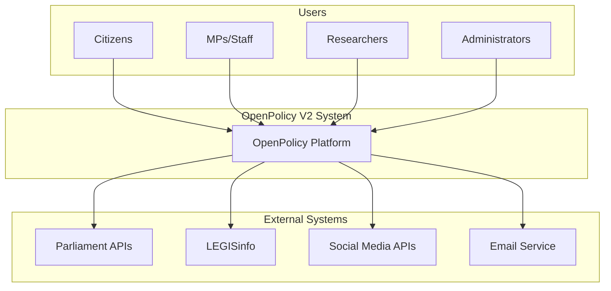
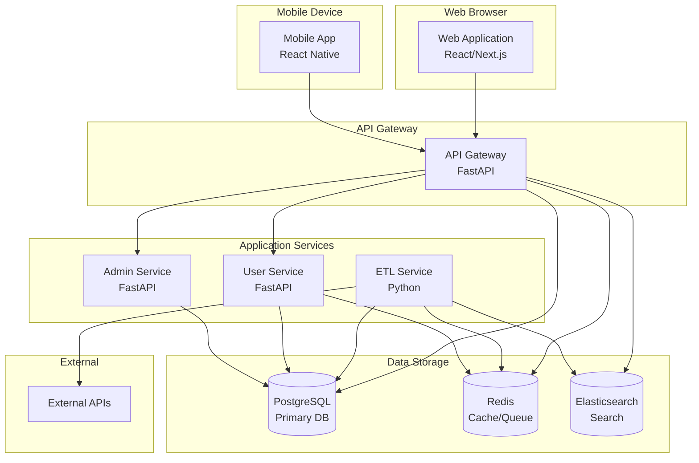
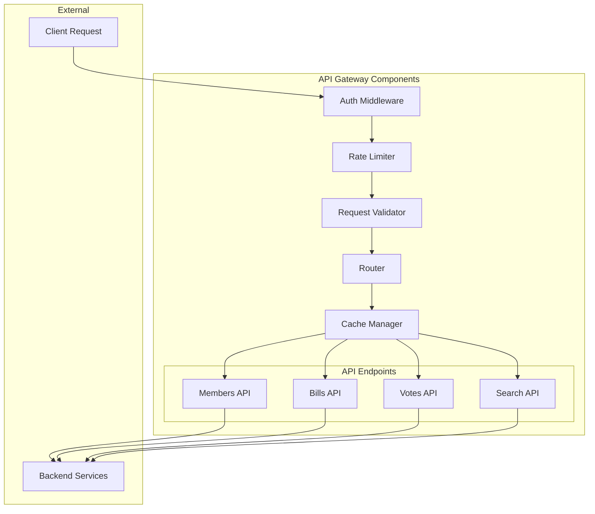
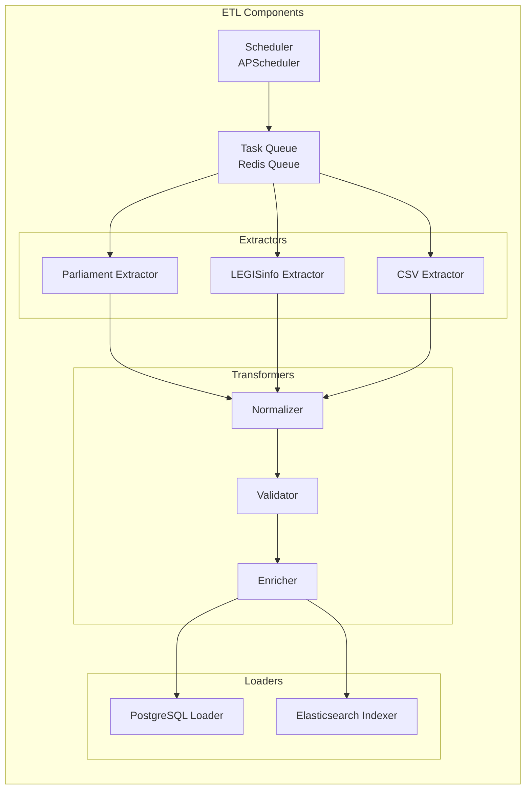
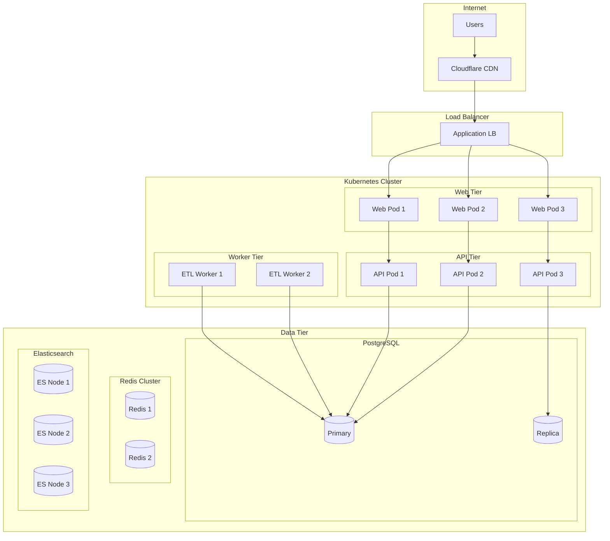
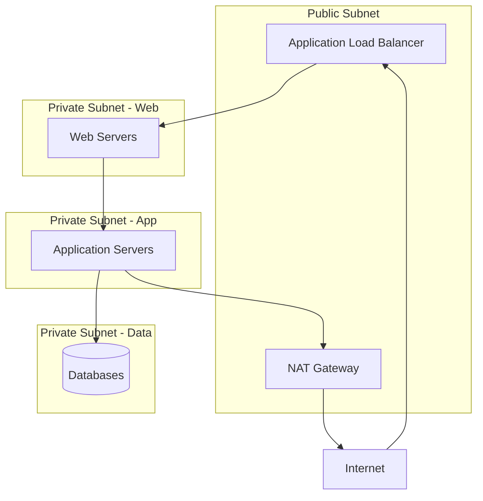
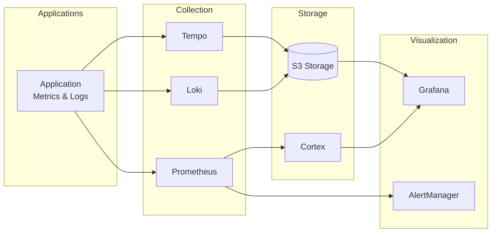

# OpenPolicy V2 Architecture Blueprint

Generated: 2025-08-23

This document describes the architecture of OpenPolicy V2 using the C4 model (Context, Container, Component, Code).

## System Context (Level 1)



### Context Description

**OpenPolicy V2** is a platform that provides transparent access to Canadian parliamentary data including:
- MP profiles and contact information
- Bill tracking and status
- Voting records and analysis
- Committee activities
- Debate transcripts

**Users**:
- **Citizens**: View parliamentary data, track bills, see how MPs vote
- **MPs/Staff**: Monitor legislation, track constituent feedback
- **Researchers**: Access historical data, analyze voting patterns
- **Administrators**: Manage system, monitor data quality

**External Systems**:
- **Parliament APIs**: Official parliamentary data sources
- **LEGISinfo**: Legislative information system
- **Social Media APIs**: Twitter/Facebook for MP social activity
- **Email Service**: SendGrid/AWS SES for notifications

## Container Diagram (Level 2)



### Container Descriptions

**Frontend Containers**:
- **Web Application**: Next.js SSR application for desktop/mobile web
- **Mobile App**: React Native application for iOS/Android (future)

**API Layer**:
- **API Gateway**: Central entry point, handles auth, routing, rate limiting

**Application Services**:
- **ETL Service**: Ingests data from external sources, transforms, loads
- **User Service**: Handles user auth, preferences, subscriptions
- **Admin Service**: System management, monitoring, manual overrides

**Data Storage**:
- **PostgreSQL**: Primary database for all transactional data
- **Redis**: Caching layer and task queue
- **Elasticsearch**: Full-text search across all content

## Component Diagram - API Gateway (Level 3)



### Component Descriptions

**Auth Middleware**: JWT validation, user context extraction
**Rate Limiter**: Redis-backed rate limiting per user/IP
**Request Validator**: Pydantic-based input validation
**Router**: FastAPI router, handles versioning
**Cache Manager**: Redis cache with TTL policies
**API Endpoints**: Domain-specific API handlers

## Component Diagram - ETL Service (Level 3)



## Data Architecture

### Database Schema (Core Tables)

```sql
-- Members
CREATE TABLE members (
    id UUID PRIMARY KEY,
    parliament_id VARCHAR UNIQUE,
    name VARCHAR NOT NULL,
    party VARCHAR,
    constituency VARCHAR,
    province VARCHAR,
    email VARCHAR,
    photo_url VARCHAR,
    created_at TIMESTAMP,
    updated_at TIMESTAMP
);

-- Bills
CREATE TABLE bills (
    id UUID PRIMARY KEY,
    number VARCHAR UNIQUE,
    title TEXT NOT NULL,
    summary TEXT,
    status VARCHAR,
    sponsor_id UUID REFERENCES members(id),
    introduced_date DATE,
    last_updated TIMESTAMP
);

-- Votes
CREATE TABLE votes (
    id UUID PRIMARY KEY,
    bill_id UUID REFERENCES bills(id),
    vote_date TIMESTAMP,
    result VARCHAR,
    yeas INTEGER,
    nays INTEGER,
    abstentions INTEGER
);

-- Ballots (Individual MP votes)
CREATE TABLE ballots (
    id UUID PRIMARY KEY,
    vote_id UUID REFERENCES votes(id),
    member_id UUID REFERENCES members(id),
    position VARCHAR, -- 'yea', 'nay', 'abstain', 'absent'
    UNIQUE(vote_id, member_id)
);
```

### Caching Strategy

| Data Type | Cache TTL | Invalidation |
|-----------|-----------|--------------|
| Member profiles | 1 hour | On update |
| Bill list | 5 minutes | On new bill |
| Vote results | 5 minutes | On new vote |
| Search results | 15 minutes | Time-based |
| Static content | 24 hours | Manual |

### Search Index Structure

```json
{
  "bills": {
    "mappings": {
      "properties": {
        "number": { "type": "keyword" },
        "title": { "type": "text", "analyzer": "english" },
        "summary": { "type": "text", "analyzer": "english" },
        "status": { "type": "keyword" },
        "sponsor_name": { "type": "text" },
        "introduced_date": { "type": "date" }
      }
    }
  }
}
```

## Deployment Architecture

### Production Environment



### Infrastructure Specifications

**Kubernetes Cluster**:
- 3 master nodes (m5.large)
- 6 worker nodes (m5.xlarge)
- Auto-scaling enabled (min: 6, max: 20)

**Database Tier**:
- PostgreSQL: RDS db.r6g.xlarge (Multi-AZ)
- Redis: ElastiCache cache.r6g.large (Cluster mode)
- Elasticsearch: 3x i3.large instances

**Storage**:
- Application: EBS gp3 volumes
- Database: EBS io2 volumes
- Backups: S3 with lifecycle policies

## Security Architecture

### Network Security



### Security Layers

1. **Network Layer**:
   - VPC with public/private subnets
   - Security groups per tier
   - NACLs for subnet protection
   - VPN for admin access

2. **Application Layer**:
   - JWT authentication
   - API key management
   - Rate limiting
   - Input validation

3. **Data Layer**:
   - Encryption at rest
   - TLS for data in transit
   - Database user permissions
   - Audit logging

## Performance Requirements

### SLAs

| Metric | Target | Measurement |
|--------|--------|-------------|
| Uptime | 99.9% | Monthly |
| API Response Time (p95) | < 200ms | Per endpoint |
| Search Response Time (p95) | < 500ms | Full-text search |
| Data Freshness | < 6 hours | Source to display |
| Concurrent Users | 10,000 | Peak capacity |

### Scaling Triggers

| Resource | Scale Up | Scale Down |
|----------|----------|------------|
| Web Pods | CPU > 70% | CPU < 30% |
| API Pods | CPU > 70% | CPU < 30% |
| ETL Workers | Queue > 1000 | Queue < 100 |
| Database Connections | > 80% | < 40% |

## Monitoring Architecture

### Observability Stack



### Key Metrics

**Application Metrics**:
- Request rate, error rate, duration (RED)
- Active users, sessions
- Feature usage statistics

**Infrastructure Metrics**:
- CPU, memory, disk, network
- Container restarts
- Database connections
- Cache hit rates

**Business Metrics**:
- Daily active users
- Bills tracked per user
- Search queries per day
- API usage by endpoint

## Disaster Recovery

### Backup Strategy

| Component | Frequency | Retention | Location |
|-----------|-----------|-----------|----------|
| Database | Continuous | 30 days | S3 Cross-region |
| Application State | Daily | 7 days | S3 |
| Configuration | On change | Forever | Git + S3 |
| Elasticsearch | Daily | 7 days | Snapshots to S3 |

### Recovery Objectives

- **RTO** (Recovery Time Objective): 4 hours
- **RPO** (Recovery Point Objective): 1 hour

### DR Procedures

1. **Database Failure**: Promote read replica, restore from backup
2. **Region Failure**: Failover to DR region (us-west-2)
3. **Data Corruption**: Point-in-time recovery from backups
4. **Service Failure**: Auto-restart, then manual intervention

## Evolution Roadmap

### Phase 1 (Current)
- Core features operational
- Basic monitoring
- Manual deployments

### Phase 2 (Q2 2025)
- GraphQL API
- Advanced analytics
- CI/CD automation

### Phase 3 (Q3 2025)
- Mobile applications
- AI-powered insights
- Multi-language support

### Phase 4 (Q4 2025)
- Real-time collaboration
- Predictive analytics
- Blockchain audit trail