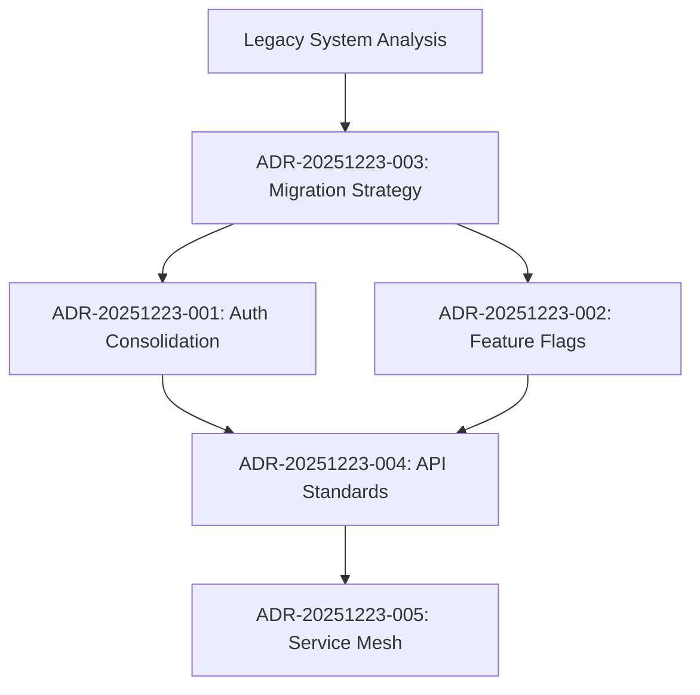

# Architecture Decision Ledger - OpenPolicy V2

This document indexes all Architecture Decision Records (ADRs) for the OpenPolicy V2 platform.

## ADR Index

| ADR ID | Title | Status | Date | Summary |
|--------|-------|--------|------|---------|
| ADR-20251223-001 | [Authentication Architecture Consolidation](ADR-20251223-001-authentication-architecture.md) | Proposed | 2025-12-23 | Consolidate three authentication implementations into API Gateway |
| ADR-20251223-002 | [Unified Feature Flag Architecture](ADR-20251223-002-feature-flag-architecture.md) | Proposed | 2025-12-23 | Create unified feature flag service from PWA and API version systems |
| ADR-20251223-003 | Legacy Code Migration Strategy | Pending | - | Gradual migration preserving domain knowledge |
| ADR-20251223-004 | API Standardization | Pending | - | RESTful conventions and versioning strategy |
| ADR-20251223-005 | Service Mesh Architecture | Pending | - | Inter-service communication patterns |

## Decision Categories

### Security & Authentication
- ADR-20251223-001: Authentication consolidation to single service

### Feature Management
- ADR-20251223-002: Unified feature flag system with targeting

### Migration & Legacy
- ADR-20251223-003: Strangler Fig pattern for legacy migration

### API Design
- ADR-20251223-004: RESTful API standardization

### Infrastructure
- ADR-20251223-005: Service mesh for microservices

## Decision Flow



## Review Process

1. **Proposed**: Initial ADR created, under discussion
2. **Accepted**: Team consensus reached, implementation authorized
3. **Implemented**: Decision executed in codebase
4. **Deprecated**: Superseded by new decision

## Templates

### ADR Template
```markdown
# ADR-YYYYMMDD-NNN: Title

## Status
[Proposed | Accepted | Implemented | Deprecated]

## Context
What is the issue that we're seeing that is motivating this decision?

## Decision
What is the change that we're proposing and/or doing?

## Consequences
What becomes easier or more difficult to do because of this change?

## Alternatives Considered
What other options were evaluated?
```

## Next Decisions Needed

1. **Legacy Code Strategy (ADR-20251223-003)**
   - How to preserve parliamentary domain knowledge
   - Migration timeline and phases
   - Backwards compatibility requirements

2. **API Standardization (ADR-20251223-004)**
   - URL patterns and naming conventions
   - Error response formats
   - Pagination standards

3. **Service Communication (ADR-20251223-005)**
   - Service discovery mechanism
   - Circuit breaker patterns
   - Event sourcing vs direct calls

