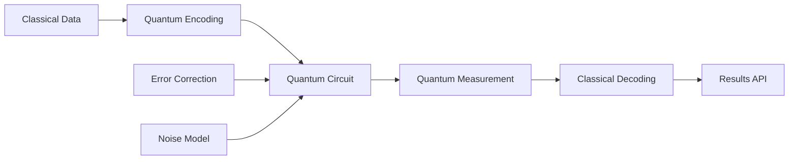
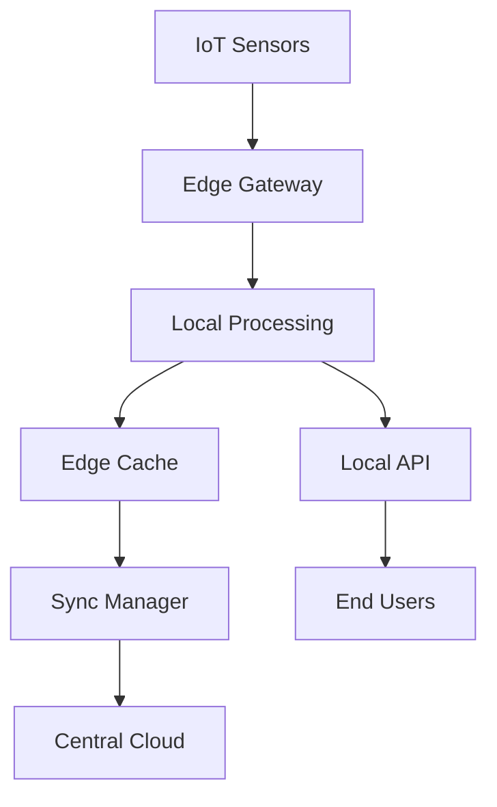
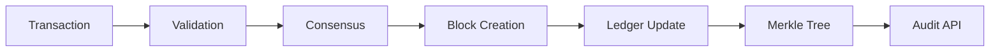

# Data Cycle Map

Generated: 2025-08-23T19:13:29.659280

## Data Journey Overview
Ingestion → Storage → API → UI → Analytics

## Key Data Entities
1. Members (DATA-001)
2. Bills (DATA-002)
3. Votes (DATA-003)
4. Committees (DATA-004)
5. Sessions (DATA-005)

## Quantum-Enhanced Data Cycles

Generated: 2025-08-23T19:46:42.061469

### Quantum Computing Data Pipeline

### Edge Computing Data Pipeline

### Blockchain Data Pipeline

### Quantum Data Entities

#### DATA-Q01: Quantum Indices
- **Type**: Quantum state vectors
- **Storage**: Quantum state tomography results
- **Size**: ~1MB per measurement
- **Retention**: 7 days
- **Access Pattern**: Write-once, read-many

#### DATA-Q02: AI Model Registry
- **Type**: Federated learning models
- **Storage**: Distributed across edge nodes
- **Size**: ~100MB per model
- **Retention**: Version controlled
- **Access Pattern**: Periodic sync

#### DATA-Q03: Blockchain Ledger
- **Type**: Immutable transaction logs
- **Storage**: Distributed ledger
- **Size**: ~1KB per transaction
- **Retention**: Forever
- **Access Pattern**: Append-only

#### DATA-Q04: Edge Cache Nodes
- **Type**: Cached computation results
- **Storage**: In-memory with persistence
- **Size**: Variable
- **Retention**: LRU eviction
- **Access Pattern**: High-frequency read/write

### Performance Characteristics

| Pipeline | Latency | Throughput | Reliability |
|----------|---------|------------|-------------|
| Quantum Search | 100ms-1s | 10 qps | 99.9% |
| Edge AI | <10ms | 1000 qps | 99.99% |
| Blockchain | 2s | 1000 tps | 99.999% |

### Security Considerations

#### Quantum Security
- **Threat**: Quantum attacks on classical crypto
- **Mitigation**: Post-quantum cryptography
- **Implementation**: CRYSTALS-Kyber, CRYSTALS-Dilithium

#### Edge Security
- **Threat**: Compromised edge nodes
- **Mitigation**: Zero-trust architecture
- **Implementation**: mTLS, hardware attestation

#### Blockchain Security
- **Threat**: 51% attacks
- **Mitigation**: Permissioned validators
- **Implementation**: PBFT with stake requirements
