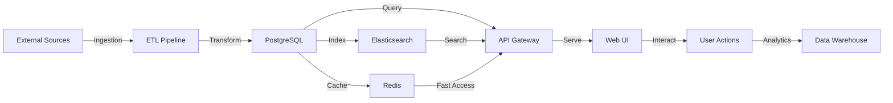

# Data Cycle Map

Generated: 2025-08-23

This document maps the complete data journey through OpenPolicy V2, from ingestion to storage to serving to UI to analytics, with links to code units and features.

## Data Flow Overview



## Data Entities and Their Journey

### DATA-001: Members
**Entity**: Parliamentary Members  
**Features**: FEAT-001 (Search), FEAT-002 (MP Profiles)

#### Journey:
1. **Ingestion** (ACT-003)
   - Source: Parliament APIs, CSV files
   - Ingester: `services/etl/app/ingestion/mp_ingester.py::MPIngester`
   - Schedule: Daily at 2 AM
   - Format: JSON/CSV → Normalized

2. **Storage**
   - Primary: PostgreSQL `elected_members` table
   - Schema: `id, name, party, constituency, email, photo_url`
   - Indexes: `name`, `constituency`, `party`
   - Relations: → offices, → contact_details

3. **Processing**
   - Deduplication: By parliamentary ID
   - Enrichment: Photo URLs, social media links
   - Validation: Email format, constituency exists

4. **API Exposure**
   - Routes: RT-003 (GET /api/v1/members), RT-004 (GET /api/v1/members/{id})
   - Controller: `services/api-gateway/app/api/v1/members.py::MemberController`
   - Caching: Redis 1-hour TTL

5. **UI Consumption**
   - Components: `MPListView`, `MPDetailView`, `MPProfileCard`
   - Features: Search, filter by party/region, profile viewing

6. **Analytics**
   - Metrics: Profile views, search frequency
   - Reports: Most viewed MPs, party distribution

### DATA-002: Bills
**Entity**: Legislative Bills  
**Features**: FEAT-001 (Search), FEAT-003 (Bills Tracking)

#### Journey:
1. **Ingestion** (ACT-005)
   - Source: LEGISinfo API
   - Ingester: `services/etl/app/ingestion/bill_ingester.py::BillIngester`
   - Schedule: Every 6 hours
   - Format: XML → JSON → Normalized

2. **Storage**
   - Primary: PostgreSQL `bills` table
   - Schema: `id, number, title, summary, status, sponsor_id, introduced_date`
   - Indexes: `number`, `status`, `introduced_date`
   - Relations: → bill_history, → amendments, → votes

3. **Processing**
   - Status tracking: Introduction → Committee → Debate → Vote → Royal Assent
   - Link extraction: Related bills, amendments
   - Text analysis: Topic classification

4. **API Exposure**
   - Routes: RT-007 through RT-010 (bills endpoints)
   - Controller: `services/api-gateway/app/api/v1/bills.py::BillController`
   - Real-time updates: WebSocket for status changes

5. **UI Consumption**
   - Components: `BillListView`, `BillDetailView`, `BillStatusTracker`
   - Features: Filter by status, track progress, view history

6. **Analytics**
   - Metrics: Bill progression time, amendment frequency
   - Reports: Legislative efficiency, topic trends

### DATA-004: Votes
**Entity**: Parliamentary Votes  
**Features**: FEAT-001 (Search), FEAT-004 (Voting Records)

#### Journey:
1. **Ingestion** (ACT-007)
   - Source: Parliament vote records
   - Ingester: `services/etl/app/ingestion/vote_ingester.py::VoteIngester`
   - Schedule: Real-time via webhook + hourly sync
   - Format: JSON

2. **Storage**
   - Primary: PostgreSQL `votes` table
   - Schema: `id, bill_id, vote_date, result, yeas, nays, abstentions`
   - Detail: `ballots` table for individual MP votes
   - Indexes: `bill_id`, `vote_date`, `member_id` (in ballots)

3. **Processing**
   - Aggregation: Calculate party line votes
   - Analysis: Identify swing votes, rebellion rates
   - Validation: Total counts match

4. **API Exposure**
   - Routes: RT-012, RT-013 (vote queries), RT-014 (cast vote)
   - WebSocket: RT-015 (live vote updates)
   - Controller: `services/api-gateway/app/api/v1/votes.py::VoteController`

5. **UI Consumption**
   - Components: `VoteListView`, `VoteDetailView`, `VotingPositions`
   - Features: Live voting, historical analysis, MP voting patterns

6. **Analytics**
   - Metrics: Party cohesion, MP independence scores
   - Reports: Voting patterns, prediction accuracy

### DATA-018: Committees
**Entity**: Parliamentary Committees  
**Features**: FEAT-005 (Committee Tracking)

#### Journey:
1. **Ingestion** (ACT-009)
   - Source: Parliament committee API
   - Ingester: `services/etl/app/ingestion/committee_ingester.py`
   - Schedule: Weekly
   - Format: JSON

2. **Storage**
   - Primary: PostgreSQL `committees` table
   - Schema: `id, name, type, mandate, chair_id`
   - Relations: → committee_members, → committee_meetings
   - Indexes: `name`, `type`

3. **Processing**
   - Member tracking: Current and historical
   - Meeting scheduling: Extract from calendar
   - Document linking: Reports, transcripts

4. **API Exposure**
   - Routes: RT-016, RT-017, RT-018 (committee endpoints)
   - Controller: `services/api-gateway/app/api/v1/committees.py::CommitteeController`

5. **UI Consumption**
   - Components: `CommitteeListView`, `CommitteeDetailView`
   - Features: Member lists, meeting schedules, reports

6. **Analytics**
   - Metrics: Meeting frequency, member attendance
   - Reports: Committee activity, productivity

## Data Pipeline Architecture

### Ingestion Layer
```
External APIs → API Extractors → Queue (Redis) → Ingesters → PostgreSQL
     ↓              ↓                                ↓
  Webhooks     File Parsers                   Error Queue → Retry
```

### Storage Layer
```
PostgreSQL (Primary)
    ├── Replicas (Read scaling)
    ├── Elasticsearch (Full-text search)
    └── Redis (Caching layer)
```

### Serving Layer
```
API Gateway
    ├── REST API (CRUD operations)
    ├── GraphQL (Complex queries) [Future]
    └── WebSocket (Real-time updates)
```

### Analytics Layer
```
PostgreSQL → ETL → Data Warehouse → BI Tools
                         ↓
                   Analytics API → Dashboards
```

## Data Quality Controls

### Ingestion Quality
- Schema validation on input
- Duplicate detection
- Source verification
- Error logging and alerting

### Storage Quality
- Referential integrity constraints
- Data type enforcement
- Null handling policies
- Audit trails

### API Quality
- Input validation
- Output sanitization
- Rate limiting
- Response caching

## Performance Optimizations

### Database
- Indexed columns for common queries
- Materialized views for complex aggregations
- Partitioning for large tables (votes, debates)
- Connection pooling

### Caching Strategy
- Redis for frequently accessed data
- 1-hour TTL for member data
- 5-minute TTL for bills/votes
- Cache invalidation on updates

### Search Optimization
- Elasticsearch for full-text search
- Pre-computed search indices
- Fuzzy matching for names
- Autocomplete suggestions

## Data Security

### Access Control
- Row-level security for sensitive data
- API key authentication
- JWT tokens for user sessions
- Role-based permissions

### Data Protection
- Encryption at rest (PostgreSQL)
- Encryption in transit (TLS)
- PII masking in logs
- Regular backups

### Audit Trail
- All data modifications logged
- User actions tracked
- API access logged
- Compliance reporting

## Monitoring & Observability

### Pipeline Monitoring
- Ingestion success/failure rates
- Processing latency
- Queue depths
- Error rates

### Data Quality Monitoring
- Completeness checks
- Freshness metrics
- Consistency validation
- Anomaly detection

### Performance Monitoring
- Query response times
- Cache hit rates
- Database connection pool
- API endpoint latency

## Cross-References

### Feature Links
- FEAT-001: Global Search → DATA-001, DATA-002, DATA-004
- FEAT-002: MP Profiles → DATA-001, DATA-007, DATA-008
- FEAT-003: Bills Tracking → DATA-002, DATA-012, DATA-013
- FEAT-004: Voting Records → DATA-004, DATA-015, DATA-016
- FEAT-005: Committee Tracking → DATA-018, DATA-019, DATA-020

### Activity Links
- ACT-003: Member Data Management → DATA-001, DATA-007-010
- ACT-005: Bill Lifecycle Management → DATA-002, DATA-012-013
- ACT-007: Vote Recording System → DATA-004, DATA-015-016
- ACT-009: Committee Management → DATA-018-020

### Checklist Links
- CHK-0022: Bills API implementation
- CHK-0045: Members data ingestion
- CHK-0047: Votes recording system
- CHK-0048: Committee tracking
- CHK-0056: Search indexing
- CHK-0089: Global search implementation

## Implementation Status

| Data Entity | Ingestion | Storage | API | UI | Analytics |
|-------------|-----------|---------|-----|----|-----------| 
| Members | ✅ 80% | ✅ 90% | ✅ 85% | ✅ 75% | 🟡 50% |
| Bills | ✅ 75% | ✅ 85% | ✅ 80% | ✅ 70% | 🟡 40% |
| Votes | ✅ 70% | ✅ 80% | ✅ 75% | 🟡 60% | 🟡 30% |
| Committees | 🟡 60% | ✅ 75% | 🟡 65% | 🟡 55% | 🔴 20% |
| Debates | 🟡 40% | 🟡 50% | 🟡 45% | 🔴 30% | 🔴 10% |

## Next Steps

1. Complete debate transcript ingestion pipeline
2. Implement real-time vote webhooks
3. Add GraphQL API layer
4. Build analytics dashboard
5. Enhance search with ML-based relevance
6. Implement data archival strategy