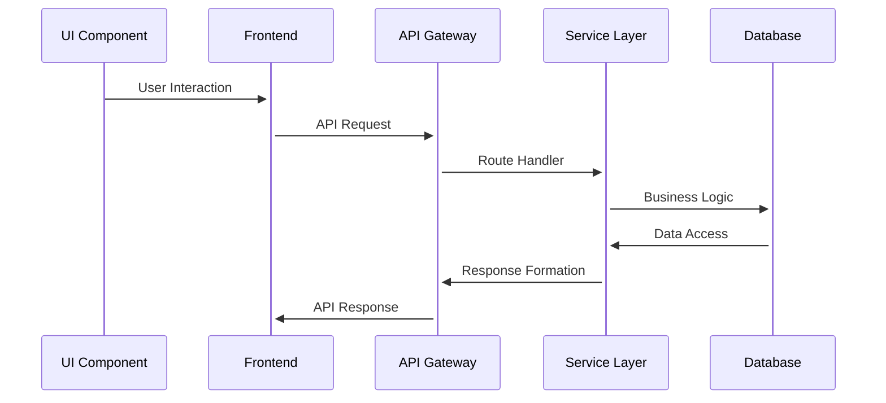

# Flow Design Document

Generated: 2025-08-23T17:33:05.387223

## Table of Contents

1. [Feature Overview](#feature-overview)
2. [Feature Flows](#feature-flows)
3. [State Transitions](#state-transitions)
4. [Routing Tables](#routing-tables)
5. [Legacy Feature Mapping](#legacy-feature-mapping)

## Feature Overview

- **Existing Features**: 50
- **Legacy Features Found**: 191

## Feature Flows

### Global Search

**Feature ID**: F001

#### Data Flow Sequence



#### Dependencies

- **Modules**: 29 modules
- **Functions**: 228 functions

---

### MP Profile System

**Feature ID**: F002

#### Data Flow Sequence


#### Dependencies

- **Modules**: 364 modules
- **Functions**: 5949 functions

---

### Bills Tracking

**Feature ID**: F003

#### API Routes

| Method | Path | Handler | File |
|--------|------|---------|------|
| get | /recent-bills | recent_bills_feed | `services/api-gateway/src/api/v1/feeds.py` |
| get | /recent-bills | unknown | `services/api-gateway/src/api/v1/feeds.py` |
| get | /bills | export_bills | `services/api-gateway/src/api/v1/export.py` |
| get | /bills | unknown | `services/api-gateway/src/api/v1/export.py` |
| get | /{bill_id} | get_bill_detail | `services/api-gateway/app/api/v1/bills.py` |

... and 57 more routes

#### Data Flow Sequence


#### Dependencies

- **Modules**: 46 modules
- **Functions**: 200 functions

---

### Voting Records

**Feature ID**: F004

#### Data Flow Sequence


#### Dependencies

- **Modules**: 11 modules
- **Functions**: 46 functions

---

### Debates Archive

**Feature ID**: F005

#### API Routes

| Method | Path | Handler | File |
|--------|------|---------|------|
| get | /recent-debates | recent_debates_feed | `services/api-gateway/src/api/v1/feeds.py` |
| get | /recent-debates | unknown | `services/api-gateway/src/api/v1/feeds.py` |
| get | /debates | export_debates | `services/api-gateway/src/api/v1/export.py` |
| get | /debates | unknown | `services/api-gateway/src/api/v1/export.py` |
| post | /sessions/{session_id}/debates | create_house_debate | `services/api-gateway/app/api/v1/house_status.py` |

... and 4 more routes

#### Data Flow Sequence


#### Dependencies

- **Modules**: 24 modules
- **Functions**: 165 functions

---

### Committee Tracking

**Feature ID**: F006

#### Data Flow Sequence


#### Dependencies

- **Modules**: 27 modules
- **Functions**: 183 functions

---

### Multi-Level Government

**Feature ID**: F007

#### Data Flow Sequence


#### Dependencies

- **Modules**: 23 modules
- **Functions**: 151 functions

---

### User Management

**Feature ID**: F008

#### Data Flow Sequence


#### Dependencies

- **Modules**: 51 modules
- **Functions**: 340 functions

---

### Mobile API Support

**Feature ID**: F009

#### Data Flow Sequence


#### Dependencies

- **Modules**: 129 modules
- **Functions**: 1337 functions

---

### Data Export

**Feature ID**: F010

#### Data Flow Sequence


#### Dependencies

- **Modules**: 28 modules
- **Functions**: 438 functions

---

### Real-time House Status

**Feature ID**: F011

#### Data Flow Sequence


#### Dependencies

- **Modules**: 10 modules
- **Functions**: 122 functions

---

### Scraper Monitoring

**Feature ID**: F012

#### Data Flow Sequence


#### Dependencies

- **Modules**: 320 modules
- **Functions**: 986 functions

---

### Historical Party Affiliation

**Feature ID**: F013

#### Data Flow Sequence


#### Dependencies

- **Modules**: 2 modules
- **Functions**: 21 functions

---

### Electoral History

**Feature ID**: F014

#### Data Flow Sequence


#### Dependencies

- **Modules**: 3 modules
- **Functions**: 16 functions

---

### Email Alerts

**Feature ID**: F015

#### Data Flow Sequence


#### Dependencies

- **Modules**: 21 modules
- **Functions**: 165 functions

---

### RSS Feeds

**Feature ID**: F016

#### Data Flow Sequence


#### Dependencies

- **Modules**: 4 modules
- **Functions**: 58 functions

---

### Word Frequency Analysis

**Feature ID**: F017

#### Data Flow Sequence


#### Dependencies

- **Modules**: 15 modules
- **Functions**: 120 functions

---

### Social Media Integration

**Feature ID**: F018

#### Data Flow Sequence


#### Dependencies

- **Modules**: 6 modules
- **Functions**: 43 functions

---

### Riding Geographic Data

**Feature ID**: F019

#### Data Flow Sequence


#### Dependencies

- **Modules**: 27 modules
- **Functions**: 426 functions

---

### Bill Status Visualization

**Feature ID**: F020

#### Data Flow Sequence


#### Dependencies

- **Modules**: 63 modules
- **Functions**: 406 functions

---

### Vote Pass/Fail Indicators

**Feature ID**: F021

#### Data Flow Sequence

```mermaid
sequenceDiagram
    UI Component->>+Frontend: User Interaction
    Frontend->>+API Gateway: API Request
    API Gateway->>+Service Layer: Route Handler
    Service Layer->>+Database: Business Logic
    Database->>+Service Layer: Data Access
    Service Layer->>+API Gateway: Response Formation
    API Gateway->>+Frontend: API Response
```

#### Dependencies

- **Modules**: 11 modules
- **Functions**: 105 functions

---

### Committee Review Tracking

**Feature ID**: F022

#### Data Flow Sequence

```mermaid
sequenceDiagram
    UI Component->>+Frontend: User Interaction
    Frontend->>+API Gateway: API Request
    API Gateway->>+Service Layer: Route Handler
    Service Layer->>+Database: Business Logic
    Database->>+Service Layer: Data Access
    Service Layer->>+API Gateway: Response Formation
    API Gateway->>+Frontend: API Response
```

#### Dependencies

- **Modules**: 27 modules
- **Functions**: 183 functions

---

### Royal Assent Tracking

**Feature ID**: F023

#### Data Flow Sequence

```mermaid
sequenceDiagram
    UI Component->>+Frontend: User Interaction
    Frontend->>+API Gateway: API Request
    API Gateway->>+Service Layer: Route Handler
    Service Layer->>+Database: Business Logic
    Database->>+Service Layer: Data Access
    Service Layer->>+API Gateway: Response Formation
    API Gateway->>+Frontend: API Response
```

#### Dependencies

- **Functions**: 6 functions

---

### Bill Amendment Tracking

**Feature ID**: F024

#### Data Flow Sequence

```mermaid
sequenceDiagram
    UI Component->>+Frontend: User Interaction
    Frontend->>+API Gateway: API Request
    API Gateway->>+Service Layer: Route Handler
    Service Layer->>+Database: Business Logic
    Database->>+Service Layer: Data Access
    Service Layer->>+API Gateway: Response Formation
    API Gateway->>+Frontend: API Response
```

#### Dependencies

- **Modules**: 53 modules
- **Functions**: 280 functions

---

### Private Member Bill Analytics

**Feature ID**: F025

#### Data Flow Sequence

```mermaid
sequenceDiagram
    UI Component->>+Frontend: User Interaction
    Frontend->>+API Gateway: API Request
    API Gateway->>+Service Layer: Route Handler
    Service Layer->>+Database: Business Logic
    Database->>+Service Layer: Data Access
    Service Layer->>+API Gateway: Response Formation
    API Gateway->>+Frontend: API Response
```

#### Dependencies

- **Modules**: 56 modules
- **Functions**: 330 functions

---

### Party Line Voting Analysis

**Feature ID**: F026

#### Data Flow Sequence

```mermaid
sequenceDiagram
    UI Component->>+Frontend: User Interaction
    Frontend->>+API Gateway: API Request
    API Gateway->>+Service Layer: Route Handler
    Service Layer->>+Database: Business Logic
    Database->>+Service Layer: Data Access
    Service Layer->>+API Gateway: Response Formation
    API Gateway->>+Frontend: API Response
```

#### Dependencies

- **Modules**: 25 modules
- **Functions**: 182 functions

---

### AI-Generated Summaries

**Feature ID**: F027

#### Data Flow Sequence

```mermaid
sequenceDiagram
    UI Component->>+Frontend: User Interaction
    Frontend->>+API Gateway: API Request
    API Gateway->>+Service Layer: Route Handler
    Service Layer->>+Database: Business Logic
    Database->>+Service Layer: Data Access
    Service Layer->>+API Gateway: Response Formation
    API Gateway->>+Frontend: API Response
```

#### Dependencies

- **Modules**: 14 modules
- **Functions**: 104 functions

---

### Topic Extraction

**Feature ID**: F028

#### Data Flow Sequence

```mermaid
sequenceDiagram
    UI Component->>+Frontend: User Interaction
    Frontend->>+API Gateway: API Request
    API Gateway->>+Service Layer: Route Handler
    Service Layer->>+Database: Business Logic
    Database->>+Service Layer: Data Access
    Service Layer->>+API Gateway: Response Formation
    API Gateway->>+Frontend: API Response
```

#### Dependencies

- **Modules**: 2 modules
- **Functions**: 38 functions

---

### Speech Attribution

**Feature ID**: F029

#### Data Flow Sequence

```mermaid
sequenceDiagram
    UI Component->>+Frontend: User Interaction
    Frontend->>+API Gateway: API Request
    API Gateway->>+Service Layer: Route Handler
    Service Layer->>+Database: Business Logic
    Database->>+Service Layer: Data Access
    Service Layer->>+API Gateway: Response Formation
    API Gateway->>+Frontend: API Response
```

#### Dependencies

- **Modules**: 2 modules
- **Functions**: 10 functions

---

### Debate Analytics

**Feature ID**: F030

#### Data Flow Sequence

```mermaid
sequenceDiagram
    UI Component->>+Frontend: User Interaction
    Frontend->>+API Gateway: API Request
    API Gateway->>+Service Layer: Route Handler
    Service Layer->>+Database: Business Logic
    Database->>+Service Layer: Data Access
    Service Layer->>+API Gateway: Response Formation
    API Gateway->>+Frontend: API Response
```

#### Dependencies

- **Modules**: 29 modules
- **Functions**: 216 functions

---

### Word of the Day

**Feature ID**: F031

#### Data Flow Sequence

```mermaid
sequenceDiagram
    UI Component->>+Frontend: User Interaction
    Frontend->>+API Gateway: API Request
    API Gateway->>+Service Layer: Route Handler
    Service Layer->>+Database: Business Logic
    Database->>+Service Layer: Data Access
    Service Layer->>+API Gateway: Response Formation
    API Gateway->>+Frontend: API Response
```

#### Dependencies

- **Modules**: 21 modules
- **Functions**: 288 functions

---

### Cross-Parliament Search

**Feature ID**: F032

#### Data Flow Sequence

```mermaid
sequenceDiagram
    UI Component->>+Frontend: User Interaction
    Frontend->>+API Gateway: API Request
    API Gateway->>+Service Layer: Route Handler
    Service Layer->>+Database: Business Logic
    Database->>+Service Layer: Data Access
    Service Layer->>+API Gateway: Response Formation
    API Gateway->>+Frontend: API Response
```

#### Dependencies

- **Modules**: 29 modules
- **Functions**: 220 functions

---

### Committee Membership

**Feature ID**: F033

#### API Routes

| Method | Path | Handler | File |
|--------|------|---------|------|
| get | /mp/{mp_slug}/statements | mp_statements_feed | `services/api-gateway/src/api/v1/feeds.py` |
| get | /mp/{mp_slug}/activity | mp_activity_feed | `services/api-gateway/src/api/v1/feeds.py` |
| get | /mp/{mp_slug}/statements | unknown | `services/api-gateway/src/api/v1/feeds.py` |
| get | /mp/{mp_slug}/activity | unknown | `services/api-gateway/src/api/v1/feeds.py` |
| get | /members | export_members | `services/api-gateway/src/api/v1/export.py` |

... and 19 more routes

#### Data Flow Sequence

```mermaid
sequenceDiagram
    UI Component->>+Frontend: User Interaction
    Frontend->>+API Gateway: API Request
    API Gateway->>+Service Layer: Route Handler
    Service Layer->>+Database: Business Logic
    Database->>+Service Layer: Data Access
    Service Layer->>+API Gateway: Response Formation
    API Gateway->>+Frontend: API Response
```

#### Dependencies

- **Modules**: 27 modules
- **Functions**: 177 functions

---

### Active Studies Monitor

**Feature ID**: F034

#### Data Flow Sequence

```mermaid
sequenceDiagram
    UI Component->>+Frontend: User Interaction
    Frontend->>+API Gateway: API Request
    API Gateway->>+Service Layer: Route Handler
    Service Layer->>+Database: Business Logic
    Database->>+Service Layer: Data Access
    Service Layer->>+API Gateway: Response Formation
    API Gateway->>+Frontend: API Response
```

#### Dependencies

- **Modules**: 4 modules
- **Functions**: 59 functions

---

### Meeting Schedule System

**Feature ID**: F035

#### Data Flow Sequence

```mermaid
sequenceDiagram
    UI Component->>+Frontend: User Interaction
    Frontend->>+API Gateway: API Request
    API Gateway->>+Service Layer: Route Handler
    Service Layer->>+Database: Business Logic
    Database->>+Service Layer: Data Access
    Service Layer->>+API Gateway: Response Formation
    API Gateway->>+Frontend: API Response
```

#### Dependencies

- **Modules**: 5 modules
- **Functions**: 81 functions

---

### Report Publication

**Feature ID**: F036

#### Data Flow Sequence

```mermaid
sequenceDiagram
    UI Component->>+Frontend: User Interaction
    Frontend->>+API Gateway: API Request
    API Gateway->>+Service Layer: Route Handler
    Service Layer->>+Database: Business Logic
    Database->>+Service Layer: Data Access
    Service Layer->>+API Gateway: Response Formation
    API Gateway->>+Frontend: API Response
```

#### Dependencies

- **Modules**: 1 modules
- **Functions**: 5 functions

---

### Haiku Generator

**Feature ID**: F037

#### Data Flow Sequence

```mermaid
sequenceDiagram
    UI Component->>+Frontend: User Interaction
    Frontend->>+API Gateway: API Request
    API Gateway->>+Service Layer: Route Handler
    Service Layer->>+Database: Business Logic
    Database->>+Service Layer: Data Access
    Service Layer->>+API Gateway: Response Formation
    API Gateway->>+Frontend: API Response
```

#### Dependencies

- **Modules**: 9 modules
- **Functions**: 110 functions

---

### Google OAuth

**Feature ID**: F038

#### Data Flow Sequence

```mermaid
sequenceDiagram
    UI Component->>+Frontend: User Interaction
    Frontend->>+API Gateway: API Request
    API Gateway->>+Service Layer: Route Handler
    Service Layer->>+Database: Business Logic
    Database->>+Service Layer: Data Access
    Service Layer->>+API Gateway: Response Formation
    API Gateway->>+Frontend: API Response
```

#### Dependencies

- **Modules**: 3 modules
- **Functions**: 21 functions

---

### Custom Search Criteria

**Feature ID**: F039

#### Data Flow Sequence

```mermaid
sequenceDiagram
    UI Component->>+Frontend: User Interaction
    Frontend->>+API Gateway: API Request
    API Gateway->>+Service Layer: Route Handler
    Service Layer->>+Database: Business Logic
    Database->>+Service Layer: Data Access
    Service Layer->>+API Gateway: Response Formation
    API Gateway->>+Frontend: API Response
```

#### Dependencies

- **Modules**: 29 modules
- **Functions**: 225 functions

---

### Bilingual Support

**Feature ID**: F040

#### Data Flow Sequence

```mermaid
sequenceDiagram
    UI Component->>+Frontend: User Interaction
    Frontend->>+API Gateway: API Request
    API Gateway->>+Service Layer: Route Handler
    Service Layer->>+Database: Business Logic
    Database->>+Service Layer: Data Access
    Service Layer->>+API Gateway: Response Formation
    API Gateway->>+Frontend: API Response
```

#### Dependencies

- **Modules**: 3 modules
- **Functions**: 39 functions

---

### Responsive Mobile Design

**Feature ID**: F041

#### Data Flow Sequence

```mermaid
sequenceDiagram
    UI Component->>+Frontend: User Interaction
    Frontend->>+API Gateway: API Request
    API Gateway->>+Service Layer: Route Handler
    Service Layer->>+Database: Business Logic
    Database->>+Service Layer: Data Access
    Service Layer->>+API Gateway: Response Formation
    API Gateway->>+Frontend: API Response
```

#### Dependencies

- **Modules**: 11 modules
- **Functions**: 20 functions

---

### Parliamentary Schedule

**Feature ID**: F042

#### Data Flow Sequence

```mermaid
sequenceDiagram
    UI Component->>+Frontend: User Interaction
    Frontend->>+API Gateway: API Request
    API Gateway->>+Service Layer: Route Handler
    Service Layer->>+Database: Business Logic
    Database->>+Service Layer: Data Access
    Service Layer->>+API Gateway: Response Formation
    API Gateway->>+Frontend: API Response
```

#### Dependencies

- **Modules**: 2 modules
- **Functions**: 25 functions

---

### Daily Transcript Feature

**Feature ID**: F043

#### Data Flow Sequence

```mermaid
sequenceDiagram
    UI Component->>+Frontend: User Interaction
    Frontend->>+API Gateway: API Request
    API Gateway->>+Service Layer: Route Handler
    Service Layer->>+Database: Business Logic
    Database->>+Service Layer: Data Access
    Service Layer->>+API Gateway: Response Formation
    API Gateway->>+Frontend: API Response
```

#### Dependencies

- **Modules**: 4 modules
- **Functions**: 14 functions

---

### Provincial MP Organization

**Feature ID**: F044

#### Data Flow Sequence

```mermaid
sequenceDiagram
    UI Component->>+Frontend: User Interaction
    Frontend->>+API Gateway: API Request
    API Gateway->>+Service Layer: Route Handler
    Service Layer->>+Database: Business Logic
    Database->>+Service Layer: Data Access
    Service Layer->>+API Gateway: Response Formation
    API Gateway->>+Frontend: API Response
```

#### Dependencies

- **Modules**: 359 modules
- **Functions**: 6009 functions

---

### Party-Based Filtering

**Feature ID**: F045

#### Data Flow Sequence

```mermaid
sequenceDiagram
    UI Component->>+Frontend: User Interaction
    Frontend->>+API Gateway: API Request
    API Gateway->>+Service Layer: Route Handler
    Service Layer->>+Database: Business Logic
    Database->>+Service Layer: Data Access
    Service Layer->>+API Gateway: Response Formation
    API Gateway->>+Frontend: API Response
```

---

### Official Photo Management

**Feature ID**: F046

#### Data Flow Sequence

```mermaid
sequenceDiagram
    UI Component->>+Frontend: User Interaction
    Frontend->>+API Gateway: API Request
    API Gateway->>+Service Layer: Route Handler
    Service Layer->>+Database: Business Logic
    Database->>+Service Layer: Data Access
    Service Layer->>+API Gateway: Response Formation
    API Gateway->>+Frontend: API Response
```

#### Dependencies

- **Modules**: 13 modules
- **Functions**: 62 functions

---

### MP Contact Form

**Feature ID**: F047

#### Data Flow Sequence

```mermaid
sequenceDiagram
    UI Component->>+Frontend: User Interaction
    Frontend->>+API Gateway: API Request
    API Gateway->>+Service Layer: Route Handler
    Service Layer->>+Database: Business Logic
    Database->>+Service Layer: Data Access
    Service Layer->>+API Gateway: Response Formation
    API Gateway->>+Frontend: API Response
```

#### Dependencies

- **Modules**: 375 modules
- **Functions**: 6021 functions

---

### LEGISinfo Integration

**Feature ID**: F048

#### Data Flow Sequence

```mermaid
sequenceDiagram
    UI Component->>+Frontend: User Interaction
    Frontend->>+API Gateway: API Request
    API Gateway->>+Service Layer: Route Handler
    Service Layer->>+Database: Business Logic
    Database->>+Service Layer: Data Access
    Service Layer->>+API Gateway: Response Formation
    API Gateway->>+Frontend: API Response
```

#### Dependencies

- **Modules**: 4 modules
- **Functions**: 48 functions

---

### Session-Based Filtering

**Feature ID**: F049

#### Data Flow Sequence

```mermaid
sequenceDiagram
    UI Component->>+Frontend: User Interaction
    Frontend->>+API Gateway: API Request
    API Gateway->>+Service Layer: Route Handler
    Service Layer->>+Database: Business Logic
    Database->>+Service Layer: Data Access
    Service Layer->>+API Gateway: Response Formation
    API Gateway->>+Frontend: API Response
```

---

### Bill Outcome Predictions

**Feature ID**: F050

#### Data Flow Sequence

```mermaid
sequenceDiagram
    UI Component->>+Frontend: User Interaction
    Frontend->>+API Gateway: API Request
    API Gateway->>+Service Layer: Route Handler
    Service Layer->>+Database: Business Logic
    Database->>+Service Layer: Data Access
    Service Layer->>+API Gateway: Response Formation
    API Gateway->>+Frontend: API Response
```

#### Dependencies

- **Modules**: 52 modules
- **Functions**: 271 functions

---

## State Transitions

## Routing Tables

### Bills

| Method | Path | File |
|--------|------|------|
| get | /recent-bills | `services/api-gateway/src/api/v1/feeds.py` |
| get | /recent-bills | `services/api-gateway/src/api/v1/feeds.py` |
| get | /bills | `services/api-gateway/src/api/v1/export.py` |
| get | /bills | `services/api-gateway/src/api/v1/export.py` |
| get | /{bill_id} | `services/api-gateway/app/api/v1/bills.py` |
| get | /{bill_id}/votes | `services/api-gateway/app/api/v1/bills.py` |
| get | /{bill_id}/history | `services/api-gateway/app/api/v1/bills.py` |
| get | /{bill_id}/amendments | `services/api-gateway/app/api/v1/bills.py` |
| get | /{bill_id}/timeline | `services/api-gateway/app/api/v1/bills.py` |
| get | /{bill_id}/history | `services/api-gateway/app/api/v1/bills.py` |

... and 52 more routes

### Debates

| Method | Path | File |
|--------|------|------|
| get | /recent-debates | `services/api-gateway/src/api/v1/feeds.py` |
| get | /recent-debates | `services/api-gateway/src/api/v1/feeds.py` |
| get | /debates | `services/api-gateway/src/api/v1/export.py` |
| get | /debates | `services/api-gateway/src/api/v1/export.py` |
| post | /sessions/{session_id}/debates | `services/api-gateway/app/api/v1/house_status.py` |
| post | /sessions/{session_id}/debates | `services/api-gateway/app/api/v1/house_status.py` |
| get | /debates/mentions | `services/api-gateway/app/api/v1/house_mentions.py` |
| get | /debates/mentions | `services/api-gateway/app/api/v1/house_mentions.py` |
| GET | debates/ | `services/web-ui/src/legacy-migration/config/urls.py` |

### Members

| Method | Path | File |
|--------|------|------|
| get | /mp/{mp_slug}/statements | `services/api-gateway/src/api/v1/feeds.py` |
| get | /mp/{mp_slug}/activity | `services/api-gateway/src/api/v1/feeds.py` |
| get | /mp/{mp_slug}/statements | `services/api-gateway/src/api/v1/feeds.py` |
| get | /mp/{mp_slug}/activity | `services/api-gateway/src/api/v1/feeds.py` |
| get | /members | `services/api-gateway/src/api/v1/export.py` |
| get | /members | `services/api-gateway/src/api/v1/export.py` |
| get | /templates | `services/api-gateway/app/api/v1/email_alerts.py` |
| get | /templates/{template_id} | `services/api-gateway/app/api/v1/email_alerts.py` |
| post | /campaigns | `services/api-gateway/app/api/v1/email_alerts.py` |
| get | /campaigns | `services/api-gateway/app/api/v1/email_alerts.py` |

... and 14 more routes

### General

| Method | Path | File |
|--------|------|------|
| get | /search | `services/api-gateway/src/api/v1/feeds.py` |
| get | /search | `services/api-gateway/src/api/v1/feeds.py` |
| get | /bulk/{dataset} | `services/api-gateway/src/api/v1/export.py` |
| get | /bulk/{dataset} | `services/api-gateway/src/api/v1/export.py` |
| get | / | `services/api-gateway/app/api/v1/bills.py` |
| get | /suggestions | `services/api-gateway/app/api/v1/bills.py` |
| get | /summary/stats | `services/api-gateway/app/api/v1/bills.py` |
| get | / | `services/api-gateway/app/api/v1/bills.py` |
| get | /suggestions | `services/api-gateway/app/api/v1/bills.py` |
| get | /summary/stats | `services/api-gateway/app/api/v1/bills.py` |

... and 466 more routes

### Votes

| Method | Path | File |
|--------|------|------|
| get | /user/{user_id}/voting-history | `services/api-gateway/app/api/v1/bill_voting.py` |
| get | /user/{user_id}/voting-recommendations | `services/api-gateway/app/api/v1/bill_voting.py` |
| get | /user/{user_id}/voting-history | `services/api-gateway/app/api/v1/bill_voting.py` |
| get | /user/{user_id}/voting-recommendations | `services/api-gateway/app/api/v1/bill_voting.py` |
| post | /cast-vote | `services/api-gateway/app/api/v1/user-voting.py` |
| get | /user/{user_id}/voting-history | `services/api-gateway/app/api/v1/user-voting.py` |
| get | /user/{user_id}/voting-recommendations | `services/api-gateway/app/api/v1/user-voting.py` |
| post | /cast-vote | `services/api-gateway/app/api/v1/user-voting.py` |
| get | /user/{user_id}/voting-history | `services/api-gateway/app/api/v1/user-voting.py` |
| get | /user/{user_id}/voting-recommendations | `services/api-gateway/app/api/v1/user-voting.py` |

... and 14 more routes

### Committees

| Method | Path | File |
|--------|------|------|
| get | /{committee_id}/meetings | `services/api-gateway/app/api/v1/committees.py` |
| get | /{committee_slug}/ | `services/api-gateway/app/api/v1/committees.py` |
| get | /{committee_slug}/{session_id}/{number}/ | `services/api-gateway/app/api/v1/committees.py` |
| get | /{committee_id}/meetings | `services/api-gateway/app/api/v1/committees.py` |
| get | /{committee_slug}/ | `services/api-gateway/app/api/v1/committees.py` |
| get | /{committee_slug}/{session_id}/{number}/ | `services/api-gateway/app/api/v1/committees.py` |
| get | /committees/mentions | `services/api-gateway/app/api/v1/house_mentions.py` |
| get | /committees/mentions | `services/api-gateway/app/api/v1/house_mentions.py` |

## Legacy Feature Mapping

- **Total Legacy Features**: 191
- **Matched**: 0
- **Unmatched**: 139

### Unmatched Legacy Features

- **CanadianScraper** (scraper)
  - File: `services/etl/legacy-scrapers-ca/utils.py`
- **CSVScraper** (scraper)
  - File: `services/etl/legacy-scrapers-ca/utils.py`
- **FrederictonPersonScraper** (scraper)
  - File: `services/etl/legacy-scrapers-ca/ca_nb_fredericton/people.py`
- **WinnipegPersonScraper** (scraper)
  - File: `services/etl/legacy-scrapers-ca/ca_mb_winnipeg/people.py`
- **MonctonPersonScraper** (scraper)
  - File: `services/etl/legacy-scrapers-ca/ca_nb_moncton/people.py`
- **AjaxPersonScraper** (scraper)
  - File: `services/etl/legacy-scrapers-ca/ca_on_ajax/people.py`
- **NewWestminsterPersonScraper** (scraper)
  - File: `services/etl/legacy-scrapers-ca/ca_bc_new_westminster/people.py`
- **CambridgePersonScraper** (scraper)
  - File: `services/etl/legacy-scrapers-ca/ca_on_cambridge/people.py`
- **LondonPersonScraper** (scraper)
  - File: `services/etl/legacy-scrapers-ca/ca_on_london/people.py`
- **KawarthaLakesPersonScraper** (scraper)
  - File: `services/etl/legacy-scrapers-ca/ca_on_kawartha_lakes/people.py`
- **SaintJohnPersonScraper** (scraper)
  - File: `services/etl/legacy-scrapers-ca/ca_nb_saint_john/people.py`
- **CanadaPersonScraper** (scraper)
  - File: `services/etl/legacy-scrapers-ca/ca/people.py`
- **RichmondPersonScraper** (scraper)
  - File: `services/etl/legacy-scrapers-ca/ca_bc_richmond/people.py`
- **KelownaPersonScraper** (scraper)
  - File: `services/etl/legacy-scrapers-ca/ca_bc_kelowna/people.py`
- **HamiltonPersonScraper** (scraper)
  - File: `services/etl/legacy-scrapers-ca/ca_on_hamilton/people.py`
- **TorontoPersonScraper** (scraper)
  - File: `services/etl/legacy-scrapers-ca/ca_on_toronto/people.py`
- **SurreyPersonScraper** (scraper)
  - File: `services/etl/legacy-scrapers-ca/ca_bc_surrey/people.py`
- **OntarioPersonScraper** (scraper)
  - File: `services/etl/legacy-scrapers-ca/ca_on/people.py`
- **SaskatchewanPersonScraper** (scraper)
  - File: `services/etl/legacy-scrapers-ca/ca_sk/people.py`
- **WaterlooPersonScraper** (scraper)
  - File: `services/etl/legacy-scrapers-ca/ca_on_waterloo/people.py`

... and 119 more
