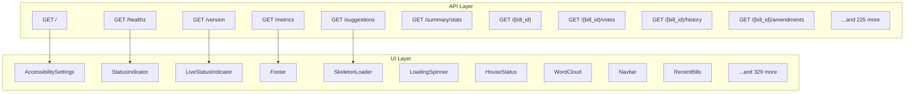

# Routing Realignment Analysis

## Executive Summary

- **Total API Routes**: 235
- **Total UI Components**: 339
- **Total Mappings**: 32
- **Analysis Path**: /workspace

## Endpoint ↔ Component ↔ Screen Mappings

### /{committee_slug}/{session_id}/{number}/

- **API Route**: `GET:/{committee_slug}/{session_id}/{number}/`
- **API File**: `services/api-gateway/app/api/v1/committees.py`
- **Component**: `Bills`
- **Component File**: `services/admin-ui/src/pages/bills/index.tsx`
- **Dependencies**:
  - import:fastapi.Depends
from sqlalchemy.orm import Session as DBSession
from sqlalchemy import text
  - import:fastapi.Bill
  - import:fastapi.page_size=page_size
  - import:fastapi.detail="Committee not found")
    
    # Build query for committee meetings
    query = db.query(CommitteeMeeting).filter(CommitteeMeeting.committee_id == committee_id)
    
    # Apply date filters
    if date__gte:
        try:
            date_gte = datetime.strptime(date__gte
  - import:fastapi.description="Session ID filter (e.g.
  - import:fastapi.Optional
from datetime import date
  - import:fastapi.page_size: int = Query(20
  - import:fastapi.db: DBSession = Depends(get_db)
):
    """
    Get meetings for a specific committee.
    
    Returns a paginated list of committee meetings with optional filtering
    by date range and session ID.
    
    This endpoint implements the committee meetings functionality required by
    checklist item 150.14.
    """
    
    # Verify committee exists
    committee = db.query(Committee).filter(Committee.id == committee_id).first()
    if not committee:
        raise HTTPException(status_code=404
  - function:list_committee_meetings
  - import:fastapi.CommitteeSummary(
            id="2"
  - import:fastapi.ge=1
  - import:fastapi.response_model=MeetingListResponse)
async def list_committee_meetings(
    committee: Optional[str] = Query(None
  - import:fastapi.le=100
  - import:fastapi.datetime
from app.database import get_db
from app.models.openparliament import Vote
  - import:fastapi.description="Date greater than or equal (YYYY-MM-DD)")
  - import:fastapi.db: DBSession = Depends(get_db)
):
    """
    List parliamentary committees with optional filtering.
    
    Based on legacy CommitteeListView functionality.
    Note: This is a simplified version since we don't have a committees table in our current schema.
    """
    
    # For now
  - import:fastapi.detail="Invalid date format. Use YYYY-MM-DD")
    
    # Apply session filter
    if session_id:
        query = query.filter(CommitteeMeeting.session_id == session_id)
    
    # Get total count
    total = query.count()
    # Defensive check for Mock objects during testing
    if str(type(total)) == "<class 'unittest.mock.Mock'>":
        total = 0
    
    # Apply pagination
    offset = (page - 1) * page_size
    meetings = query.order_by(desc(CommitteeMeeting.date)
  - import:fastapi.detail="Committee not found")
    
    committee_detail = CommitteeDetail(
        id="1" if committee_slug == "finance" else "2"
  - import:fastapi.date__lte: Optional[str] = Query(None
  - import:fastapi.MeetingSummary
  - import:fastapi.short_name="FINA"
  - import:fastapi.desc
from typing import List
  - import:fastapi.total=len(committees)
  - import:fastapi.pages=1
    )
    
    return CommitteeListResponse(
        committees=committees
  - import:fastapi.db: DBSession = Depends(get_db)
):
    """
    Get detailed information about a specific committee.
    
    Based on legacy CommitteeView functionality.
    """
    
    # Placeholder implementation - in reality would query committee table
    if committee_slug not in ["finance"
  - import:fastapi.HTTPException
  - import:fastapi.CommitteeDetail
  - import:fastapi.MeetingListResponse
  - import:fastapi.response_model=CommitteeListResponse)
async def list_committees(
    session: Optional[str] = Query(None
  - import:fastapi.name=f"Standing Committee on {committee_slug.title()}"
  - import:fastapi.Member
  - import:fastapi.detail="Invalid date format. Use YYYY-MM-DD")
    
    if date__lte:
        try:
            date_lte = datetime.strptime(date__lte
  - import:fastapi.session_id=meeting.session_id
  - import:fastapi.description="Date less than or equal (YYYY-MM-DD)")
  - import:fastapi.url=f"/api/v1/committees/{committee.slug}/{meeting.session_id}/{meeting.number}/"
        ))
    
    # Calculate pagination
    total_pages = (total + page_size - 1) // page_size if total > 0 else 0
    
    pagination = Pagination(
        page=page
  - import:fastapi.recent_meetings=[]
  - import:fastapi.desc(CommitteeMeeting.number)).offset(offset).limit(page_size).all()
    
    # Defensive check for Mock objects during testing
    if str(type(meetings)) == "<class 'unittest.mock.Mock'>":
        meetings = []
    
    # Convert to response format
    meeting_summaries = []
    for meeting in meetings:
        meeting_summaries.append(MeetingSummary(
            id=str(meeting.id)
  - import:fastapi.and_
  - import:fastapi.committee_name=committee.name_en
  - import:fastapi.active_only: bool = Query(True
  - import:fastapi.has_evidence=meeting.has_evidence
  - import:fastapi.'45-1')")
  - import:fastapi.Party
  - import:fastapi.pages=0
    )
    
    return MeetingListResponse(
        meetings=meetings
  - import:fastapi.pagination=pagination
    )

@router.get("/{committee_slug}/"
  - import:fastapi.total=0
  - import:fastapi.short_name="FINA" if committee_slug == "finance" else "HESA"
  - import:fastapi.name="Standing Committee on Health"
  - import:fastapi.Session
from app.schemas.committees import (
    CommitteeSummary
  - import:fastapi.name="Standing Committee on Finance"
  - import:fastapi.CommitteeDetailResponse
  - import:fastapi.pages=total_pages
    )
    
    return MeetingListResponse(
        meetings=meeting_summaries
  - import:fastapi.db: DBSession = Depends(get_db)
):
    """
    List committee meetings with optional filtering.
    
    Based on legacy CommitteeMeetingListView functionality.
    Note: Simplified version since we don't have committee meeting models.
    """
    
    # Placeholder implementation
    meetings = []
    
    pagination = Pagination(
        page=page
  - import:fastapi.page: int = Query(1
  - import:fastapi.return a placeholder response since we don't have committee models
    # In the real implementation
  - import:fastapi.committee_slug=committee.slug
  - import:fastapi.short_name="HESA"
  - import:fastapi.pagination=pagination
    )
  - import:fastapi.response_model=MeetingListResponse)
async def get_committee_meetings(
    committee_id: int
  - import:fastapi.url=f"/api/v1/committees/{committee_slug}/"
    )
    
    return CommitteeDetailResponse(committee=committee_detail)

@router.get("/meetings/"
  - import:fastapi.date__gte: Optional[str] = Query(None
  - import:fastapi.description="Items per page")
  - import:fastapi.url="/api/v1/committees/health/"
        )
    ]
    
    pagination = Pagination(
        page=page
  - import:fastapi.url="/api/v1/committees/finance/"
        )
  - import:fastapi.Query
  - import:fastapi.total=total
  - import:fastapi.description="Session ID (e.g.
  - import:fastapi.session_id: Optional[str] = Query(None
  - import:fastapi.date=meeting.date.isoformat() if meeting.date else None
  - import:fastapi.member_count=0
  - import:fastapi."%Y-%m-%d").date()
            query = query.filter(CommitteeMeeting.date >= date_gte)
        except ValueError:
            raise HTTPException(status_code=400
  - import:fastapi.number=meeting.number
  - import:fastapi.meeting_count=0
  - import:fastapi.description="Page number")
  - import:fastapi.MeetingDetailResponse
  - import:fastapi.MeetingDetail
  - import:fastapi."health"]:
        raise HTTPException(status_code=404
  - import:fastapi.active=True
  - import:fastapi.response_model=CommitteeDetailResponse)
async def get_committee_detail(
    committee_slug: str
  - import:fastapi.description="Committee slug filter")
  - import:fastapi.pagination=pagination
    )

@router.get("/{committee_id}/meetings"
  - import:fastapi.CommitteeSummaryResponse
)

router = APIRouter()

@router.get("/"
  - import:fastapi.CommitteeListResponse
  - import:fastapi."%Y-%m-%d").date()
            query = query.filter(CommitteeMeeting.date <= date_lte)
        except ValueError:
            raise HTTPException(status_code=400
  - import:fastapi.Pagination
  - import:fastapi.APIRouter
  - import:fastapi.description="Show only active committees")
  - import:fastapi.this would query the committees table
    committees = [
        CommitteeSummary(
            id="1"

### /{committee_slug}/{session_id}/{number}/

- **API Route**: `GET:/{committee_slug}/{session_id}/{number}/`
- **API File**: `services/api-gateway/app/api/v1/committees.py`
- **Component**: `Bills`
- **Component File**: `services/admin-ui/src/pages/bills/index.tsx`
- **Dependencies**:
  - import:fastapi.Depends
from sqlalchemy.orm import Session as DBSession
from sqlalchemy import text
  - import:fastapi.Bill
  - import:fastapi.page_size=page_size
  - import:fastapi.detail="Committee not found")
    
    # Build query for committee meetings
    query = db.query(CommitteeMeeting).filter(CommitteeMeeting.committee_id == committee_id)
    
    # Apply date filters
    if date__gte:
        try:
            date_gte = datetime.strptime(date__gte
  - import:fastapi.description="Session ID filter (e.g.
  - import:fastapi.Optional
from datetime import date
  - import:fastapi.page_size: int = Query(20
  - import:fastapi.db: DBSession = Depends(get_db)
):
    """
    Get meetings for a specific committee.
    
    Returns a paginated list of committee meetings with optional filtering
    by date range and session ID.
    
    This endpoint implements the committee meetings functionality required by
    checklist item 150.14.
    """
    
    # Verify committee exists
    committee = db.query(Committee).filter(Committee.id == committee_id).first()
    if not committee:
        raise HTTPException(status_code=404
  - function:list_committee_meetings
  - import:fastapi.CommitteeSummary(
            id="2"
  - import:fastapi.ge=1
  - import:fastapi.response_model=MeetingListResponse)
async def list_committee_meetings(
    committee: Optional[str] = Query(None
  - import:fastapi.le=100
  - import:fastapi.datetime
from app.database import get_db
from app.models.openparliament import Vote
  - import:fastapi.description="Date greater than or equal (YYYY-MM-DD)")
  - import:fastapi.db: DBSession = Depends(get_db)
):
    """
    List parliamentary committees with optional filtering.
    
    Based on legacy CommitteeListView functionality.
    Note: This is a simplified version since we don't have a committees table in our current schema.
    """
    
    # For now
  - import:fastapi.detail="Invalid date format. Use YYYY-MM-DD")
    
    # Apply session filter
    if session_id:
        query = query.filter(CommitteeMeeting.session_id == session_id)
    
    # Get total count
    total = query.count()
    # Defensive check for Mock objects during testing
    if str(type(total)) == "<class 'unittest.mock.Mock'>":
        total = 0
    
    # Apply pagination
    offset = (page - 1) * page_size
    meetings = query.order_by(desc(CommitteeMeeting.date)
  - import:fastapi.detail="Committee not found")
    
    committee_detail = CommitteeDetail(
        id="1" if committee_slug == "finance" else "2"
  - import:fastapi.date__lte: Optional[str] = Query(None
  - import:fastapi.MeetingSummary
  - import:fastapi.short_name="FINA"
  - import:fastapi.desc
from typing import List
  - import:fastapi.total=len(committees)
  - import:fastapi.pages=1
    )
    
    return CommitteeListResponse(
        committees=committees
  - import:fastapi.db: DBSession = Depends(get_db)
):
    """
    Get detailed information about a specific committee.
    
    Based on legacy CommitteeView functionality.
    """
    
    # Placeholder implementation - in reality would query committee table
    if committee_slug not in ["finance"
  - import:fastapi.HTTPException
  - import:fastapi.CommitteeDetail
  - import:fastapi.MeetingListResponse
  - import:fastapi.response_model=CommitteeListResponse)
async def list_committees(
    session: Optional[str] = Query(None
  - import:fastapi.name=f"Standing Committee on {committee_slug.title()}"
  - import:fastapi.Member
  - import:fastapi.detail="Invalid date format. Use YYYY-MM-DD")
    
    if date__lte:
        try:
            date_lte = datetime.strptime(date__lte
  - import:fastapi.session_id=meeting.session_id
  - import:fastapi.description="Date less than or equal (YYYY-MM-DD)")
  - import:fastapi.url=f"/api/v1/committees/{committee.slug}/{meeting.session_id}/{meeting.number}/"
        ))
    
    # Calculate pagination
    total_pages = (total + page_size - 1) // page_size if total > 0 else 0
    
    pagination = Pagination(
        page=page
  - import:fastapi.recent_meetings=[]
  - import:fastapi.desc(CommitteeMeeting.number)).offset(offset).limit(page_size).all()
    
    # Defensive check for Mock objects during testing
    if str(type(meetings)) == "<class 'unittest.mock.Mock'>":
        meetings = []
    
    # Convert to response format
    meeting_summaries = []
    for meeting in meetings:
        meeting_summaries.append(MeetingSummary(
            id=str(meeting.id)
  - import:fastapi.and_
  - import:fastapi.committee_name=committee.name_en
  - import:fastapi.active_only: bool = Query(True
  - import:fastapi.has_evidence=meeting.has_evidence
  - import:fastapi.'45-1')")
  - import:fastapi.Party
  - import:fastapi.pages=0
    )
    
    return MeetingListResponse(
        meetings=meetings
  - import:fastapi.pagination=pagination
    )

@router.get("/{committee_slug}/"
  - import:fastapi.total=0
  - import:fastapi.short_name="FINA" if committee_slug == "finance" else "HESA"
  - import:fastapi.name="Standing Committee on Health"
  - import:fastapi.Session
from app.schemas.committees import (
    CommitteeSummary
  - import:fastapi.name="Standing Committee on Finance"
  - import:fastapi.CommitteeDetailResponse
  - import:fastapi.pages=total_pages
    )
    
    return MeetingListResponse(
        meetings=meeting_summaries
  - import:fastapi.db: DBSession = Depends(get_db)
):
    """
    List committee meetings with optional filtering.
    
    Based on legacy CommitteeMeetingListView functionality.
    Note: Simplified version since we don't have committee meeting models.
    """
    
    # Placeholder implementation
    meetings = []
    
    pagination = Pagination(
        page=page
  - import:fastapi.page: int = Query(1
  - import:fastapi.return a placeholder response since we don't have committee models
    # In the real implementation
  - import:fastapi.committee_slug=committee.slug
  - import:fastapi.short_name="HESA"
  - import:fastapi.pagination=pagination
    )
  - import:fastapi.response_model=MeetingListResponse)
async def get_committee_meetings(
    committee_id: int
  - import:fastapi.url=f"/api/v1/committees/{committee_slug}/"
    )
    
    return CommitteeDetailResponse(committee=committee_detail)

@router.get("/meetings/"
  - import:fastapi.date__gte: Optional[str] = Query(None
  - import:fastapi.description="Items per page")
  - import:fastapi.url="/api/v1/committees/health/"
        )
    ]
    
    pagination = Pagination(
        page=page
  - import:fastapi.url="/api/v1/committees/finance/"
        )
  - import:fastapi.Query
  - import:fastapi.total=total
  - import:fastapi.description="Session ID (e.g.
  - import:fastapi.session_id: Optional[str] = Query(None
  - import:fastapi.date=meeting.date.isoformat() if meeting.date else None
  - import:fastapi.member_count=0
  - import:fastapi."%Y-%m-%d").date()
            query = query.filter(CommitteeMeeting.date >= date_gte)
        except ValueError:
            raise HTTPException(status_code=400
  - import:fastapi.number=meeting.number
  - import:fastapi.meeting_count=0
  - import:fastapi.description="Page number")
  - import:fastapi.MeetingDetailResponse
  - import:fastapi.MeetingDetail
  - import:fastapi."health"]:
        raise HTTPException(status_code=404
  - import:fastapi.active=True
  - import:fastapi.response_model=CommitteeDetailResponse)
async def get_committee_detail(
    committee_slug: str
  - import:fastapi.description="Committee slug filter")
  - import:fastapi.pagination=pagination
    )

@router.get("/{committee_id}/meetings"
  - import:fastapi.CommitteeSummaryResponse
)

router = APIRouter()

@router.get("/"
  - import:fastapi.CommitteeListResponse
  - import:fastapi."%Y-%m-%d").date()
            query = query.filter(CommitteeMeeting.date <= date_lte)
        except ValueError:
            raise HTTPException(status_code=400
  - import:fastapi.Pagination
  - import:fastapi.APIRouter
  - import:fastapi.description="Show only active committees")
  - import:fastapi.this would query the committees table
    committees = [
        CommitteeSummary(
            id="1"

### /{committee_slug}/{session_id}/{number}/

- **API Route**: `GET:/{committee_slug}/{session_id}/{number}/`
- **API File**: `services/api-gateway/app/api/v1/committees.py`
- **Component**: `Debates`
- **Component File**: `services/admin-ui/src/pages/debates/index.tsx`
- **Dependencies**:
  - import:fastapi.Depends
from sqlalchemy.orm import Session as DBSession
from sqlalchemy import text
  - import:fastapi.Bill
  - import:fastapi.page_size=page_size
  - import:fastapi.detail="Committee not found")
    
    # Build query for committee meetings
    query = db.query(CommitteeMeeting).filter(CommitteeMeeting.committee_id == committee_id)
    
    # Apply date filters
    if date__gte:
        try:
            date_gte = datetime.strptime(date__gte
  - import:fastapi.description="Session ID filter (e.g.
  - import:fastapi.Optional
from datetime import date
  - import:fastapi.page_size: int = Query(20
  - import:fastapi.db: DBSession = Depends(get_db)
):
    """
    Get meetings for a specific committee.
    
    Returns a paginated list of committee meetings with optional filtering
    by date range and session ID.
    
    This endpoint implements the committee meetings functionality required by
    checklist item 150.14.
    """
    
    # Verify committee exists
    committee = db.query(Committee).filter(Committee.id == committee_id).first()
    if not committee:
        raise HTTPException(status_code=404
  - function:list_committee_meetings
  - import:fastapi.CommitteeSummary(
            id="2"
  - import:fastapi.ge=1
  - import:fastapi.response_model=MeetingListResponse)
async def list_committee_meetings(
    committee: Optional[str] = Query(None
  - import:fastapi.le=100
  - import:fastapi.datetime
from app.database import get_db
from app.models.openparliament import Vote
  - import:fastapi.description="Date greater than or equal (YYYY-MM-DD)")
  - import:fastapi.db: DBSession = Depends(get_db)
):
    """
    List parliamentary committees with optional filtering.
    
    Based on legacy CommitteeListView functionality.
    Note: This is a simplified version since we don't have a committees table in our current schema.
    """
    
    # For now
  - import:fastapi.detail="Invalid date format. Use YYYY-MM-DD")
    
    # Apply session filter
    if session_id:
        query = query.filter(CommitteeMeeting.session_id == session_id)
    
    # Get total count
    total = query.count()
    # Defensive check for Mock objects during testing
    if str(type(total)) == "<class 'unittest.mock.Mock'>":
        total = 0
    
    # Apply pagination
    offset = (page - 1) * page_size
    meetings = query.order_by(desc(CommitteeMeeting.date)
  - import:fastapi.detail="Committee not found")
    
    committee_detail = CommitteeDetail(
        id="1" if committee_slug == "finance" else "2"
  - import:fastapi.date__lte: Optional[str] = Query(None
  - import:fastapi.MeetingSummary
  - import:fastapi.short_name="FINA"
  - import:fastapi.desc
from typing import List
  - import:fastapi.total=len(committees)
  - import:fastapi.pages=1
    )
    
    return CommitteeListResponse(
        committees=committees
  - import:fastapi.db: DBSession = Depends(get_db)
):
    """
    Get detailed information about a specific committee.
    
    Based on legacy CommitteeView functionality.
    """
    
    # Placeholder implementation - in reality would query committee table
    if committee_slug not in ["finance"
  - import:fastapi.HTTPException
  - import:fastapi.CommitteeDetail
  - import:fastapi.MeetingListResponse
  - import:fastapi.response_model=CommitteeListResponse)
async def list_committees(
    session: Optional[str] = Query(None
  - import:fastapi.name=f"Standing Committee on {committee_slug.title()}"
  - import:fastapi.Member
  - import:fastapi.detail="Invalid date format. Use YYYY-MM-DD")
    
    if date__lte:
        try:
            date_lte = datetime.strptime(date__lte
  - import:fastapi.session_id=meeting.session_id
  - import:fastapi.description="Date less than or equal (YYYY-MM-DD)")
  - import:fastapi.url=f"/api/v1/committees/{committee.slug}/{meeting.session_id}/{meeting.number}/"
        ))
    
    # Calculate pagination
    total_pages = (total + page_size - 1) // page_size if total > 0 else 0
    
    pagination = Pagination(
        page=page
  - import:fastapi.recent_meetings=[]
  - import:fastapi.desc(CommitteeMeeting.number)).offset(offset).limit(page_size).all()
    
    # Defensive check for Mock objects during testing
    if str(type(meetings)) == "<class 'unittest.mock.Mock'>":
        meetings = []
    
    # Convert to response format
    meeting_summaries = []
    for meeting in meetings:
        meeting_summaries.append(MeetingSummary(
            id=str(meeting.id)
  - import:fastapi.and_
  - import:fastapi.committee_name=committee.name_en
  - import:fastapi.active_only: bool = Query(True
  - import:fastapi.has_evidence=meeting.has_evidence
  - import:fastapi.'45-1')")
  - import:fastapi.Party
  - import:fastapi.pages=0
    )
    
    return MeetingListResponse(
        meetings=meetings
  - import:fastapi.pagination=pagination
    )

@router.get("/{committee_slug}/"
  - import:fastapi.total=0
  - import:fastapi.short_name="FINA" if committee_slug == "finance" else "HESA"
  - import:fastapi.name="Standing Committee on Health"
  - import:fastapi.Session
from app.schemas.committees import (
    CommitteeSummary
  - import:fastapi.name="Standing Committee on Finance"
  - import:fastapi.CommitteeDetailResponse
  - import:fastapi.pages=total_pages
    )
    
    return MeetingListResponse(
        meetings=meeting_summaries
  - import:fastapi.db: DBSession = Depends(get_db)
):
    """
    List committee meetings with optional filtering.
    
    Based on legacy CommitteeMeetingListView functionality.
    Note: Simplified version since we don't have committee meeting models.
    """
    
    # Placeholder implementation
    meetings = []
    
    pagination = Pagination(
        page=page
  - import:fastapi.page: int = Query(1
  - import:fastapi.return a placeholder response since we don't have committee models
    # In the real implementation
  - import:fastapi.committee_slug=committee.slug
  - import:fastapi.short_name="HESA"
  - import:fastapi.pagination=pagination
    )
  - import:fastapi.response_model=MeetingListResponse)
async def get_committee_meetings(
    committee_id: int
  - import:fastapi.url=f"/api/v1/committees/{committee_slug}/"
    )
    
    return CommitteeDetailResponse(committee=committee_detail)

@router.get("/meetings/"
  - import:fastapi.date__gte: Optional[str] = Query(None
  - import:fastapi.description="Items per page")
  - import:fastapi.url="/api/v1/committees/health/"
        )
    ]
    
    pagination = Pagination(
        page=page
  - import:fastapi.url="/api/v1/committees/finance/"
        )
  - import:fastapi.Query
  - import:fastapi.total=total
  - import:fastapi.description="Session ID (e.g.
  - import:fastapi.session_id: Optional[str] = Query(None
  - import:fastapi.date=meeting.date.isoformat() if meeting.date else None
  - import:fastapi.member_count=0
  - import:fastapi."%Y-%m-%d").date()
            query = query.filter(CommitteeMeeting.date >= date_gte)
        except ValueError:
            raise HTTPException(status_code=400
  - import:fastapi.number=meeting.number
  - import:fastapi.meeting_count=0
  - import:fastapi.description="Page number")
  - import:fastapi.MeetingDetailResponse
  - import:fastapi.MeetingDetail
  - import:fastapi."health"]:
        raise HTTPException(status_code=404
  - import:fastapi.active=True
  - import:fastapi.response_model=CommitteeDetailResponse)
async def get_committee_detail(
    committee_slug: str
  - import:fastapi.description="Committee slug filter")
  - import:fastapi.pagination=pagination
    )

@router.get("/{committee_id}/meetings"
  - import:fastapi.CommitteeSummaryResponse
)

router = APIRouter()

@router.get("/"
  - import:fastapi.CommitteeListResponse
  - import:fastapi."%Y-%m-%d").date()
            query = query.filter(CommitteeMeeting.date <= date_lte)
        except ValueError:
            raise HTTPException(status_code=400
  - import:fastapi.Pagination
  - import:fastapi.APIRouter
  - import:fastapi.description="Show only active committees")
  - import:fastapi.this would query the committees table
    committees = [
        CommitteeSummary(
            id="1"

### /{committee_slug}/{session_id}/{number}/

- **API Route**: `GET:/{committee_slug}/{session_id}/{number}/`
- **API File**: `services/api-gateway/app/api/v1/committees.py`
- **Component**: `Debates`
- **Component File**: `services/admin-ui/src/pages/debates/index.tsx`
- **Dependencies**:
  - import:fastapi.Depends
from sqlalchemy.orm import Session as DBSession
from sqlalchemy import text
  - import:fastapi.Bill
  - import:fastapi.page_size=page_size
  - import:fastapi.detail="Committee not found")
    
    # Build query for committee meetings
    query = db.query(CommitteeMeeting).filter(CommitteeMeeting.committee_id == committee_id)
    
    # Apply date filters
    if date__gte:
        try:
            date_gte = datetime.strptime(date__gte
  - import:fastapi.description="Session ID filter (e.g.
  - import:fastapi.Optional
from datetime import date
  - import:fastapi.page_size: int = Query(20
  - import:fastapi.db: DBSession = Depends(get_db)
):
    """
    Get meetings for a specific committee.
    
    Returns a paginated list of committee meetings with optional filtering
    by date range and session ID.
    
    This endpoint implements the committee meetings functionality required by
    checklist item 150.14.
    """
    
    # Verify committee exists
    committee = db.query(Committee).filter(Committee.id == committee_id).first()
    if not committee:
        raise HTTPException(status_code=404
  - function:list_committee_meetings
  - import:fastapi.CommitteeSummary(
            id="2"
  - import:fastapi.ge=1
  - import:fastapi.response_model=MeetingListResponse)
async def list_committee_meetings(
    committee: Optional[str] = Query(None
  - import:fastapi.le=100
  - import:fastapi.datetime
from app.database import get_db
from app.models.openparliament import Vote
  - import:fastapi.description="Date greater than or equal (YYYY-MM-DD)")
  - import:fastapi.db: DBSession = Depends(get_db)
):
    """
    List parliamentary committees with optional filtering.
    
    Based on legacy CommitteeListView functionality.
    Note: This is a simplified version since we don't have a committees table in our current schema.
    """
    
    # For now
  - import:fastapi.detail="Invalid date format. Use YYYY-MM-DD")
    
    # Apply session filter
    if session_id:
        query = query.filter(CommitteeMeeting.session_id == session_id)
    
    # Get total count
    total = query.count()
    # Defensive check for Mock objects during testing
    if str(type(total)) == "<class 'unittest.mock.Mock'>":
        total = 0
    
    # Apply pagination
    offset = (page - 1) * page_size
    meetings = query.order_by(desc(CommitteeMeeting.date)
  - import:fastapi.detail="Committee not found")
    
    committee_detail = CommitteeDetail(
        id="1" if committee_slug == "finance" else "2"
  - import:fastapi.date__lte: Optional[str] = Query(None
  - import:fastapi.MeetingSummary
  - import:fastapi.short_name="FINA"
  - import:fastapi.desc
from typing import List
  - import:fastapi.total=len(committees)
  - import:fastapi.pages=1
    )
    
    return CommitteeListResponse(
        committees=committees
  - import:fastapi.db: DBSession = Depends(get_db)
):
    """
    Get detailed information about a specific committee.
    
    Based on legacy CommitteeView functionality.
    """
    
    # Placeholder implementation - in reality would query committee table
    if committee_slug not in ["finance"
  - import:fastapi.HTTPException
  - import:fastapi.CommitteeDetail
  - import:fastapi.MeetingListResponse
  - import:fastapi.response_model=CommitteeListResponse)
async def list_committees(
    session: Optional[str] = Query(None
  - import:fastapi.name=f"Standing Committee on {committee_slug.title()}"
  - import:fastapi.Member
  - import:fastapi.detail="Invalid date format. Use YYYY-MM-DD")
    
    if date__lte:
        try:
            date_lte = datetime.strptime(date__lte
  - import:fastapi.session_id=meeting.session_id
  - import:fastapi.description="Date less than or equal (YYYY-MM-DD)")
  - import:fastapi.url=f"/api/v1/committees/{committee.slug}/{meeting.session_id}/{meeting.number}/"
        ))
    
    # Calculate pagination
    total_pages = (total + page_size - 1) // page_size if total > 0 else 0
    
    pagination = Pagination(
        page=page
  - import:fastapi.recent_meetings=[]
  - import:fastapi.desc(CommitteeMeeting.number)).offset(offset).limit(page_size).all()
    
    # Defensive check for Mock objects during testing
    if str(type(meetings)) == "<class 'unittest.mock.Mock'>":
        meetings = []
    
    # Convert to response format
    meeting_summaries = []
    for meeting in meetings:
        meeting_summaries.append(MeetingSummary(
            id=str(meeting.id)
  - import:fastapi.and_
  - import:fastapi.committee_name=committee.name_en
  - import:fastapi.active_only: bool = Query(True
  - import:fastapi.has_evidence=meeting.has_evidence
  - import:fastapi.'45-1')")
  - import:fastapi.Party
  - import:fastapi.pages=0
    )
    
    return MeetingListResponse(
        meetings=meetings
  - import:fastapi.pagination=pagination
    )

@router.get("/{committee_slug}/"
  - import:fastapi.total=0
  - import:fastapi.short_name="FINA" if committee_slug == "finance" else "HESA"
  - import:fastapi.name="Standing Committee on Health"
  - import:fastapi.Session
from app.schemas.committees import (
    CommitteeSummary
  - import:fastapi.name="Standing Committee on Finance"
  - import:fastapi.CommitteeDetailResponse
  - import:fastapi.pages=total_pages
    )
    
    return MeetingListResponse(
        meetings=meeting_summaries
  - import:fastapi.db: DBSession = Depends(get_db)
):
    """
    List committee meetings with optional filtering.
    
    Based on legacy CommitteeMeetingListView functionality.
    Note: Simplified version since we don't have committee meeting models.
    """
    
    # Placeholder implementation
    meetings = []
    
    pagination = Pagination(
        page=page
  - import:fastapi.page: int = Query(1
  - import:fastapi.return a placeholder response since we don't have committee models
    # In the real implementation
  - import:fastapi.committee_slug=committee.slug
  - import:fastapi.short_name="HESA"
  - import:fastapi.pagination=pagination
    )
  - import:fastapi.response_model=MeetingListResponse)
async def get_committee_meetings(
    committee_id: int
  - import:fastapi.url=f"/api/v1/committees/{committee_slug}/"
    )
    
    return CommitteeDetailResponse(committee=committee_detail)

@router.get("/meetings/"
  - import:fastapi.date__gte: Optional[str] = Query(None
  - import:fastapi.description="Items per page")
  - import:fastapi.url="/api/v1/committees/health/"
        )
    ]
    
    pagination = Pagination(
        page=page
  - import:fastapi.url="/api/v1/committees/finance/"
        )
  - import:fastapi.Query
  - import:fastapi.total=total
  - import:fastapi.description="Session ID (e.g.
  - import:fastapi.session_id: Optional[str] = Query(None
  - import:fastapi.date=meeting.date.isoformat() if meeting.date else None
  - import:fastapi.member_count=0
  - import:fastapi."%Y-%m-%d").date()
            query = query.filter(CommitteeMeeting.date >= date_gte)
        except ValueError:
            raise HTTPException(status_code=400
  - import:fastapi.number=meeting.number
  - import:fastapi.meeting_count=0
  - import:fastapi.description="Page number")
  - import:fastapi.MeetingDetailResponse
  - import:fastapi.MeetingDetail
  - import:fastapi."health"]:
        raise HTTPException(status_code=404
  - import:fastapi.active=True
  - import:fastapi.response_model=CommitteeDetailResponse)
async def get_committee_detail(
    committee_slug: str
  - import:fastapi.description="Committee slug filter")
  - import:fastapi.pagination=pagination
    )

@router.get("/{committee_id}/meetings"
  - import:fastapi.CommitteeSummaryResponse
)

router = APIRouter()

@router.get("/"
  - import:fastapi.CommitteeListResponse
  - import:fastapi."%Y-%m-%d").date()
            query = query.filter(CommitteeMeeting.date <= date_lte)
        except ValueError:
            raise HTTPException(status_code=400
  - import:fastapi.Pagination
  - import:fastapi.APIRouter
  - import:fastapi.description="Show only active committees")
  - import:fastapi.this would query the committees table
    committees = [
        CommitteeSummary(
            id="1"

### /{committee_slug}/{session_id}/{number}/

- **API Route**: `GET:/{committee_slug}/{session_id}/{number}/`
- **API File**: `services/api-gateway/app/api/v1/committees.py`
- **Component**: `Debates`
- **Component File**: `services/admin-ui/src/pages/debates/index.tsx`
- **Dependencies**:
  - import:fastapi.Depends
from sqlalchemy.orm import Session as DBSession
from sqlalchemy import text
  - import:fastapi.Bill
  - import:fastapi.page_size=page_size
  - import:fastapi.detail="Committee not found")
    
    # Build query for committee meetings
    query = db.query(CommitteeMeeting).filter(CommitteeMeeting.committee_id == committee_id)
    
    # Apply date filters
    if date__gte:
        try:
            date_gte = datetime.strptime(date__gte
  - import:fastapi.description="Session ID filter (e.g.
  - import:fastapi.Optional
from datetime import date
  - import:fastapi.page_size: int = Query(20
  - import:fastapi.db: DBSession = Depends(get_db)
):
    """
    Get meetings for a specific committee.
    
    Returns a paginated list of committee meetings with optional filtering
    by date range and session ID.
    
    This endpoint implements the committee meetings functionality required by
    checklist item 150.14.
    """
    
    # Verify committee exists
    committee = db.query(Committee).filter(Committee.id == committee_id).first()
    if not committee:
        raise HTTPException(status_code=404
  - function:list_committee_meetings
  - import:fastapi.CommitteeSummary(
            id="2"
  - import:fastapi.ge=1
  - import:fastapi.response_model=MeetingListResponse)
async def list_committee_meetings(
    committee: Optional[str] = Query(None
  - import:fastapi.le=100
  - import:fastapi.datetime
from app.database import get_db
from app.models.openparliament import Vote
  - import:fastapi.description="Date greater than or equal (YYYY-MM-DD)")
  - import:fastapi.db: DBSession = Depends(get_db)
):
    """
    List parliamentary committees with optional filtering.
    
    Based on legacy CommitteeListView functionality.
    Note: This is a simplified version since we don't have a committees table in our current schema.
    """
    
    # For now
  - import:fastapi.detail="Invalid date format. Use YYYY-MM-DD")
    
    # Apply session filter
    if session_id:
        query = query.filter(CommitteeMeeting.session_id == session_id)
    
    # Get total count
    total = query.count()
    # Defensive check for Mock objects during testing
    if str(type(total)) == "<class 'unittest.mock.Mock'>":
        total = 0
    
    # Apply pagination
    offset = (page - 1) * page_size
    meetings = query.order_by(desc(CommitteeMeeting.date)
  - import:fastapi.detail="Committee not found")
    
    committee_detail = CommitteeDetail(
        id="1" if committee_slug == "finance" else "2"
  - import:fastapi.date__lte: Optional[str] = Query(None
  - import:fastapi.MeetingSummary
  - import:fastapi.short_name="FINA"
  - import:fastapi.desc
from typing import List
  - import:fastapi.total=len(committees)
  - import:fastapi.pages=1
    )
    
    return CommitteeListResponse(
        committees=committees
  - import:fastapi.db: DBSession = Depends(get_db)
):
    """
    Get detailed information about a specific committee.
    
    Based on legacy CommitteeView functionality.
    """
    
    # Placeholder implementation - in reality would query committee table
    if committee_slug not in ["finance"
  - import:fastapi.HTTPException
  - import:fastapi.CommitteeDetail
  - import:fastapi.MeetingListResponse
  - import:fastapi.response_model=CommitteeListResponse)
async def list_committees(
    session: Optional[str] = Query(None
  - import:fastapi.name=f"Standing Committee on {committee_slug.title()}"
  - import:fastapi.Member
  - import:fastapi.detail="Invalid date format. Use YYYY-MM-DD")
    
    if date__lte:
        try:
            date_lte = datetime.strptime(date__lte
  - import:fastapi.session_id=meeting.session_id
  - import:fastapi.description="Date less than or equal (YYYY-MM-DD)")
  - import:fastapi.url=f"/api/v1/committees/{committee.slug}/{meeting.session_id}/{meeting.number}/"
        ))
    
    # Calculate pagination
    total_pages = (total + page_size - 1) // page_size if total > 0 else 0
    
    pagination = Pagination(
        page=page
  - import:fastapi.recent_meetings=[]
  - import:fastapi.desc(CommitteeMeeting.number)).offset(offset).limit(page_size).all()
    
    # Defensive check for Mock objects during testing
    if str(type(meetings)) == "<class 'unittest.mock.Mock'>":
        meetings = []
    
    # Convert to response format
    meeting_summaries = []
    for meeting in meetings:
        meeting_summaries.append(MeetingSummary(
            id=str(meeting.id)
  - import:fastapi.and_
  - import:fastapi.committee_name=committee.name_en
  - import:fastapi.active_only: bool = Query(True
  - import:fastapi.has_evidence=meeting.has_evidence
  - import:fastapi.'45-1')")
  - import:fastapi.Party
  - import:fastapi.pages=0
    )
    
    return MeetingListResponse(
        meetings=meetings
  - import:fastapi.pagination=pagination
    )

@router.get("/{committee_slug}/"
  - import:fastapi.total=0
  - import:fastapi.short_name="FINA" if committee_slug == "finance" else "HESA"
  - import:fastapi.name="Standing Committee on Health"
  - import:fastapi.Session
from app.schemas.committees import (
    CommitteeSummary
  - import:fastapi.name="Standing Committee on Finance"
  - import:fastapi.CommitteeDetailResponse
  - import:fastapi.pages=total_pages
    )
    
    return MeetingListResponse(
        meetings=meeting_summaries
  - import:fastapi.db: DBSession = Depends(get_db)
):
    """
    List committee meetings with optional filtering.
    
    Based on legacy CommitteeMeetingListView functionality.
    Note: Simplified version since we don't have committee meeting models.
    """
    
    # Placeholder implementation
    meetings = []
    
    pagination = Pagination(
        page=page
  - import:fastapi.page: int = Query(1
  - import:fastapi.return a placeholder response since we don't have committee models
    # In the real implementation
  - import:fastapi.committee_slug=committee.slug
  - import:fastapi.short_name="HESA"
  - import:fastapi.pagination=pagination
    )
  - import:fastapi.response_model=MeetingListResponse)
async def get_committee_meetings(
    committee_id: int
  - import:fastapi.url=f"/api/v1/committees/{committee_slug}/"
    )
    
    return CommitteeDetailResponse(committee=committee_detail)

@router.get("/meetings/"
  - import:fastapi.date__gte: Optional[str] = Query(None
  - import:fastapi.description="Items per page")
  - import:fastapi.url="/api/v1/committees/health/"
        )
    ]
    
    pagination = Pagination(
        page=page
  - import:fastapi.url="/api/v1/committees/finance/"
        )
  - import:fastapi.Query
  - import:fastapi.total=total
  - import:fastapi.description="Session ID (e.g.
  - import:fastapi.session_id: Optional[str] = Query(None
  - import:fastapi.date=meeting.date.isoformat() if meeting.date else None
  - import:fastapi.member_count=0
  - import:fastapi."%Y-%m-%d").date()
            query = query.filter(CommitteeMeeting.date >= date_gte)
        except ValueError:
            raise HTTPException(status_code=400
  - import:fastapi.number=meeting.number
  - import:fastapi.meeting_count=0
  - import:fastapi.description="Page number")
  - import:fastapi.MeetingDetailResponse
  - import:fastapi.MeetingDetail
  - import:fastapi."health"]:
        raise HTTPException(status_code=404
  - import:fastapi.active=True
  - import:fastapi.response_model=CommitteeDetailResponse)
async def get_committee_detail(
    committee_slug: str
  - import:fastapi.description="Committee slug filter")
  - import:fastapi.pagination=pagination
    )

@router.get("/{committee_id}/meetings"
  - import:fastapi.CommitteeSummaryResponse
)

router = APIRouter()

@router.get("/"
  - import:fastapi.CommitteeListResponse
  - import:fastapi."%Y-%m-%d").date()
            query = query.filter(CommitteeMeeting.date <= date_lte)
        except ValueError:
            raise HTTPException(status_code=400
  - import:fastapi.Pagination
  - import:fastapi.APIRouter
  - import:fastapi.description="Show only active committees")
  - import:fastapi.this would query the committees table
    committees = [
        CommitteeSummary(
            id="1"

### /{committee_slug}/{session_id}/{number}/

- **API Route**: `GET:/{committee_slug}/{session_id}/{number}/`
- **API File**: `services/api-gateway/app/api/v1/committees.py`
- **Component**: `Debates`
- **Component File**: `services/admin-ui/src/pages/debates/index.tsx`
- **Dependencies**:
  - import:fastapi.Depends
from sqlalchemy.orm import Session as DBSession
from sqlalchemy import text
  - import:fastapi.Bill
  - import:fastapi.page_size=page_size
  - import:fastapi.detail="Committee not found")
    
    # Build query for committee meetings
    query = db.query(CommitteeMeeting).filter(CommitteeMeeting.committee_id == committee_id)
    
    # Apply date filters
    if date__gte:
        try:
            date_gte = datetime.strptime(date__gte
  - import:fastapi.description="Session ID filter (e.g.
  - import:fastapi.Optional
from datetime import date
  - import:fastapi.page_size: int = Query(20
  - import:fastapi.db: DBSession = Depends(get_db)
):
    """
    Get meetings for a specific committee.
    
    Returns a paginated list of committee meetings with optional filtering
    by date range and session ID.
    
    This endpoint implements the committee meetings functionality required by
    checklist item 150.14.
    """
    
    # Verify committee exists
    committee = db.query(Committee).filter(Committee.id == committee_id).first()
    if not committee:
        raise HTTPException(status_code=404
  - function:list_committee_meetings
  - import:fastapi.CommitteeSummary(
            id="2"
  - import:fastapi.ge=1
  - import:fastapi.response_model=MeetingListResponse)
async def list_committee_meetings(
    committee: Optional[str] = Query(None
  - import:fastapi.le=100
  - import:fastapi.datetime
from app.database import get_db
from app.models.openparliament import Vote
  - import:fastapi.description="Date greater than or equal (YYYY-MM-DD)")
  - import:fastapi.db: DBSession = Depends(get_db)
):
    """
    List parliamentary committees with optional filtering.
    
    Based on legacy CommitteeListView functionality.
    Note: This is a simplified version since we don't have a committees table in our current schema.
    """
    
    # For now
  - import:fastapi.detail="Invalid date format. Use YYYY-MM-DD")
    
    # Apply session filter
    if session_id:
        query = query.filter(CommitteeMeeting.session_id == session_id)
    
    # Get total count
    total = query.count()
    # Defensive check for Mock objects during testing
    if str(type(total)) == "<class 'unittest.mock.Mock'>":
        total = 0
    
    # Apply pagination
    offset = (page - 1) * page_size
    meetings = query.order_by(desc(CommitteeMeeting.date)
  - import:fastapi.detail="Committee not found")
    
    committee_detail = CommitteeDetail(
        id="1" if committee_slug == "finance" else "2"
  - import:fastapi.date__lte: Optional[str] = Query(None
  - import:fastapi.MeetingSummary
  - import:fastapi.short_name="FINA"
  - import:fastapi.desc
from typing import List
  - import:fastapi.total=len(committees)
  - import:fastapi.pages=1
    )
    
    return CommitteeListResponse(
        committees=committees
  - import:fastapi.db: DBSession = Depends(get_db)
):
    """
    Get detailed information about a specific committee.
    
    Based on legacy CommitteeView functionality.
    """
    
    # Placeholder implementation - in reality would query committee table
    if committee_slug not in ["finance"
  - import:fastapi.HTTPException
  - import:fastapi.CommitteeDetail
  - import:fastapi.MeetingListResponse
  - import:fastapi.response_model=CommitteeListResponse)
async def list_committees(
    session: Optional[str] = Query(None
  - import:fastapi.name=f"Standing Committee on {committee_slug.title()}"
  - import:fastapi.Member
  - import:fastapi.detail="Invalid date format. Use YYYY-MM-DD")
    
    if date__lte:
        try:
            date_lte = datetime.strptime(date__lte
  - import:fastapi.session_id=meeting.session_id
  - import:fastapi.description="Date less than or equal (YYYY-MM-DD)")
  - import:fastapi.url=f"/api/v1/committees/{committee.slug}/{meeting.session_id}/{meeting.number}/"
        ))
    
    # Calculate pagination
    total_pages = (total + page_size - 1) // page_size if total > 0 else 0
    
    pagination = Pagination(
        page=page
  - import:fastapi.recent_meetings=[]
  - import:fastapi.desc(CommitteeMeeting.number)).offset(offset).limit(page_size).all()
    
    # Defensive check for Mock objects during testing
    if str(type(meetings)) == "<class 'unittest.mock.Mock'>":
        meetings = []
    
    # Convert to response format
    meeting_summaries = []
    for meeting in meetings:
        meeting_summaries.append(MeetingSummary(
            id=str(meeting.id)
  - import:fastapi.and_
  - import:fastapi.committee_name=committee.name_en
  - import:fastapi.active_only: bool = Query(True
  - import:fastapi.has_evidence=meeting.has_evidence
  - import:fastapi.'45-1')")
  - import:fastapi.Party
  - import:fastapi.pages=0
    )
    
    return MeetingListResponse(
        meetings=meetings
  - import:fastapi.pagination=pagination
    )

@router.get("/{committee_slug}/"
  - import:fastapi.total=0
  - import:fastapi.short_name="FINA" if committee_slug == "finance" else "HESA"
  - import:fastapi.name="Standing Committee on Health"
  - import:fastapi.Session
from app.schemas.committees import (
    CommitteeSummary
  - import:fastapi.name="Standing Committee on Finance"
  - import:fastapi.CommitteeDetailResponse
  - import:fastapi.pages=total_pages
    )
    
    return MeetingListResponse(
        meetings=meeting_summaries
  - import:fastapi.db: DBSession = Depends(get_db)
):
    """
    List committee meetings with optional filtering.
    
    Based on legacy CommitteeMeetingListView functionality.
    Note: Simplified version since we don't have committee meeting models.
    """
    
    # Placeholder implementation
    meetings = []
    
    pagination = Pagination(
        page=page
  - import:fastapi.page: int = Query(1
  - import:fastapi.return a placeholder response since we don't have committee models
    # In the real implementation
  - import:fastapi.committee_slug=committee.slug
  - import:fastapi.short_name="HESA"
  - import:fastapi.pagination=pagination
    )
  - import:fastapi.response_model=MeetingListResponse)
async def get_committee_meetings(
    committee_id: int
  - import:fastapi.url=f"/api/v1/committees/{committee_slug}/"
    )
    
    return CommitteeDetailResponse(committee=committee_detail)

@router.get("/meetings/"
  - import:fastapi.date__gte: Optional[str] = Query(None
  - import:fastapi.description="Items per page")
  - import:fastapi.url="/api/v1/committees/health/"
        )
    ]
    
    pagination = Pagination(
        page=page
  - import:fastapi.url="/api/v1/committees/finance/"
        )
  - import:fastapi.Query
  - import:fastapi.total=total
  - import:fastapi.description="Session ID (e.g.
  - import:fastapi.session_id: Optional[str] = Query(None
  - import:fastapi.date=meeting.date.isoformat() if meeting.date else None
  - import:fastapi.member_count=0
  - import:fastapi."%Y-%m-%d").date()
            query = query.filter(CommitteeMeeting.date >= date_gte)
        except ValueError:
            raise HTTPException(status_code=400
  - import:fastapi.number=meeting.number
  - import:fastapi.meeting_count=0
  - import:fastapi.description="Page number")
  - import:fastapi.MeetingDetailResponse
  - import:fastapi.MeetingDetail
  - import:fastapi."health"]:
        raise HTTPException(status_code=404
  - import:fastapi.active=True
  - import:fastapi.response_model=CommitteeDetailResponse)
async def get_committee_detail(
    committee_slug: str
  - import:fastapi.description="Committee slug filter")
  - import:fastapi.pagination=pagination
    )

@router.get("/{committee_id}/meetings"
  - import:fastapi.CommitteeSummaryResponse
)

router = APIRouter()

@router.get("/"
  - import:fastapi.CommitteeListResponse
  - import:fastapi."%Y-%m-%d").date()
            query = query.filter(CommitteeMeeting.date <= date_lte)
        except ValueError:
            raise HTTPException(status_code=400
  - import:fastapi.Pagination
  - import:fastapi.APIRouter
  - import:fastapi.description="Show only active committees")
  - import:fastapi.this would query the committees table
    committees = [
        CommitteeSummary(
            id="1"

### /{committee_slug}/{session_id}/{number}/

- **API Route**: `GET:/{committee_slug}/{session_id}/{number}/`
- **API File**: `services/api-gateway/app/api/v1/committees.py`
- **Component**: `HouseCommitte`
- **Component File**: `services/admin-ui/src/pages/house-committee/index.tsx`
- **Dependencies**:
  - import:fastapi.Depends
from sqlalchemy.orm import Session as DBSession
from sqlalchemy import text
  - import:fastapi.Bill
  - import:fastapi.page_size=page_size
  - import:fastapi.detail="Committee not found")
    
    # Build query for committee meetings
    query = db.query(CommitteeMeeting).filter(CommitteeMeeting.committee_id == committee_id)
    
    # Apply date filters
    if date__gte:
        try:
            date_gte = datetime.strptime(date__gte
  - import:fastapi.description="Session ID filter (e.g.
  - import:fastapi.Optional
from datetime import date
  - import:fastapi.page_size: int = Query(20
  - import:fastapi.db: DBSession = Depends(get_db)
):
    """
    Get meetings for a specific committee.
    
    Returns a paginated list of committee meetings with optional filtering
    by date range and session ID.
    
    This endpoint implements the committee meetings functionality required by
    checklist item 150.14.
    """
    
    # Verify committee exists
    committee = db.query(Committee).filter(Committee.id == committee_id).first()
    if not committee:
        raise HTTPException(status_code=404
  - function:list_committee_meetings
  - import:fastapi.CommitteeSummary(
            id="2"
  - import:fastapi.ge=1
  - import:fastapi.response_model=MeetingListResponse)
async def list_committee_meetings(
    committee: Optional[str] = Query(None
  - import:fastapi.le=100
  - import:fastapi.datetime
from app.database import get_db
from app.models.openparliament import Vote
  - import:fastapi.description="Date greater than or equal (YYYY-MM-DD)")
  - import:fastapi.db: DBSession = Depends(get_db)
):
    """
    List parliamentary committees with optional filtering.
    
    Based on legacy CommitteeListView functionality.
    Note: This is a simplified version since we don't have a committees table in our current schema.
    """
    
    # For now
  - import:fastapi.detail="Invalid date format. Use YYYY-MM-DD")
    
    # Apply session filter
    if session_id:
        query = query.filter(CommitteeMeeting.session_id == session_id)
    
    # Get total count
    total = query.count()
    # Defensive check for Mock objects during testing
    if str(type(total)) == "<class 'unittest.mock.Mock'>":
        total = 0
    
    # Apply pagination
    offset = (page - 1) * page_size
    meetings = query.order_by(desc(CommitteeMeeting.date)
  - import:fastapi.detail="Committee not found")
    
    committee_detail = CommitteeDetail(
        id="1" if committee_slug == "finance" else "2"
  - import:fastapi.date__lte: Optional[str] = Query(None
  - import:fastapi.MeetingSummary
  - import:fastapi.short_name="FINA"
  - import:fastapi.desc
from typing import List
  - import:fastapi.total=len(committees)
  - import:fastapi.pages=1
    )
    
    return CommitteeListResponse(
        committees=committees
  - import:fastapi.db: DBSession = Depends(get_db)
):
    """
    Get detailed information about a specific committee.
    
    Based on legacy CommitteeView functionality.
    """
    
    # Placeholder implementation - in reality would query committee table
    if committee_slug not in ["finance"
  - import:fastapi.HTTPException
  - import:fastapi.CommitteeDetail
  - import:fastapi.MeetingListResponse
  - import:fastapi.response_model=CommitteeListResponse)
async def list_committees(
    session: Optional[str] = Query(None
  - import:fastapi.name=f"Standing Committee on {committee_slug.title()}"
  - import:fastapi.Member
  - import:fastapi.detail="Invalid date format. Use YYYY-MM-DD")
    
    if date__lte:
        try:
            date_lte = datetime.strptime(date__lte
  - import:fastapi.session_id=meeting.session_id
  - import:fastapi.description="Date less than or equal (YYYY-MM-DD)")
  - import:fastapi.url=f"/api/v1/committees/{committee.slug}/{meeting.session_id}/{meeting.number}/"
        ))
    
    # Calculate pagination
    total_pages = (total + page_size - 1) // page_size if total > 0 else 0
    
    pagination = Pagination(
        page=page
  - import:fastapi.recent_meetings=[]
  - import:fastapi.desc(CommitteeMeeting.number)).offset(offset).limit(page_size).all()
    
    # Defensive check for Mock objects during testing
    if str(type(meetings)) == "<class 'unittest.mock.Mock'>":
        meetings = []
    
    # Convert to response format
    meeting_summaries = []
    for meeting in meetings:
        meeting_summaries.append(MeetingSummary(
            id=str(meeting.id)
  - import:fastapi.and_
  - import:fastapi.committee_name=committee.name_en
  - import:fastapi.active_only: bool = Query(True
  - import:fastapi.has_evidence=meeting.has_evidence
  - import:fastapi.'45-1')")
  - import:fastapi.Party
  - import:fastapi.pages=0
    )
    
    return MeetingListResponse(
        meetings=meetings
  - import:fastapi.pagination=pagination
    )

@router.get("/{committee_slug}/"
  - import:fastapi.total=0
  - import:fastapi.short_name="FINA" if committee_slug == "finance" else "HESA"
  - import:fastapi.name="Standing Committee on Health"
  - import:fastapi.Session
from app.schemas.committees import (
    CommitteeSummary
  - import:fastapi.name="Standing Committee on Finance"
  - import:fastapi.CommitteeDetailResponse
  - import:fastapi.pages=total_pages
    )
    
    return MeetingListResponse(
        meetings=meeting_summaries
  - import:fastapi.db: DBSession = Depends(get_db)
):
    """
    List committee meetings with optional filtering.
    
    Based on legacy CommitteeMeetingListView functionality.
    Note: Simplified version since we don't have committee meeting models.
    """
    
    # Placeholder implementation
    meetings = []
    
    pagination = Pagination(
        page=page
  - import:fastapi.page: int = Query(1
  - import:fastapi.return a placeholder response since we don't have committee models
    # In the real implementation
  - import:fastapi.committee_slug=committee.slug
  - import:fastapi.short_name="HESA"
  - import:fastapi.pagination=pagination
    )
  - import:fastapi.response_model=MeetingListResponse)
async def get_committee_meetings(
    committee_id: int
  - import:fastapi.url=f"/api/v1/committees/{committee_slug}/"
    )
    
    return CommitteeDetailResponse(committee=committee_detail)

@router.get("/meetings/"
  - import:fastapi.date__gte: Optional[str] = Query(None
  - import:fastapi.description="Items per page")
  - import:fastapi.url="/api/v1/committees/health/"
        )
    ]
    
    pagination = Pagination(
        page=page
  - import:fastapi.url="/api/v1/committees/finance/"
        )
  - import:fastapi.Query
  - import:fastapi.total=total
  - import:fastapi.description="Session ID (e.g.
  - import:fastapi.session_id: Optional[str] = Query(None
  - import:fastapi.date=meeting.date.isoformat() if meeting.date else None
  - import:fastapi.member_count=0
  - import:fastapi."%Y-%m-%d").date()
            query = query.filter(CommitteeMeeting.date >= date_gte)
        except ValueError:
            raise HTTPException(status_code=400
  - import:fastapi.number=meeting.number
  - import:fastapi.meeting_count=0
  - import:fastapi.description="Page number")
  - import:fastapi.MeetingDetailResponse
  - import:fastapi.MeetingDetail
  - import:fastapi."health"]:
        raise HTTPException(status_code=404
  - import:fastapi.active=True
  - import:fastapi.response_model=CommitteeDetailResponse)
async def get_committee_detail(
    committee_slug: str
  - import:fastapi.description="Committee slug filter")
  - import:fastapi.pagination=pagination
    )

@router.get("/{committee_id}/meetings"
  - import:fastapi.CommitteeSummaryResponse
)

router = APIRouter()

@router.get("/"
  - import:fastapi.CommitteeListResponse
  - import:fastapi."%Y-%m-%d").date()
            query = query.filter(CommitteeMeeting.date <= date_lte)
        except ValueError:
            raise HTTPException(status_code=400
  - import:fastapi.Pagination
  - import:fastapi.APIRouter
  - import:fastapi.description="Show only active committees")
  - import:fastapi.this would query the committees table
    committees = [
        CommitteeSummary(
            id="1"

### /{committee_slug}/{session_id}/{number}/

- **API Route**: `GET:/{committee_slug}/{session_id}/{number}/`
- **API File**: `services/api-gateway/app/api/v1/committees.py`
- **Component**: `HouseCommitte`
- **Component File**: `services/admin-ui/src/pages/house-committee/index.tsx`
- **Dependencies**:
  - import:fastapi.Depends
from sqlalchemy.orm import Session as DBSession
from sqlalchemy import text
  - import:fastapi.Bill
  - import:fastapi.page_size=page_size
  - import:fastapi.detail="Committee not found")
    
    # Build query for committee meetings
    query = db.query(CommitteeMeeting).filter(CommitteeMeeting.committee_id == committee_id)
    
    # Apply date filters
    if date__gte:
        try:
            date_gte = datetime.strptime(date__gte
  - import:fastapi.description="Session ID filter (e.g.
  - import:fastapi.Optional
from datetime import date
  - import:fastapi.page_size: int = Query(20
  - import:fastapi.db: DBSession = Depends(get_db)
):
    """
    Get meetings for a specific committee.
    
    Returns a paginated list of committee meetings with optional filtering
    by date range and session ID.
    
    This endpoint implements the committee meetings functionality required by
    checklist item 150.14.
    """
    
    # Verify committee exists
    committee = db.query(Committee).filter(Committee.id == committee_id).first()
    if not committee:
        raise HTTPException(status_code=404
  - function:list_committee_meetings
  - import:fastapi.CommitteeSummary(
            id="2"
  - import:fastapi.ge=1
  - import:fastapi.response_model=MeetingListResponse)
async def list_committee_meetings(
    committee: Optional[str] = Query(None
  - import:fastapi.le=100
  - import:fastapi.datetime
from app.database import get_db
from app.models.openparliament import Vote
  - import:fastapi.description="Date greater than or equal (YYYY-MM-DD)")
  - import:fastapi.db: DBSession = Depends(get_db)
):
    """
    List parliamentary committees with optional filtering.
    
    Based on legacy CommitteeListView functionality.
    Note: This is a simplified version since we don't have a committees table in our current schema.
    """
    
    # For now
  - import:fastapi.detail="Invalid date format. Use YYYY-MM-DD")
    
    # Apply session filter
    if session_id:
        query = query.filter(CommitteeMeeting.session_id == session_id)
    
    # Get total count
    total = query.count()
    # Defensive check for Mock objects during testing
    if str(type(total)) == "<class 'unittest.mock.Mock'>":
        total = 0
    
    # Apply pagination
    offset = (page - 1) * page_size
    meetings = query.order_by(desc(CommitteeMeeting.date)
  - import:fastapi.detail="Committee not found")
    
    committee_detail = CommitteeDetail(
        id="1" if committee_slug == "finance" else "2"
  - import:fastapi.date__lte: Optional[str] = Query(None
  - import:fastapi.MeetingSummary
  - import:fastapi.short_name="FINA"
  - import:fastapi.desc
from typing import List
  - import:fastapi.total=len(committees)
  - import:fastapi.pages=1
    )
    
    return CommitteeListResponse(
        committees=committees
  - import:fastapi.db: DBSession = Depends(get_db)
):
    """
    Get detailed information about a specific committee.
    
    Based on legacy CommitteeView functionality.
    """
    
    # Placeholder implementation - in reality would query committee table
    if committee_slug not in ["finance"
  - import:fastapi.HTTPException
  - import:fastapi.CommitteeDetail
  - import:fastapi.MeetingListResponse
  - import:fastapi.response_model=CommitteeListResponse)
async def list_committees(
    session: Optional[str] = Query(None
  - import:fastapi.name=f"Standing Committee on {committee_slug.title()}"
  - import:fastapi.Member
  - import:fastapi.detail="Invalid date format. Use YYYY-MM-DD")
    
    if date__lte:
        try:
            date_lte = datetime.strptime(date__lte
  - import:fastapi.session_id=meeting.session_id
  - import:fastapi.description="Date less than or equal (YYYY-MM-DD)")
  - import:fastapi.url=f"/api/v1/committees/{committee.slug}/{meeting.session_id}/{meeting.number}/"
        ))
    
    # Calculate pagination
    total_pages = (total + page_size - 1) // page_size if total > 0 else 0
    
    pagination = Pagination(
        page=page
  - import:fastapi.recent_meetings=[]
  - import:fastapi.desc(CommitteeMeeting.number)).offset(offset).limit(page_size).all()
    
    # Defensive check for Mock objects during testing
    if str(type(meetings)) == "<class 'unittest.mock.Mock'>":
        meetings = []
    
    # Convert to response format
    meeting_summaries = []
    for meeting in meetings:
        meeting_summaries.append(MeetingSummary(
            id=str(meeting.id)
  - import:fastapi.and_
  - import:fastapi.committee_name=committee.name_en
  - import:fastapi.active_only: bool = Query(True
  - import:fastapi.has_evidence=meeting.has_evidence
  - import:fastapi.'45-1')")
  - import:fastapi.Party
  - import:fastapi.pages=0
    )
    
    return MeetingListResponse(
        meetings=meetings
  - import:fastapi.pagination=pagination
    )

@router.get("/{committee_slug}/"
  - import:fastapi.total=0
  - import:fastapi.short_name="FINA" if committee_slug == "finance" else "HESA"
  - import:fastapi.name="Standing Committee on Health"
  - import:fastapi.Session
from app.schemas.committees import (
    CommitteeSummary
  - import:fastapi.name="Standing Committee on Finance"
  - import:fastapi.CommitteeDetailResponse
  - import:fastapi.pages=total_pages
    )
    
    return MeetingListResponse(
        meetings=meeting_summaries
  - import:fastapi.db: DBSession = Depends(get_db)
):
    """
    List committee meetings with optional filtering.
    
    Based on legacy CommitteeMeetingListView functionality.
    Note: Simplified version since we don't have committee meeting models.
    """
    
    # Placeholder implementation
    meetings = []
    
    pagination = Pagination(
        page=page
  - import:fastapi.page: int = Query(1
  - import:fastapi.return a placeholder response since we don't have committee models
    # In the real implementation
  - import:fastapi.committee_slug=committee.slug
  - import:fastapi.short_name="HESA"
  - import:fastapi.pagination=pagination
    )
  - import:fastapi.response_model=MeetingListResponse)
async def get_committee_meetings(
    committee_id: int
  - import:fastapi.url=f"/api/v1/committees/{committee_slug}/"
    )
    
    return CommitteeDetailResponse(committee=committee_detail)

@router.get("/meetings/"
  - import:fastapi.date__gte: Optional[str] = Query(None
  - import:fastapi.description="Items per page")
  - import:fastapi.url="/api/v1/committees/health/"
        )
    ]
    
    pagination = Pagination(
        page=page
  - import:fastapi.url="/api/v1/committees/finance/"
        )
  - import:fastapi.Query
  - import:fastapi.total=total
  - import:fastapi.description="Session ID (e.g.
  - import:fastapi.session_id: Optional[str] = Query(None
  - import:fastapi.date=meeting.date.isoformat() if meeting.date else None
  - import:fastapi.member_count=0
  - import:fastapi."%Y-%m-%d").date()
            query = query.filter(CommitteeMeeting.date >= date_gte)
        except ValueError:
            raise HTTPException(status_code=400
  - import:fastapi.number=meeting.number
  - import:fastapi.meeting_count=0
  - import:fastapi.description="Page number")
  - import:fastapi.MeetingDetailResponse
  - import:fastapi.MeetingDetail
  - import:fastapi."health"]:
        raise HTTPException(status_code=404
  - import:fastapi.active=True
  - import:fastapi.response_model=CommitteeDetailResponse)
async def get_committee_detail(
    committee_slug: str
  - import:fastapi.description="Committee slug filter")
  - import:fastapi.pagination=pagination
    )

@router.get("/{committee_id}/meetings"
  - import:fastapi.CommitteeSummaryResponse
)

router = APIRouter()

@router.get("/"
  - import:fastapi.CommitteeListResponse
  - import:fastapi."%Y-%m-%d").date()
            query = query.filter(CommitteeMeeting.date <= date_lte)
        except ValueError:
            raise HTTPException(status_code=400
  - import:fastapi.Pagination
  - import:fastapi.APIRouter
  - import:fastapi.description="Show only active committees")
  - import:fastapi.this would query the committees table
    committees = [
        CommitteeSummary(
            id="1"

### /{committee_slug}/{session_id}/{number}/

- **API Route**: `GET:/{committee_slug}/{session_id}/{number}/`
- **API File**: `services/api-gateway/app/api/v1/committees.py`
- **Component**: `HouseCommitte`
- **Component File**: `services/admin-ui/src/pages/house-committee/index.tsx`
- **Dependencies**:
  - import:fastapi.Depends
from sqlalchemy.orm import Session as DBSession
from sqlalchemy import text
  - import:fastapi.Bill
  - import:fastapi.page_size=page_size
  - import:fastapi.detail="Committee not found")
    
    # Build query for committee meetings
    query = db.query(CommitteeMeeting).filter(CommitteeMeeting.committee_id == committee_id)
    
    # Apply date filters
    if date__gte:
        try:
            date_gte = datetime.strptime(date__gte
  - import:fastapi.description="Session ID filter (e.g.
  - import:fastapi.Optional
from datetime import date
  - import:fastapi.page_size: int = Query(20
  - import:fastapi.db: DBSession = Depends(get_db)
):
    """
    Get meetings for a specific committee.
    
    Returns a paginated list of committee meetings with optional filtering
    by date range and session ID.
    
    This endpoint implements the committee meetings functionality required by
    checklist item 150.14.
    """
    
    # Verify committee exists
    committee = db.query(Committee).filter(Committee.id == committee_id).first()
    if not committee:
        raise HTTPException(status_code=404
  - function:list_committee_meetings
  - import:fastapi.CommitteeSummary(
            id="2"
  - import:fastapi.ge=1
  - import:fastapi.response_model=MeetingListResponse)
async def list_committee_meetings(
    committee: Optional[str] = Query(None
  - import:fastapi.le=100
  - import:fastapi.datetime
from app.database import get_db
from app.models.openparliament import Vote
  - import:fastapi.description="Date greater than or equal (YYYY-MM-DD)")
  - import:fastapi.db: DBSession = Depends(get_db)
):
    """
    List parliamentary committees with optional filtering.
    
    Based on legacy CommitteeListView functionality.
    Note: This is a simplified version since we don't have a committees table in our current schema.
    """
    
    # For now
  - import:fastapi.detail="Invalid date format. Use YYYY-MM-DD")
    
    # Apply session filter
    if session_id:
        query = query.filter(CommitteeMeeting.session_id == session_id)
    
    # Get total count
    total = query.count()
    # Defensive check for Mock objects during testing
    if str(type(total)) == "<class 'unittest.mock.Mock'>":
        total = 0
    
    # Apply pagination
    offset = (page - 1) * page_size
    meetings = query.order_by(desc(CommitteeMeeting.date)
  - import:fastapi.detail="Committee not found")
    
    committee_detail = CommitteeDetail(
        id="1" if committee_slug == "finance" else "2"
  - import:fastapi.date__lte: Optional[str] = Query(None
  - import:fastapi.MeetingSummary
  - import:fastapi.short_name="FINA"
  - import:fastapi.desc
from typing import List
  - import:fastapi.total=len(committees)
  - import:fastapi.pages=1
    )
    
    return CommitteeListResponse(
        committees=committees
  - import:fastapi.db: DBSession = Depends(get_db)
):
    """
    Get detailed information about a specific committee.
    
    Based on legacy CommitteeView functionality.
    """
    
    # Placeholder implementation - in reality would query committee table
    if committee_slug not in ["finance"
  - import:fastapi.HTTPException
  - import:fastapi.CommitteeDetail
  - import:fastapi.MeetingListResponse
  - import:fastapi.response_model=CommitteeListResponse)
async def list_committees(
    session: Optional[str] = Query(None
  - import:fastapi.name=f"Standing Committee on {committee_slug.title()}"
  - import:fastapi.Member
  - import:fastapi.detail="Invalid date format. Use YYYY-MM-DD")
    
    if date__lte:
        try:
            date_lte = datetime.strptime(date__lte
  - import:fastapi.session_id=meeting.session_id
  - import:fastapi.description="Date less than or equal (YYYY-MM-DD)")
  - import:fastapi.url=f"/api/v1/committees/{committee.slug}/{meeting.session_id}/{meeting.number}/"
        ))
    
    # Calculate pagination
    total_pages = (total + page_size - 1) // page_size if total > 0 else 0
    
    pagination = Pagination(
        page=page
  - import:fastapi.recent_meetings=[]
  - import:fastapi.desc(CommitteeMeeting.number)).offset(offset).limit(page_size).all()
    
    # Defensive check for Mock objects during testing
    if str(type(meetings)) == "<class 'unittest.mock.Mock'>":
        meetings = []
    
    # Convert to response format
    meeting_summaries = []
    for meeting in meetings:
        meeting_summaries.append(MeetingSummary(
            id=str(meeting.id)
  - import:fastapi.and_
  - import:fastapi.committee_name=committee.name_en
  - import:fastapi.active_only: bool = Query(True
  - import:fastapi.has_evidence=meeting.has_evidence
  - import:fastapi.'45-1')")
  - import:fastapi.Party
  - import:fastapi.pages=0
    )
    
    return MeetingListResponse(
        meetings=meetings
  - import:fastapi.pagination=pagination
    )

@router.get("/{committee_slug}/"
  - import:fastapi.total=0
  - import:fastapi.short_name="FINA" if committee_slug == "finance" else "HESA"
  - import:fastapi.name="Standing Committee on Health"
  - import:fastapi.Session
from app.schemas.committees import (
    CommitteeSummary
  - import:fastapi.name="Standing Committee on Finance"
  - import:fastapi.CommitteeDetailResponse
  - import:fastapi.pages=total_pages
    )
    
    return MeetingListResponse(
        meetings=meeting_summaries
  - import:fastapi.db: DBSession = Depends(get_db)
):
    """
    List committee meetings with optional filtering.
    
    Based on legacy CommitteeMeetingListView functionality.
    Note: Simplified version since we don't have committee meeting models.
    """
    
    # Placeholder implementation
    meetings = []
    
    pagination = Pagination(
        page=page
  - import:fastapi.page: int = Query(1
  - import:fastapi.return a placeholder response since we don't have committee models
    # In the real implementation
  - import:fastapi.committee_slug=committee.slug
  - import:fastapi.short_name="HESA"
  - import:fastapi.pagination=pagination
    )
  - import:fastapi.response_model=MeetingListResponse)
async def get_committee_meetings(
    committee_id: int
  - import:fastapi.url=f"/api/v1/committees/{committee_slug}/"
    )
    
    return CommitteeDetailResponse(committee=committee_detail)

@router.get("/meetings/"
  - import:fastapi.date__gte: Optional[str] = Query(None
  - import:fastapi.description="Items per page")
  - import:fastapi.url="/api/v1/committees/health/"
        )
    ]
    
    pagination = Pagination(
        page=page
  - import:fastapi.url="/api/v1/committees/finance/"
        )
  - import:fastapi.Query
  - import:fastapi.total=total
  - import:fastapi.description="Session ID (e.g.
  - import:fastapi.session_id: Optional[str] = Query(None
  - import:fastapi.date=meeting.date.isoformat() if meeting.date else None
  - import:fastapi.member_count=0
  - import:fastapi."%Y-%m-%d").date()
            query = query.filter(CommitteeMeeting.date >= date_gte)
        except ValueError:
            raise HTTPException(status_code=400
  - import:fastapi.number=meeting.number
  - import:fastapi.meeting_count=0
  - import:fastapi.description="Page number")
  - import:fastapi.MeetingDetailResponse
  - import:fastapi.MeetingDetail
  - import:fastapi."health"]:
        raise HTTPException(status_code=404
  - import:fastapi.active=True
  - import:fastapi.response_model=CommitteeDetailResponse)
async def get_committee_detail(
    committee_slug: str
  - import:fastapi.description="Committee slug filter")
  - import:fastapi.pagination=pagination
    )

@router.get("/{committee_id}/meetings"
  - import:fastapi.CommitteeSummaryResponse
)

router = APIRouter()

@router.get("/"
  - import:fastapi.CommitteeListResponse
  - import:fastapi."%Y-%m-%d").date()
            query = query.filter(CommitteeMeeting.date <= date_lte)
        except ValueError:
            raise HTTPException(status_code=400
  - import:fastapi.Pagination
  - import:fastapi.APIRouter
  - import:fastapi.description="Show only active committees")
  - import:fastapi.this would query the committees table
    committees = [
        CommitteeSummary(
            id="1"

### /{committee_slug}/{session_id}/{number}/

- **API Route**: `GET:/{committee_slug}/{session_id}/{number}/`
- **API File**: `services/api-gateway/app/api/v1/committees.py`
- **Component**: `HouseCommitte`
- **Component File**: `services/admin-ui/src/pages/house-committee/index.tsx`
- **Dependencies**:
  - import:fastapi.Depends
from sqlalchemy.orm import Session as DBSession
from sqlalchemy import text
  - import:fastapi.Bill
  - import:fastapi.page_size=page_size
  - import:fastapi.detail="Committee not found")
    
    # Build query for committee meetings
    query = db.query(CommitteeMeeting).filter(CommitteeMeeting.committee_id == committee_id)
    
    # Apply date filters
    if date__gte:
        try:
            date_gte = datetime.strptime(date__gte
  - import:fastapi.description="Session ID filter (e.g.
  - import:fastapi.Optional
from datetime import date
  - import:fastapi.page_size: int = Query(20
  - import:fastapi.db: DBSession = Depends(get_db)
):
    """
    Get meetings for a specific committee.
    
    Returns a paginated list of committee meetings with optional filtering
    by date range and session ID.
    
    This endpoint implements the committee meetings functionality required by
    checklist item 150.14.
    """
    
    # Verify committee exists
    committee = db.query(Committee).filter(Committee.id == committee_id).first()
    if not committee:
        raise HTTPException(status_code=404
  - function:list_committee_meetings
  - import:fastapi.CommitteeSummary(
            id="2"
  - import:fastapi.ge=1
  - import:fastapi.response_model=MeetingListResponse)
async def list_committee_meetings(
    committee: Optional[str] = Query(None
  - import:fastapi.le=100
  - import:fastapi.datetime
from app.database import get_db
from app.models.openparliament import Vote
  - import:fastapi.description="Date greater than or equal (YYYY-MM-DD)")
  - import:fastapi.db: DBSession = Depends(get_db)
):
    """
    List parliamentary committees with optional filtering.
    
    Based on legacy CommitteeListView functionality.
    Note: This is a simplified version since we don't have a committees table in our current schema.
    """
    
    # For now
  - import:fastapi.detail="Invalid date format. Use YYYY-MM-DD")
    
    # Apply session filter
    if session_id:
        query = query.filter(CommitteeMeeting.session_id == session_id)
    
    # Get total count
    total = query.count()
    # Defensive check for Mock objects during testing
    if str(type(total)) == "<class 'unittest.mock.Mock'>":
        total = 0
    
    # Apply pagination
    offset = (page - 1) * page_size
    meetings = query.order_by(desc(CommitteeMeeting.date)
  - import:fastapi.detail="Committee not found")
    
    committee_detail = CommitteeDetail(
        id="1" if committee_slug == "finance" else "2"
  - import:fastapi.date__lte: Optional[str] = Query(None
  - import:fastapi.MeetingSummary
  - import:fastapi.short_name="FINA"
  - import:fastapi.desc
from typing import List
  - import:fastapi.total=len(committees)
  - import:fastapi.pages=1
    )
    
    return CommitteeListResponse(
        committees=committees
  - import:fastapi.db: DBSession = Depends(get_db)
):
    """
    Get detailed information about a specific committee.
    
    Based on legacy CommitteeView functionality.
    """
    
    # Placeholder implementation - in reality would query committee table
    if committee_slug not in ["finance"
  - import:fastapi.HTTPException
  - import:fastapi.CommitteeDetail
  - import:fastapi.MeetingListResponse
  - import:fastapi.response_model=CommitteeListResponse)
async def list_committees(
    session: Optional[str] = Query(None
  - import:fastapi.name=f"Standing Committee on {committee_slug.title()}"
  - import:fastapi.Member
  - import:fastapi.detail="Invalid date format. Use YYYY-MM-DD")
    
    if date__lte:
        try:
            date_lte = datetime.strptime(date__lte
  - import:fastapi.session_id=meeting.session_id
  - import:fastapi.description="Date less than or equal (YYYY-MM-DD)")
  - import:fastapi.url=f"/api/v1/committees/{committee.slug}/{meeting.session_id}/{meeting.number}/"
        ))
    
    # Calculate pagination
    total_pages = (total + page_size - 1) // page_size if total > 0 else 0
    
    pagination = Pagination(
        page=page
  - import:fastapi.recent_meetings=[]
  - import:fastapi.desc(CommitteeMeeting.number)).offset(offset).limit(page_size).all()
    
    # Defensive check for Mock objects during testing
    if str(type(meetings)) == "<class 'unittest.mock.Mock'>":
        meetings = []
    
    # Convert to response format
    meeting_summaries = []
    for meeting in meetings:
        meeting_summaries.append(MeetingSummary(
            id=str(meeting.id)
  - import:fastapi.and_
  - import:fastapi.committee_name=committee.name_en
  - import:fastapi.active_only: bool = Query(True
  - import:fastapi.has_evidence=meeting.has_evidence
  - import:fastapi.'45-1')")
  - import:fastapi.Party
  - import:fastapi.pages=0
    )
    
    return MeetingListResponse(
        meetings=meetings
  - import:fastapi.pagination=pagination
    )

@router.get("/{committee_slug}/"
  - import:fastapi.total=0
  - import:fastapi.short_name="FINA" if committee_slug == "finance" else "HESA"
  - import:fastapi.name="Standing Committee on Health"
  - import:fastapi.Session
from app.schemas.committees import (
    CommitteeSummary
  - import:fastapi.name="Standing Committee on Finance"
  - import:fastapi.CommitteeDetailResponse
  - import:fastapi.pages=total_pages
    )
    
    return MeetingListResponse(
        meetings=meeting_summaries
  - import:fastapi.db: DBSession = Depends(get_db)
):
    """
    List committee meetings with optional filtering.
    
    Based on legacy CommitteeMeetingListView functionality.
    Note: Simplified version since we don't have committee meeting models.
    """
    
    # Placeholder implementation
    meetings = []
    
    pagination = Pagination(
        page=page
  - import:fastapi.page: int = Query(1
  - import:fastapi.return a placeholder response since we don't have committee models
    # In the real implementation
  - import:fastapi.committee_slug=committee.slug
  - import:fastapi.short_name="HESA"
  - import:fastapi.pagination=pagination
    )
  - import:fastapi.response_model=MeetingListResponse)
async def get_committee_meetings(
    committee_id: int
  - import:fastapi.url=f"/api/v1/committees/{committee_slug}/"
    )
    
    return CommitteeDetailResponse(committee=committee_detail)

@router.get("/meetings/"
  - import:fastapi.date__gte: Optional[str] = Query(None
  - import:fastapi.description="Items per page")
  - import:fastapi.url="/api/v1/committees/health/"
        )
    ]
    
    pagination = Pagination(
        page=page
  - import:fastapi.url="/api/v1/committees/finance/"
        )
  - import:fastapi.Query
  - import:fastapi.total=total
  - import:fastapi.description="Session ID (e.g.
  - import:fastapi.session_id: Optional[str] = Query(None
  - import:fastapi.date=meeting.date.isoformat() if meeting.date else None
  - import:fastapi.member_count=0
  - import:fastapi."%Y-%m-%d").date()
            query = query.filter(CommitteeMeeting.date >= date_gte)
        except ValueError:
            raise HTTPException(status_code=400
  - import:fastapi.number=meeting.number
  - import:fastapi.meeting_count=0
  - import:fastapi.description="Page number")
  - import:fastapi.MeetingDetailResponse
  - import:fastapi.MeetingDetail
  - import:fastapi."health"]:
        raise HTTPException(status_code=404
  - import:fastapi.active=True
  - import:fastapi.response_model=CommitteeDetailResponse)
async def get_committee_detail(
    committee_slug: str
  - import:fastapi.description="Committee slug filter")
  - import:fastapi.pagination=pagination
    )

@router.get("/{committee_id}/meetings"
  - import:fastapi.CommitteeSummaryResponse
)

router = APIRouter()

@router.get("/"
  - import:fastapi.CommitteeListResponse
  - import:fastapi."%Y-%m-%d").date()
            query = query.filter(CommitteeMeeting.date <= date_lte)
        except ValueError:
            raise HTTPException(status_code=400
  - import:fastapi.Pagination
  - import:fastapi.APIRouter
  - import:fastapi.description="Show only active committees")
  - import:fastapi.this would query the committees table
    committees = [
        CommitteeSummary(
            id="1"

### /{committee_slug}/{session_id}/{number}/

- **API Route**: `GET:/{committee_slug}/{session_id}/{number}/`
- **API File**: `services/api-gateway/app/api/v1/committees.py`
- **Component**: `HouseCommitte`
- **Component File**: `services/admin-ui/src/pages/house-committee/index.tsx`
- **Dependencies**:
  - import:fastapi.Depends
from sqlalchemy.orm import Session as DBSession
from sqlalchemy import text
  - import:fastapi.Bill
  - import:fastapi.page_size=page_size
  - import:fastapi.detail="Committee not found")
    
    # Build query for committee meetings
    query = db.query(CommitteeMeeting).filter(CommitteeMeeting.committee_id == committee_id)
    
    # Apply date filters
    if date__gte:
        try:
            date_gte = datetime.strptime(date__gte
  - import:fastapi.description="Session ID filter (e.g.
  - import:fastapi.Optional
from datetime import date
  - import:fastapi.page_size: int = Query(20
  - import:fastapi.db: DBSession = Depends(get_db)
):
    """
    Get meetings for a specific committee.
    
    Returns a paginated list of committee meetings with optional filtering
    by date range and session ID.
    
    This endpoint implements the committee meetings functionality required by
    checklist item 150.14.
    """
    
    # Verify committee exists
    committee = db.query(Committee).filter(Committee.id == committee_id).first()
    if not committee:
        raise HTTPException(status_code=404
  - function:list_committee_meetings
  - import:fastapi.CommitteeSummary(
            id="2"
  - import:fastapi.ge=1
  - import:fastapi.response_model=MeetingListResponse)
async def list_committee_meetings(
    committee: Optional[str] = Query(None
  - import:fastapi.le=100
  - import:fastapi.datetime
from app.database import get_db
from app.models.openparliament import Vote
  - import:fastapi.description="Date greater than or equal (YYYY-MM-DD)")
  - import:fastapi.db: DBSession = Depends(get_db)
):
    """
    List parliamentary committees with optional filtering.
    
    Based on legacy CommitteeListView functionality.
    Note: This is a simplified version since we don't have a committees table in our current schema.
    """
    
    # For now
  - import:fastapi.detail="Invalid date format. Use YYYY-MM-DD")
    
    # Apply session filter
    if session_id:
        query = query.filter(CommitteeMeeting.session_id == session_id)
    
    # Get total count
    total = query.count()
    # Defensive check for Mock objects during testing
    if str(type(total)) == "<class 'unittest.mock.Mock'>":
        total = 0
    
    # Apply pagination
    offset = (page - 1) * page_size
    meetings = query.order_by(desc(CommitteeMeeting.date)
  - import:fastapi.detail="Committee not found")
    
    committee_detail = CommitteeDetail(
        id="1" if committee_slug == "finance" else "2"
  - import:fastapi.date__lte: Optional[str] = Query(None
  - import:fastapi.MeetingSummary
  - import:fastapi.short_name="FINA"
  - import:fastapi.desc
from typing import List
  - import:fastapi.total=len(committees)
  - import:fastapi.pages=1
    )
    
    return CommitteeListResponse(
        committees=committees
  - import:fastapi.db: DBSession = Depends(get_db)
):
    """
    Get detailed information about a specific committee.
    
    Based on legacy CommitteeView functionality.
    """
    
    # Placeholder implementation - in reality would query committee table
    if committee_slug not in ["finance"
  - import:fastapi.HTTPException
  - import:fastapi.CommitteeDetail
  - import:fastapi.MeetingListResponse
  - import:fastapi.response_model=CommitteeListResponse)
async def list_committees(
    session: Optional[str] = Query(None
  - import:fastapi.name=f"Standing Committee on {committee_slug.title()}"
  - import:fastapi.Member
  - import:fastapi.detail="Invalid date format. Use YYYY-MM-DD")
    
    if date__lte:
        try:
            date_lte = datetime.strptime(date__lte
  - import:fastapi.session_id=meeting.session_id
  - import:fastapi.description="Date less than or equal (YYYY-MM-DD)")
  - import:fastapi.url=f"/api/v1/committees/{committee.slug}/{meeting.session_id}/{meeting.number}/"
        ))
    
    # Calculate pagination
    total_pages = (total + page_size - 1) // page_size if total > 0 else 0
    
    pagination = Pagination(
        page=page
  - import:fastapi.recent_meetings=[]
  - import:fastapi.desc(CommitteeMeeting.number)).offset(offset).limit(page_size).all()
    
    # Defensive check for Mock objects during testing
    if str(type(meetings)) == "<class 'unittest.mock.Mock'>":
        meetings = []
    
    # Convert to response format
    meeting_summaries = []
    for meeting in meetings:
        meeting_summaries.append(MeetingSummary(
            id=str(meeting.id)
  - import:fastapi.and_
  - import:fastapi.committee_name=committee.name_en
  - import:fastapi.active_only: bool = Query(True
  - import:fastapi.has_evidence=meeting.has_evidence
  - import:fastapi.'45-1')")
  - import:fastapi.Party
  - import:fastapi.pages=0
    )
    
    return MeetingListResponse(
        meetings=meetings
  - import:fastapi.pagination=pagination
    )

@router.get("/{committee_slug}/"
  - import:fastapi.total=0
  - import:fastapi.short_name="FINA" if committee_slug == "finance" else "HESA"
  - import:fastapi.name="Standing Committee on Health"
  - import:fastapi.Session
from app.schemas.committees import (
    CommitteeSummary
  - import:fastapi.name="Standing Committee on Finance"
  - import:fastapi.CommitteeDetailResponse
  - import:fastapi.pages=total_pages
    )
    
    return MeetingListResponse(
        meetings=meeting_summaries
  - import:fastapi.db: DBSession = Depends(get_db)
):
    """
    List committee meetings with optional filtering.
    
    Based on legacy CommitteeMeetingListView functionality.
    Note: Simplified version since we don't have committee meeting models.
    """
    
    # Placeholder implementation
    meetings = []
    
    pagination = Pagination(
        page=page
  - import:fastapi.page: int = Query(1
  - import:fastapi.return a placeholder response since we don't have committee models
    # In the real implementation
  - import:fastapi.committee_slug=committee.slug
  - import:fastapi.short_name="HESA"
  - import:fastapi.pagination=pagination
    )
  - import:fastapi.response_model=MeetingListResponse)
async def get_committee_meetings(
    committee_id: int
  - import:fastapi.url=f"/api/v1/committees/{committee_slug}/"
    )
    
    return CommitteeDetailResponse(committee=committee_detail)

@router.get("/meetings/"
  - import:fastapi.date__gte: Optional[str] = Query(None
  - import:fastapi.description="Items per page")
  - import:fastapi.url="/api/v1/committees/health/"
        )
    ]
    
    pagination = Pagination(
        page=page
  - import:fastapi.url="/api/v1/committees/finance/"
        )
  - import:fastapi.Query
  - import:fastapi.total=total
  - import:fastapi.description="Session ID (e.g.
  - import:fastapi.session_id: Optional[str] = Query(None
  - import:fastapi.date=meeting.date.isoformat() if meeting.date else None
  - import:fastapi.member_count=0
  - import:fastapi."%Y-%m-%d").date()
            query = query.filter(CommitteeMeeting.date >= date_gte)
        except ValueError:
            raise HTTPException(status_code=400
  - import:fastapi.number=meeting.number
  - import:fastapi.meeting_count=0
  - import:fastapi.description="Page number")
  - import:fastapi.MeetingDetailResponse
  - import:fastapi.MeetingDetail
  - import:fastapi."health"]:
        raise HTTPException(status_code=404
  - import:fastapi.active=True
  - import:fastapi.response_model=CommitteeDetailResponse)
async def get_committee_detail(
    committee_slug: str
  - import:fastapi.description="Committee slug filter")
  - import:fastapi.pagination=pagination
    )

@router.get("/{committee_id}/meetings"
  - import:fastapi.CommitteeSummaryResponse
)

router = APIRouter()

@router.get("/"
  - import:fastapi.CommitteeListResponse
  - import:fastapi."%Y-%m-%d").date()
            query = query.filter(CommitteeMeeting.date <= date_lte)
        except ValueError:
            raise HTTPException(status_code=400
  - import:fastapi.Pagination
  - import:fastapi.APIRouter
  - import:fastapi.description="Show only active committees")
  - import:fastapi.this would query the committees table
    committees = [
        CommitteeSummary(
            id="1"

### /{committee_slug}/{session_id}/{number}/

- **API Route**: `GET:/{committee_slug}/{session_id}/{number}/`
- **API File**: `services/api-gateway/app/api/v1/committees.py`
- **Component**: `Speech`
- **Component File**: `services/admin-ui/src/pages/house-committee/speech.tsx`
- **Dependencies**:
  - import:fastapi.Depends
from sqlalchemy.orm import Session as DBSession
from sqlalchemy import text
  - import:fastapi.Bill
  - import:fastapi.page_size=page_size
  - import:fastapi.detail="Committee not found")
    
    # Build query for committee meetings
    query = db.query(CommitteeMeeting).filter(CommitteeMeeting.committee_id == committee_id)
    
    # Apply date filters
    if date__gte:
        try:
            date_gte = datetime.strptime(date__gte
  - import:fastapi.description="Session ID filter (e.g.
  - import:fastapi.Optional
from datetime import date
  - import:fastapi.page_size: int = Query(20
  - import:fastapi.db: DBSession = Depends(get_db)
):
    """
    Get meetings for a specific committee.
    
    Returns a paginated list of committee meetings with optional filtering
    by date range and session ID.
    
    This endpoint implements the committee meetings functionality required by
    checklist item 150.14.
    """
    
    # Verify committee exists
    committee = db.query(Committee).filter(Committee.id == committee_id).first()
    if not committee:
        raise HTTPException(status_code=404
  - function:list_committee_meetings
  - import:fastapi.CommitteeSummary(
            id="2"
  - import:fastapi.ge=1
  - import:fastapi.response_model=MeetingListResponse)
async def list_committee_meetings(
    committee: Optional[str] = Query(None
  - import:fastapi.le=100
  - import:fastapi.datetime
from app.database import get_db
from app.models.openparliament import Vote
  - import:fastapi.description="Date greater than or equal (YYYY-MM-DD)")
  - import:fastapi.db: DBSession = Depends(get_db)
):
    """
    List parliamentary committees with optional filtering.
    
    Based on legacy CommitteeListView functionality.
    Note: This is a simplified version since we don't have a committees table in our current schema.
    """
    
    # For now
  - import:fastapi.detail="Invalid date format. Use YYYY-MM-DD")
    
    # Apply session filter
    if session_id:
        query = query.filter(CommitteeMeeting.session_id == session_id)
    
    # Get total count
    total = query.count()
    # Defensive check for Mock objects during testing
    if str(type(total)) == "<class 'unittest.mock.Mock'>":
        total = 0
    
    # Apply pagination
    offset = (page - 1) * page_size
    meetings = query.order_by(desc(CommitteeMeeting.date)
  - import:fastapi.detail="Committee not found")
    
    committee_detail = CommitteeDetail(
        id="1" if committee_slug == "finance" else "2"
  - import:fastapi.date__lte: Optional[str] = Query(None
  - import:fastapi.MeetingSummary
  - import:fastapi.short_name="FINA"
  - import:fastapi.desc
from typing import List
  - import:fastapi.total=len(committees)
  - import:fastapi.pages=1
    )
    
    return CommitteeListResponse(
        committees=committees
  - import:fastapi.db: DBSession = Depends(get_db)
):
    """
    Get detailed information about a specific committee.
    
    Based on legacy CommitteeView functionality.
    """
    
    # Placeholder implementation - in reality would query committee table
    if committee_slug not in ["finance"
  - import:fastapi.HTTPException
  - import:fastapi.CommitteeDetail
  - import:fastapi.MeetingListResponse
  - import:fastapi.response_model=CommitteeListResponse)
async def list_committees(
    session: Optional[str] = Query(None
  - import:fastapi.name=f"Standing Committee on {committee_slug.title()}"
  - import:fastapi.Member
  - import:fastapi.detail="Invalid date format. Use YYYY-MM-DD")
    
    if date__lte:
        try:
            date_lte = datetime.strptime(date__lte
  - import:fastapi.session_id=meeting.session_id
  - import:fastapi.description="Date less than or equal (YYYY-MM-DD)")
  - import:fastapi.url=f"/api/v1/committees/{committee.slug}/{meeting.session_id}/{meeting.number}/"
        ))
    
    # Calculate pagination
    total_pages = (total + page_size - 1) // page_size if total > 0 else 0
    
    pagination = Pagination(
        page=page
  - import:fastapi.recent_meetings=[]
  - import:fastapi.desc(CommitteeMeeting.number)).offset(offset).limit(page_size).all()
    
    # Defensive check for Mock objects during testing
    if str(type(meetings)) == "<class 'unittest.mock.Mock'>":
        meetings = []
    
    # Convert to response format
    meeting_summaries = []
    for meeting in meetings:
        meeting_summaries.append(MeetingSummary(
            id=str(meeting.id)
  - import:fastapi.and_
  - import:fastapi.committee_name=committee.name_en
  - import:fastapi.active_only: bool = Query(True
  - import:fastapi.has_evidence=meeting.has_evidence
  - import:fastapi.'45-1')")
  - import:fastapi.Party
  - import:fastapi.pages=0
    )
    
    return MeetingListResponse(
        meetings=meetings
  - import:fastapi.pagination=pagination
    )

@router.get("/{committee_slug}/"
  - import:fastapi.total=0
  - import:fastapi.short_name="FINA" if committee_slug == "finance" else "HESA"
  - import:fastapi.name="Standing Committee on Health"
  - import:fastapi.Session
from app.schemas.committees import (
    CommitteeSummary
  - import:fastapi.name="Standing Committee on Finance"
  - import:fastapi.CommitteeDetailResponse
  - import:fastapi.pages=total_pages
    )
    
    return MeetingListResponse(
        meetings=meeting_summaries
  - import:fastapi.db: DBSession = Depends(get_db)
):
    """
    List committee meetings with optional filtering.
    
    Based on legacy CommitteeMeetingListView functionality.
    Note: Simplified version since we don't have committee meeting models.
    """
    
    # Placeholder implementation
    meetings = []
    
    pagination = Pagination(
        page=page
  - import:fastapi.page: int = Query(1
  - import:fastapi.return a placeholder response since we don't have committee models
    # In the real implementation
  - import:fastapi.committee_slug=committee.slug
  - import:fastapi.short_name="HESA"
  - import:fastapi.pagination=pagination
    )
  - import:fastapi.response_model=MeetingListResponse)
async def get_committee_meetings(
    committee_id: int
  - import:fastapi.url=f"/api/v1/committees/{committee_slug}/"
    )
    
    return CommitteeDetailResponse(committee=committee_detail)

@router.get("/meetings/"
  - import:fastapi.date__gte: Optional[str] = Query(None
  - import:fastapi.description="Items per page")
  - import:fastapi.url="/api/v1/committees/health/"
        )
    ]
    
    pagination = Pagination(
        page=page
  - import:fastapi.url="/api/v1/committees/finance/"
        )
  - import:fastapi.Query
  - import:fastapi.total=total
  - import:fastapi.description="Session ID (e.g.
  - import:fastapi.session_id: Optional[str] = Query(None
  - import:fastapi.date=meeting.date.isoformat() if meeting.date else None
  - import:fastapi.member_count=0
  - import:fastapi."%Y-%m-%d").date()
            query = query.filter(CommitteeMeeting.date >= date_gte)
        except ValueError:
            raise HTTPException(status_code=400
  - import:fastapi.number=meeting.number
  - import:fastapi.meeting_count=0
  - import:fastapi.description="Page number")
  - import:fastapi.MeetingDetailResponse
  - import:fastapi.MeetingDetail
  - import:fastapi."health"]:
        raise HTTPException(status_code=404
  - import:fastapi.active=True
  - import:fastapi.response_model=CommitteeDetailResponse)
async def get_committee_detail(
    committee_slug: str
  - import:fastapi.description="Committee slug filter")
  - import:fastapi.pagination=pagination
    )

@router.get("/{committee_id}/meetings"
  - import:fastapi.CommitteeSummaryResponse
)

router = APIRouter()

@router.get("/"
  - import:fastapi.CommitteeListResponse
  - import:fastapi."%Y-%m-%d").date()
            query = query.filter(CommitteeMeeting.date <= date_lte)
        except ValueError:
            raise HTTPException(status_code=400
  - import:fastapi.Pagination
  - import:fastapi.APIRouter
  - import:fastapi.description="Show only active committees")
  - import:fastapi.this would query the committees table
    committees = [
        CommitteeSummary(
            id="1"

### /{session_id}/{vote_number}

- **API Route**: `GET:/{session_id}/{vote_number}`
- **API File**: `services/api-gateway/app/api/v1/votes.py`
- **Component**: `MPProfile`
- **Component File**: `services/admin-ui/src/pages/mps/[id].tsx`
- **UI Routes**: `/former-mps`
- **Dependencies**:
  - import:fastapi.description="Bill filter (e.g.
  - import:fastapi.Bill
  - import:fastapi.response_model=VoteListResponse)
async def list_votes(
    q: Optional[str] = Query(None
  - import:fastapi.description="Page number")
  - import:fastapi.:search_term)
        """)
        query = query.filter(search_query.bindparams(search_term=q))
    
    # Apply filters
    if session:
        query = query.filter(Bill.session_id == session)
    
    if bill:
        # Parse bill filter (e.g.
  - import:fastapi.description=vote.description
  - import:fastapi.page_size=page_size
  - import:fastapi.pages=total_pages
    )
    
    return VoteListResponse(
        votes=vote_summaries
  - import:fastapi.Member
  - import:fastapi.date=vote.date
  - import:fastapi.UserVoteResponse
)

router = APIRouter()

@router.get("/"
  - import:fastapi.bill_title=vote.bill.name_en
        ))
    
    # Calculate pagination info
    total_pages = (total + page_size - 1) // page_size
    
    pagination = Pagination(
        page=page
  - import:fastapi.VoteBallotsResponse
  - import:fastapi.VoteSummaryResponse
  - import:fastapi.result: Optional[str] = Query(None
  - import:fastapi.description="Vote type filter")
  - import:fastapi.description="Date less than or equal (YYYY-MM-DD)")
  - import:fastapi.'unanimous': 'unanimous'
  - import:fastapi.VoteBallot
  - import:fastapi.bills_bill.name_en || ' ' || COALESCE(votes_vote.description
  - import:fastapi.description="Vote number in session")
  - import:fastapi.page: int = Query(1
  - import:fastapi.'')) 
            @@ plainto_tsquery('english'
  - import:fastapi.bill_number = bill.split('/'
  - import:fastapi.'45-1/C-5')")
  - import:fastapi.Bill.number == bill_number)
    
    if result:
        query = query.filter(Vote.result == result)
    
    if type:
        # For now
  - import:fastapi.page_size: int = Query(20
  - import:fastapi.'recorded': 'recorded'
        }
        if type in type_mapping:
            # This is a placeholder - actual implementation would filter by vote type
            pass
    
    if date__gte:
        query = query.filter(Vote.date >= date__gte)
    
    if date__lte:
        query = query.filter(Vote.date <= date__lte)
    
    if number:
        query = query.filter(Vote.number == number)
    
    # Get total count for pagination
    total = query.count()
    
    # Apply pagination
    offset = (page - 1) * page_size
    votes = query.offset(offset).limit(page_size).all()
    
    # Convert to response format
    vote_summaries = []
    for vote in votes:
        # Get vote totals
        yea_total = db.query(Member).filter(
            Member.votequestion_id == vote.id
  - import:fastapi.VoteAnalysis
  - import:fastapi.pagination=pagination
    )
  - import:fastapi.session=vote.bill.session_id
  - import:fastapi.type: Optional[str] = Query(None
  - import:fastapi.ge=1
  - import:fastapi.Depends
from sqlalchemy.orm import Session as DBSession
from sqlalchemy import text
from typing import Optional
from app.database import get_db
from app.models.openparliament import Vote
  - import:fastapi.date__gte: Optional[str] = Query(None
  - import:fastapi.VoteAnalysisResponse
  - import:fastapi.description="Items per page")
  - import:fastapi.UserVoteCast
  - import:fastapi.description="Vote result filter")
  - import:fastapi.Query
  - import:fastapi.yea_total=yea_total
  - import:fastapi.le=100
  - import:fastapi.MPVotePosition
  - import:fastapi.VoteListResponse
  - import:fastapi.total=total
  - import:fastapi.description="Date greater than or equal (YYYY-MM-DD)")
  - import:fastapi.'45-1')")
  - import:fastapi.Member.vote == 'Yea'
        ).count()
        
        nay_total = db.query(Member).filter(
            Member.votequestion_id == vote.id
  - import:fastapi.description="Session ID (e.g.
  - import:fastapi.Party
from app.schemas.votes import (
    VoteSummary
  - import:fastapi.session: Optional[str] = Query(None
  - import:fastapi.db: DBSession = Depends(get_db)
):
    """
    List parliamentary votes with optional filtering.
    
    Supports:
    - Filtering by session
    - Filtering by bill
    - Filtering by result
    - Date range filtering
    - Filtering by vote number
    - Pagination
    """
    
    # Build base query
    query = db.query(Vote).join(Bill)
    
    # Apply search if query provided
    if q:
        # Use PostgreSQL full-text search on bill name and vote description
        search_query = text("""
            to_tsvector('english'
  - import:fastapi.date__lte: Optional[str] = Query(None
  - import:fastapi."45-1/C-5")
        if '/' in bill:
            session_id
  - import:fastapi.Member.vote == 'Nay'
        ).count()
        
        vote_summaries.append(VoteSummary(
            vote_id=str(vote.id)
  - import:fastapi.bill_number=vote.bill.number
  - import:fastapi.1)
            query = query.filter(Bill.session_id == session_id
  - import:fastapi.Pagination
  - import:fastapi.'voice': 'voice'
  - import:fastapi.number: Optional[int] = Query(None
  - import:fastapi.we'll use a simplified type mapping
        # In a full implementation
  - import:fastapi.result=vote.result
  - import:fastapi.bill: Optional[str] = Query(None
  - import:fastapi.nay_total=nay_total
  - import:fastapi.this would come from a vote type field
        type_mapping = {
            'division': 'division'
  - import:fastapi.APIRouter
  - import:fastapi.VoteDetailResponse
  - import:fastapi.description="Search query for bill title or description")
  - import:fastapi.number=vote.number
  - import:fastapi.VoteDetail
  - import:fastapi.HTTPException
  - function:list_votes

### /{session_id}/{vote_number}

- **API Route**: `GET:/{session_id}/{vote_number}`
- **API File**: `services/api-gateway/app/api/v1/votes.py`
- **Component**: `Mps`
- **Component File**: `services/admin-ui/src/pages/mps/index.tsx`
- **UI Routes**: `/former-mps`
- **Dependencies**:
  - import:fastapi.description="Bill filter (e.g.
  - import:fastapi.Bill
  - import:fastapi.response_model=VoteListResponse)
async def list_votes(
    q: Optional[str] = Query(None
  - import:fastapi.description="Page number")
  - import:fastapi.:search_term)
        """)
        query = query.filter(search_query.bindparams(search_term=q))
    
    # Apply filters
    if session:
        query = query.filter(Bill.session_id == session)
    
    if bill:
        # Parse bill filter (e.g.
  - import:fastapi.description=vote.description
  - import:fastapi.page_size=page_size
  - import:fastapi.pages=total_pages
    )
    
    return VoteListResponse(
        votes=vote_summaries
  - import:fastapi.Member
  - import:fastapi.date=vote.date
  - import:fastapi.UserVoteResponse
)

router = APIRouter()

@router.get("/"
  - import:fastapi.bill_title=vote.bill.name_en
        ))
    
    # Calculate pagination info
    total_pages = (total + page_size - 1) // page_size
    
    pagination = Pagination(
        page=page
  - import:fastapi.VoteBallotsResponse
  - import:fastapi.VoteSummaryResponse
  - import:fastapi.result: Optional[str] = Query(None
  - import:fastapi.description="Vote type filter")
  - import:fastapi.description="Date less than or equal (YYYY-MM-DD)")
  - import:fastapi.'unanimous': 'unanimous'
  - import:fastapi.VoteBallot
  - import:fastapi.bills_bill.name_en || ' ' || COALESCE(votes_vote.description
  - import:fastapi.description="Vote number in session")
  - import:fastapi.page: int = Query(1
  - import:fastapi.'')) 
            @@ plainto_tsquery('english'
  - import:fastapi.bill_number = bill.split('/'
  - import:fastapi.'45-1/C-5')")
  - import:fastapi.Bill.number == bill_number)
    
    if result:
        query = query.filter(Vote.result == result)
    
    if type:
        # For now
  - import:fastapi.page_size: int = Query(20
  - import:fastapi.'recorded': 'recorded'
        }
        if type in type_mapping:
            # This is a placeholder - actual implementation would filter by vote type
            pass
    
    if date__gte:
        query = query.filter(Vote.date >= date__gte)
    
    if date__lte:
        query = query.filter(Vote.date <= date__lte)
    
    if number:
        query = query.filter(Vote.number == number)
    
    # Get total count for pagination
    total = query.count()
    
    # Apply pagination
    offset = (page - 1) * page_size
    votes = query.offset(offset).limit(page_size).all()
    
    # Convert to response format
    vote_summaries = []
    for vote in votes:
        # Get vote totals
        yea_total = db.query(Member).filter(
            Member.votequestion_id == vote.id
  - import:fastapi.VoteAnalysis
  - import:fastapi.pagination=pagination
    )
  - import:fastapi.session=vote.bill.session_id
  - import:fastapi.type: Optional[str] = Query(None
  - import:fastapi.ge=1
  - import:fastapi.Depends
from sqlalchemy.orm import Session as DBSession
from sqlalchemy import text
from typing import Optional
from app.database import get_db
from app.models.openparliament import Vote
  - import:fastapi.date__gte: Optional[str] = Query(None
  - import:fastapi.VoteAnalysisResponse
  - import:fastapi.description="Items per page")
  - import:fastapi.UserVoteCast
  - import:fastapi.description="Vote result filter")
  - import:fastapi.Query
  - import:fastapi.yea_total=yea_total
  - import:fastapi.le=100
  - import:fastapi.MPVotePosition
  - import:fastapi.VoteListResponse
  - import:fastapi.total=total
  - import:fastapi.description="Date greater than or equal (YYYY-MM-DD)")
  - import:fastapi.'45-1')")
  - import:fastapi.Member.vote == 'Yea'
        ).count()
        
        nay_total = db.query(Member).filter(
            Member.votequestion_id == vote.id
  - import:fastapi.description="Session ID (e.g.
  - import:fastapi.Party
from app.schemas.votes import (
    VoteSummary
  - import:fastapi.session: Optional[str] = Query(None
  - import:fastapi.db: DBSession = Depends(get_db)
):
    """
    List parliamentary votes with optional filtering.
    
    Supports:
    - Filtering by session
    - Filtering by bill
    - Filtering by result
    - Date range filtering
    - Filtering by vote number
    - Pagination
    """
    
    # Build base query
    query = db.query(Vote).join(Bill)
    
    # Apply search if query provided
    if q:
        # Use PostgreSQL full-text search on bill name and vote description
        search_query = text("""
            to_tsvector('english'
  - import:fastapi.date__lte: Optional[str] = Query(None
  - import:fastapi."45-1/C-5")
        if '/' in bill:
            session_id
  - import:fastapi.Member.vote == 'Nay'
        ).count()
        
        vote_summaries.append(VoteSummary(
            vote_id=str(vote.id)
  - import:fastapi.bill_number=vote.bill.number
  - import:fastapi.1)
            query = query.filter(Bill.session_id == session_id
  - import:fastapi.Pagination
  - import:fastapi.'voice': 'voice'
  - import:fastapi.number: Optional[int] = Query(None
  - import:fastapi.we'll use a simplified type mapping
        # In a full implementation
  - import:fastapi.result=vote.result
  - import:fastapi.bill: Optional[str] = Query(None
  - import:fastapi.nay_total=nay_total
  - import:fastapi.this would come from a vote type field
        type_mapping = {
            'division': 'division'
  - import:fastapi.APIRouter
  - import:fastapi.VoteDetailResponse
  - import:fastapi.description="Search query for bill title or description")
  - import:fastapi.number=vote.number
  - import:fastapi.VoteDetail
  - import:fastapi.HTTPException
  - function:list_votes

### /{session_id}/{vote_number}

- **API Route**: `GET:/{session_id}/{vote_number}`
- **API File**: `services/api-gateway/app/api/v1/votes.py`
- **Component**: `LoadingMPCard`
- **Component File**: `services/admin-ui/src/pages/mps/index.tsx`
- **UI Routes**: `/former-mps`
- **Dependencies**:
  - import:fastapi.description="Bill filter (e.g.
  - import:fastapi.Bill
  - import:fastapi.response_model=VoteListResponse)
async def list_votes(
    q: Optional[str] = Query(None
  - import:fastapi.description="Page number")
  - import:fastapi.:search_term)
        """)
        query = query.filter(search_query.bindparams(search_term=q))
    
    # Apply filters
    if session:
        query = query.filter(Bill.session_id == session)
    
    if bill:
        # Parse bill filter (e.g.
  - import:fastapi.description=vote.description
  - import:fastapi.page_size=page_size
  - import:fastapi.pages=total_pages
    )
    
    return VoteListResponse(
        votes=vote_summaries
  - import:fastapi.Member
  - import:fastapi.date=vote.date
  - import:fastapi.UserVoteResponse
)

router = APIRouter()

@router.get("/"
  - import:fastapi.bill_title=vote.bill.name_en
        ))
    
    # Calculate pagination info
    total_pages = (total + page_size - 1) // page_size
    
    pagination = Pagination(
        page=page
  - import:fastapi.VoteBallotsResponse
  - import:fastapi.VoteSummaryResponse
  - import:fastapi.result: Optional[str] = Query(None
  - import:fastapi.description="Vote type filter")
  - import:fastapi.description="Date less than or equal (YYYY-MM-DD)")
  - import:fastapi.'unanimous': 'unanimous'
  - import:fastapi.VoteBallot
  - import:fastapi.bills_bill.name_en || ' ' || COALESCE(votes_vote.description
  - import:fastapi.description="Vote number in session")
  - import:fastapi.page: int = Query(1
  - import:fastapi.'')) 
            @@ plainto_tsquery('english'
  - import:fastapi.bill_number = bill.split('/'
  - import:fastapi.'45-1/C-5')")
  - import:fastapi.Bill.number == bill_number)
    
    if result:
        query = query.filter(Vote.result == result)
    
    if type:
        # For now
  - import:fastapi.page_size: int = Query(20
  - import:fastapi.'recorded': 'recorded'
        }
        if type in type_mapping:
            # This is a placeholder - actual implementation would filter by vote type
            pass
    
    if date__gte:
        query = query.filter(Vote.date >= date__gte)
    
    if date__lte:
        query = query.filter(Vote.date <= date__lte)
    
    if number:
        query = query.filter(Vote.number == number)
    
    # Get total count for pagination
    total = query.count()
    
    # Apply pagination
    offset = (page - 1) * page_size
    votes = query.offset(offset).limit(page_size).all()
    
    # Convert to response format
    vote_summaries = []
    for vote in votes:
        # Get vote totals
        yea_total = db.query(Member).filter(
            Member.votequestion_id == vote.id
  - import:fastapi.VoteAnalysis
  - import:fastapi.pagination=pagination
    )
  - import:fastapi.session=vote.bill.session_id
  - import:fastapi.type: Optional[str] = Query(None
  - import:fastapi.ge=1
  - import:fastapi.Depends
from sqlalchemy.orm import Session as DBSession
from sqlalchemy import text
from typing import Optional
from app.database import get_db
from app.models.openparliament import Vote
  - import:fastapi.date__gte: Optional[str] = Query(None
  - import:fastapi.VoteAnalysisResponse
  - import:fastapi.description="Items per page")
  - import:fastapi.UserVoteCast
  - import:fastapi.description="Vote result filter")
  - import:fastapi.Query
  - import:fastapi.yea_total=yea_total
  - import:fastapi.le=100
  - import:fastapi.MPVotePosition
  - import:fastapi.VoteListResponse
  - import:fastapi.total=total
  - import:fastapi.description="Date greater than or equal (YYYY-MM-DD)")
  - import:fastapi.'45-1')")
  - import:fastapi.Member.vote == 'Yea'
        ).count()
        
        nay_total = db.query(Member).filter(
            Member.votequestion_id == vote.id
  - import:fastapi.description="Session ID (e.g.
  - import:fastapi.Party
from app.schemas.votes import (
    VoteSummary
  - import:fastapi.session: Optional[str] = Query(None
  - import:fastapi.db: DBSession = Depends(get_db)
):
    """
    List parliamentary votes with optional filtering.
    
    Supports:
    - Filtering by session
    - Filtering by bill
    - Filtering by result
    - Date range filtering
    - Filtering by vote number
    - Pagination
    """
    
    # Build base query
    query = db.query(Vote).join(Bill)
    
    # Apply search if query provided
    if q:
        # Use PostgreSQL full-text search on bill name and vote description
        search_query = text("""
            to_tsvector('english'
  - import:fastapi.date__lte: Optional[str] = Query(None
  - import:fastapi."45-1/C-5")
        if '/' in bill:
            session_id
  - import:fastapi.Member.vote == 'Nay'
        ).count()
        
        vote_summaries.append(VoteSummary(
            vote_id=str(vote.id)
  - import:fastapi.bill_number=vote.bill.number
  - import:fastapi.1)
            query = query.filter(Bill.session_id == session_id
  - import:fastapi.Pagination
  - import:fastapi.'voice': 'voice'
  - import:fastapi.number: Optional[int] = Query(None
  - import:fastapi.we'll use a simplified type mapping
        # In a full implementation
  - import:fastapi.result=vote.result
  - import:fastapi.bill: Optional[str] = Query(None
  - import:fastapi.nay_total=nay_total
  - import:fastapi.this would come from a vote type field
        type_mapping = {
            'division': 'division'
  - import:fastapi.APIRouter
  - import:fastapi.VoteDetailResponse
  - import:fastapi.description="Search query for bill title or description")
  - import:fastapi.number=vote.number
  - import:fastapi.VoteDetail
  - import:fastapi.HTTPException
  - function:list_votes

### /{session_id}/{vote_number}

- **API Route**: `GET:/{session_id}/{vote_number}`
- **API File**: `services/api-gateway/app/api/v1/votes.py`
- **Component**: `FormerMps`
- **Component File**: `services/admin-ui/src/pages/mps/former-mp.tsx`
- **UI Routes**: `/former-mps`
- **Dependencies**:
  - import:fastapi.description="Bill filter (e.g.
  - import:fastapi.Bill
  - import:fastapi.response_model=VoteListResponse)
async def list_votes(
    q: Optional[str] = Query(None
  - import:fastapi.description="Page number")
  - import:fastapi.:search_term)
        """)
        query = query.filter(search_query.bindparams(search_term=q))
    
    # Apply filters
    if session:
        query = query.filter(Bill.session_id == session)
    
    if bill:
        # Parse bill filter (e.g.
  - import:fastapi.description=vote.description
  - import:fastapi.page_size=page_size
  - import:fastapi.pages=total_pages
    )
    
    return VoteListResponse(
        votes=vote_summaries
  - import:fastapi.Member
  - import:fastapi.date=vote.date
  - import:fastapi.UserVoteResponse
)

router = APIRouter()

@router.get("/"
  - import:fastapi.bill_title=vote.bill.name_en
        ))
    
    # Calculate pagination info
    total_pages = (total + page_size - 1) // page_size
    
    pagination = Pagination(
        page=page
  - import:fastapi.VoteBallotsResponse
  - import:fastapi.VoteSummaryResponse
  - import:fastapi.result: Optional[str] = Query(None
  - import:fastapi.description="Vote type filter")
  - import:fastapi.description="Date less than or equal (YYYY-MM-DD)")
  - import:fastapi.'unanimous': 'unanimous'
  - import:fastapi.VoteBallot
  - import:fastapi.bills_bill.name_en || ' ' || COALESCE(votes_vote.description
  - import:fastapi.description="Vote number in session")
  - import:fastapi.page: int = Query(1
  - import:fastapi.'')) 
            @@ plainto_tsquery('english'
  - import:fastapi.bill_number = bill.split('/'
  - import:fastapi.'45-1/C-5')")
  - import:fastapi.Bill.number == bill_number)
    
    if result:
        query = query.filter(Vote.result == result)
    
    if type:
        # For now
  - import:fastapi.page_size: int = Query(20
  - import:fastapi.'recorded': 'recorded'
        }
        if type in type_mapping:
            # This is a placeholder - actual implementation would filter by vote type
            pass
    
    if date__gte:
        query = query.filter(Vote.date >= date__gte)
    
    if date__lte:
        query = query.filter(Vote.date <= date__lte)
    
    if number:
        query = query.filter(Vote.number == number)
    
    # Get total count for pagination
    total = query.count()
    
    # Apply pagination
    offset = (page - 1) * page_size
    votes = query.offset(offset).limit(page_size).all()
    
    # Convert to response format
    vote_summaries = []
    for vote in votes:
        # Get vote totals
        yea_total = db.query(Member).filter(
            Member.votequestion_id == vote.id
  - import:fastapi.VoteAnalysis
  - import:fastapi.pagination=pagination
    )
  - import:fastapi.session=vote.bill.session_id
  - import:fastapi.type: Optional[str] = Query(None
  - import:fastapi.ge=1
  - import:fastapi.Depends
from sqlalchemy.orm import Session as DBSession
from sqlalchemy import text
from typing import Optional
from app.database import get_db
from app.models.openparliament import Vote
  - import:fastapi.date__gte: Optional[str] = Query(None
  - import:fastapi.VoteAnalysisResponse
  - import:fastapi.description="Items per page")
  - import:fastapi.UserVoteCast
  - import:fastapi.description="Vote result filter")
  - import:fastapi.Query
  - import:fastapi.yea_total=yea_total
  - import:fastapi.le=100
  - import:fastapi.MPVotePosition
  - import:fastapi.VoteListResponse
  - import:fastapi.total=total
  - import:fastapi.description="Date greater than or equal (YYYY-MM-DD)")
  - import:fastapi.'45-1')")
  - import:fastapi.Member.vote == 'Yea'
        ).count()
        
        nay_total = db.query(Member).filter(
            Member.votequestion_id == vote.id
  - import:fastapi.description="Session ID (e.g.
  - import:fastapi.Party
from app.schemas.votes import (
    VoteSummary
  - import:fastapi.session: Optional[str] = Query(None
  - import:fastapi.db: DBSession = Depends(get_db)
):
    """
    List parliamentary votes with optional filtering.
    
    Supports:
    - Filtering by session
    - Filtering by bill
    - Filtering by result
    - Date range filtering
    - Filtering by vote number
    - Pagination
    """
    
    # Build base query
    query = db.query(Vote).join(Bill)
    
    # Apply search if query provided
    if q:
        # Use PostgreSQL full-text search on bill name and vote description
        search_query = text("""
            to_tsvector('english'
  - import:fastapi.date__lte: Optional[str] = Query(None
  - import:fastapi."45-1/C-5")
        if '/' in bill:
            session_id
  - import:fastapi.Member.vote == 'Nay'
        ).count()
        
        vote_summaries.append(VoteSummary(
            vote_id=str(vote.id)
  - import:fastapi.bill_number=vote.bill.number
  - import:fastapi.1)
            query = query.filter(Bill.session_id == session_id
  - import:fastapi.Pagination
  - import:fastapi.'voice': 'voice'
  - import:fastapi.number: Optional[int] = Query(None
  - import:fastapi.we'll use a simplified type mapping
        # In a full implementation
  - import:fastapi.result=vote.result
  - import:fastapi.bill: Optional[str] = Query(None
  - import:fastapi.nay_total=nay_total
  - import:fastapi.this would come from a vote type field
        type_mapping = {
            'division': 'division'
  - import:fastapi.APIRouter
  - import:fastapi.VoteDetailResponse
  - import:fastapi.description="Search query for bill title or description")
  - import:fastapi.number=vote.number
  - import:fastapi.VoteDetail
  - import:fastapi.HTTPException
  - function:list_votes

### /{session_id}/{vote_number}

- **API Route**: `GET:/{session_id}/{vote_number}`
- **API File**: `services/api-gateway/app/api/v1/votes.py`
- **Component**: `LoadingCard`
- **Component File**: `services/admin-ui/src/pages/government-bills/index.tsx`
- **Dependencies**:
  - import:fastapi.description="Bill filter (e.g.
  - import:fastapi.Bill
  - import:fastapi.response_model=VoteListResponse)
async def list_votes(
    q: Optional[str] = Query(None
  - import:fastapi.description="Page number")
  - import:fastapi.:search_term)
        """)
        query = query.filter(search_query.bindparams(search_term=q))
    
    # Apply filters
    if session:
        query = query.filter(Bill.session_id == session)
    
    if bill:
        # Parse bill filter (e.g.
  - import:fastapi.description=vote.description
  - import:fastapi.page_size=page_size
  - import:fastapi.pages=total_pages
    )
    
    return VoteListResponse(
        votes=vote_summaries
  - import:fastapi.Member
  - import:fastapi.date=vote.date
  - import:fastapi.UserVoteResponse
)

router = APIRouter()

@router.get("/"
  - import:fastapi.bill_title=vote.bill.name_en
        ))
    
    # Calculate pagination info
    total_pages = (total + page_size - 1) // page_size
    
    pagination = Pagination(
        page=page
  - import:fastapi.VoteBallotsResponse
  - import:fastapi.VoteSummaryResponse
  - import:fastapi.result: Optional[str] = Query(None
  - import:fastapi.description="Vote type filter")
  - import:fastapi.description="Date less than or equal (YYYY-MM-DD)")
  - import:fastapi.'unanimous': 'unanimous'
  - import:fastapi.VoteBallot
  - import:fastapi.bills_bill.name_en || ' ' || COALESCE(votes_vote.description
  - import:fastapi.description="Vote number in session")
  - import:fastapi.page: int = Query(1
  - import:fastapi.'')) 
            @@ plainto_tsquery('english'
  - import:fastapi.bill_number = bill.split('/'
  - import:fastapi.'45-1/C-5')")
  - import:fastapi.Bill.number == bill_number)
    
    if result:
        query = query.filter(Vote.result == result)
    
    if type:
        # For now
  - import:fastapi.page_size: int = Query(20
  - import:fastapi.'recorded': 'recorded'
        }
        if type in type_mapping:
            # This is a placeholder - actual implementation would filter by vote type
            pass
    
    if date__gte:
        query = query.filter(Vote.date >= date__gte)
    
    if date__lte:
        query = query.filter(Vote.date <= date__lte)
    
    if number:
        query = query.filter(Vote.number == number)
    
    # Get total count for pagination
    total = query.count()
    
    # Apply pagination
    offset = (page - 1) * page_size
    votes = query.offset(offset).limit(page_size).all()
    
    # Convert to response format
    vote_summaries = []
    for vote in votes:
        # Get vote totals
        yea_total = db.query(Member).filter(
            Member.votequestion_id == vote.id
  - import:fastapi.VoteAnalysis
  - import:fastapi.pagination=pagination
    )
  - import:fastapi.session=vote.bill.session_id
  - import:fastapi.type: Optional[str] = Query(None
  - import:fastapi.ge=1
  - import:fastapi.Depends
from sqlalchemy.orm import Session as DBSession
from sqlalchemy import text
from typing import Optional
from app.database import get_db
from app.models.openparliament import Vote
  - import:fastapi.date__gte: Optional[str] = Query(None
  - import:fastapi.VoteAnalysisResponse
  - import:fastapi.description="Items per page")
  - import:fastapi.UserVoteCast
  - import:fastapi.description="Vote result filter")
  - import:fastapi.Query
  - import:fastapi.yea_total=yea_total
  - import:fastapi.le=100
  - import:fastapi.MPVotePosition
  - import:fastapi.VoteListResponse
  - import:fastapi.total=total
  - import:fastapi.description="Date greater than or equal (YYYY-MM-DD)")
  - import:fastapi.'45-1')")
  - import:fastapi.Member.vote == 'Yea'
        ).count()
        
        nay_total = db.query(Member).filter(
            Member.votequestion_id == vote.id
  - import:fastapi.description="Session ID (e.g.
  - import:fastapi.Party
from app.schemas.votes import (
    VoteSummary
  - import:fastapi.session: Optional[str] = Query(None
  - import:fastapi.db: DBSession = Depends(get_db)
):
    """
    List parliamentary votes with optional filtering.
    
    Supports:
    - Filtering by session
    - Filtering by bill
    - Filtering by result
    - Date range filtering
    - Filtering by vote number
    - Pagination
    """
    
    # Build base query
    query = db.query(Vote).join(Bill)
    
    # Apply search if query provided
    if q:
        # Use PostgreSQL full-text search on bill name and vote description
        search_query = text("""
            to_tsvector('english'
  - import:fastapi.date__lte: Optional[str] = Query(None
  - import:fastapi."45-1/C-5")
        if '/' in bill:
            session_id
  - import:fastapi.Member.vote == 'Nay'
        ).count()
        
        vote_summaries.append(VoteSummary(
            vote_id=str(vote.id)
  - import:fastapi.bill_number=vote.bill.number
  - import:fastapi.1)
            query = query.filter(Bill.session_id == session_id
  - import:fastapi.Pagination
  - import:fastapi.'voice': 'voice'
  - import:fastapi.number: Optional[int] = Query(None
  - import:fastapi.we'll use a simplified type mapping
        # In a full implementation
  - import:fastapi.result=vote.result
  - import:fastapi.bill: Optional[str] = Query(None
  - import:fastapi.nay_total=nay_total
  - import:fastapi.this would come from a vote type field
        type_mapping = {
            'division': 'division'
  - import:fastapi.APIRouter
  - import:fastapi.VoteDetailResponse
  - import:fastapi.description="Search query for bill title or description")
  - import:fastapi.number=vote.number
  - import:fastapi.VoteDetail
  - import:fastapi.HTTPException
  - function:list_votes

### /{session_id}/{vote_number}

- **API Route**: `GET:/{session_id}/{vote_number}`
- **API File**: `services/api-gateway/app/api/v1/votes.py`
- **Component**: `GovernmentBills`
- **Component File**: `services/admin-ui/src/pages/government-bills/index.tsx`
- **Dependencies**:
  - import:fastapi.description="Bill filter (e.g.
  - import:fastapi.Bill
  - import:fastapi.response_model=VoteListResponse)
async def list_votes(
    q: Optional[str] = Query(None
  - import:fastapi.description="Page number")
  - import:fastapi.:search_term)
        """)
        query = query.filter(search_query.bindparams(search_term=q))
    
    # Apply filters
    if session:
        query = query.filter(Bill.session_id == session)
    
    if bill:
        # Parse bill filter (e.g.
  - import:fastapi.description=vote.description
  - import:fastapi.page_size=page_size
  - import:fastapi.pages=total_pages
    )
    
    return VoteListResponse(
        votes=vote_summaries
  - import:fastapi.Member
  - import:fastapi.date=vote.date
  - import:fastapi.UserVoteResponse
)

router = APIRouter()

@router.get("/"
  - import:fastapi.bill_title=vote.bill.name_en
        ))
    
    # Calculate pagination info
    total_pages = (total + page_size - 1) // page_size
    
    pagination = Pagination(
        page=page
  - import:fastapi.VoteBallotsResponse
  - import:fastapi.VoteSummaryResponse
  - import:fastapi.result: Optional[str] = Query(None
  - import:fastapi.description="Vote type filter")
  - import:fastapi.description="Date less than or equal (YYYY-MM-DD)")
  - import:fastapi.'unanimous': 'unanimous'
  - import:fastapi.VoteBallot
  - import:fastapi.bills_bill.name_en || ' ' || COALESCE(votes_vote.description
  - import:fastapi.description="Vote number in session")
  - import:fastapi.page: int = Query(1
  - import:fastapi.'')) 
            @@ plainto_tsquery('english'
  - import:fastapi.bill_number = bill.split('/'
  - import:fastapi.'45-1/C-5')")
  - import:fastapi.Bill.number == bill_number)
    
    if result:
        query = query.filter(Vote.result == result)
    
    if type:
        # For now
  - import:fastapi.page_size: int = Query(20
  - import:fastapi.'recorded': 'recorded'
        }
        if type in type_mapping:
            # This is a placeholder - actual implementation would filter by vote type
            pass
    
    if date__gte:
        query = query.filter(Vote.date >= date__gte)
    
    if date__lte:
        query = query.filter(Vote.date <= date__lte)
    
    if number:
        query = query.filter(Vote.number == number)
    
    # Get total count for pagination
    total = query.count()
    
    # Apply pagination
    offset = (page - 1) * page_size
    votes = query.offset(offset).limit(page_size).all()
    
    # Convert to response format
    vote_summaries = []
    for vote in votes:
        # Get vote totals
        yea_total = db.query(Member).filter(
            Member.votequestion_id == vote.id
  - import:fastapi.VoteAnalysis
  - import:fastapi.pagination=pagination
    )
  - import:fastapi.session=vote.bill.session_id
  - import:fastapi.type: Optional[str] = Query(None
  - import:fastapi.ge=1
  - import:fastapi.Depends
from sqlalchemy.orm import Session as DBSession
from sqlalchemy import text
from typing import Optional
from app.database import get_db
from app.models.openparliament import Vote
  - import:fastapi.date__gte: Optional[str] = Query(None
  - import:fastapi.VoteAnalysisResponse
  - import:fastapi.description="Items per page")
  - import:fastapi.UserVoteCast
  - import:fastapi.description="Vote result filter")
  - import:fastapi.Query
  - import:fastapi.yea_total=yea_total
  - import:fastapi.le=100
  - import:fastapi.MPVotePosition
  - import:fastapi.VoteListResponse
  - import:fastapi.total=total
  - import:fastapi.description="Date greater than or equal (YYYY-MM-DD)")
  - import:fastapi.'45-1')")
  - import:fastapi.Member.vote == 'Yea'
        ).count()
        
        nay_total = db.query(Member).filter(
            Member.votequestion_id == vote.id
  - import:fastapi.description="Session ID (e.g.
  - import:fastapi.Party
from app.schemas.votes import (
    VoteSummary
  - import:fastapi.session: Optional[str] = Query(None
  - import:fastapi.db: DBSession = Depends(get_db)
):
    """
    List parliamentary votes with optional filtering.
    
    Supports:
    - Filtering by session
    - Filtering by bill
    - Filtering by result
    - Date range filtering
    - Filtering by vote number
    - Pagination
    """
    
    # Build base query
    query = db.query(Vote).join(Bill)
    
    # Apply search if query provided
    if q:
        # Use PostgreSQL full-text search on bill name and vote description
        search_query = text("""
            to_tsvector('english'
  - import:fastapi.date__lte: Optional[str] = Query(None
  - import:fastapi."45-1/C-5")
        if '/' in bill:
            session_id
  - import:fastapi.Member.vote == 'Nay'
        ).count()
        
        vote_summaries.append(VoteSummary(
            vote_id=str(vote.id)
  - import:fastapi.bill_number=vote.bill.number
  - import:fastapi.1)
            query = query.filter(Bill.session_id == session_id
  - import:fastapi.Pagination
  - import:fastapi.'voice': 'voice'
  - import:fastapi.number: Optional[int] = Query(None
  - import:fastapi.we'll use a simplified type mapping
        # In a full implementation
  - import:fastapi.result=vote.result
  - import:fastapi.bill: Optional[str] = Query(None
  - import:fastapi.nay_total=nay_total
  - import:fastapi.this would come from a vote type field
        type_mapping = {
            'division': 'division'
  - import:fastapi.APIRouter
  - import:fastapi.VoteDetailResponse
  - import:fastapi.description="Search query for bill title or description")
  - import:fastapi.number=vote.number
  - import:fastapi.VoteDetail
  - import:fastapi.HTTPException
  - function:list_votes

### /{session_id}/{vote_number}

- **API Route**: `GET:/{session_id}/{vote_number}`
- **API File**: `services/api-gateway/app/api/v1/votes.py`
- **Component**: `DebateSearch`
- **Component File**: `services/admin-ui/src/pages/other/debtaes.tsx`
- **Dependencies**:
  - import:fastapi.description="Bill filter (e.g.
  - import:fastapi.Bill
  - import:fastapi.response_model=VoteListResponse)
async def list_votes(
    q: Optional[str] = Query(None
  - import:fastapi.description="Page number")
  - import:fastapi.:search_term)
        """)
        query = query.filter(search_query.bindparams(search_term=q))
    
    # Apply filters
    if session:
        query = query.filter(Bill.session_id == session)
    
    if bill:
        # Parse bill filter (e.g.
  - import:fastapi.description=vote.description
  - import:fastapi.page_size=page_size
  - import:fastapi.pages=total_pages
    )
    
    return VoteListResponse(
        votes=vote_summaries
  - import:fastapi.Member
  - import:fastapi.date=vote.date
  - import:fastapi.UserVoteResponse
)

router = APIRouter()

@router.get("/"
  - import:fastapi.bill_title=vote.bill.name_en
        ))
    
    # Calculate pagination info
    total_pages = (total + page_size - 1) // page_size
    
    pagination = Pagination(
        page=page
  - import:fastapi.VoteBallotsResponse
  - import:fastapi.VoteSummaryResponse
  - import:fastapi.result: Optional[str] = Query(None
  - import:fastapi.description="Vote type filter")
  - import:fastapi.description="Date less than or equal (YYYY-MM-DD)")
  - import:fastapi.'unanimous': 'unanimous'
  - import:fastapi.VoteBallot
  - import:fastapi.bills_bill.name_en || ' ' || COALESCE(votes_vote.description
  - import:fastapi.description="Vote number in session")
  - import:fastapi.page: int = Query(1
  - import:fastapi.'')) 
            @@ plainto_tsquery('english'
  - import:fastapi.bill_number = bill.split('/'
  - import:fastapi.'45-1/C-5')")
  - import:fastapi.Bill.number == bill_number)
    
    if result:
        query = query.filter(Vote.result == result)
    
    if type:
        # For now
  - import:fastapi.page_size: int = Query(20
  - import:fastapi.'recorded': 'recorded'
        }
        if type in type_mapping:
            # This is a placeholder - actual implementation would filter by vote type
            pass
    
    if date__gte:
        query = query.filter(Vote.date >= date__gte)
    
    if date__lte:
        query = query.filter(Vote.date <= date__lte)
    
    if number:
        query = query.filter(Vote.number == number)
    
    # Get total count for pagination
    total = query.count()
    
    # Apply pagination
    offset = (page - 1) * page_size
    votes = query.offset(offset).limit(page_size).all()
    
    # Convert to response format
    vote_summaries = []
    for vote in votes:
        # Get vote totals
        yea_total = db.query(Member).filter(
            Member.votequestion_id == vote.id
  - import:fastapi.VoteAnalysis
  - import:fastapi.pagination=pagination
    )
  - import:fastapi.session=vote.bill.session_id
  - import:fastapi.type: Optional[str] = Query(None
  - import:fastapi.ge=1
  - import:fastapi.Depends
from sqlalchemy.orm import Session as DBSession
from sqlalchemy import text
from typing import Optional
from app.database import get_db
from app.models.openparliament import Vote
  - import:fastapi.date__gte: Optional[str] = Query(None
  - import:fastapi.VoteAnalysisResponse
  - import:fastapi.description="Items per page")
  - import:fastapi.UserVoteCast
  - import:fastapi.description="Vote result filter")
  - import:fastapi.Query
  - import:fastapi.yea_total=yea_total
  - import:fastapi.le=100
  - import:fastapi.MPVotePosition
  - import:fastapi.VoteListResponse
  - import:fastapi.total=total
  - import:fastapi.description="Date greater than or equal (YYYY-MM-DD)")
  - import:fastapi.'45-1')")
  - import:fastapi.Member.vote == 'Yea'
        ).count()
        
        nay_total = db.query(Member).filter(
            Member.votequestion_id == vote.id
  - import:fastapi.description="Session ID (e.g.
  - import:fastapi.Party
from app.schemas.votes import (
    VoteSummary
  - import:fastapi.session: Optional[str] = Query(None
  - import:fastapi.db: DBSession = Depends(get_db)
):
    """
    List parliamentary votes with optional filtering.
    
    Supports:
    - Filtering by session
    - Filtering by bill
    - Filtering by result
    - Date range filtering
    - Filtering by vote number
    - Pagination
    """
    
    # Build base query
    query = db.query(Vote).join(Bill)
    
    # Apply search if query provided
    if q:
        # Use PostgreSQL full-text search on bill name and vote description
        search_query = text("""
            to_tsvector('english'
  - import:fastapi.date__lte: Optional[str] = Query(None
  - import:fastapi."45-1/C-5")
        if '/' in bill:
            session_id
  - import:fastapi.Member.vote == 'Nay'
        ).count()
        
        vote_summaries.append(VoteSummary(
            vote_id=str(vote.id)
  - import:fastapi.bill_number=vote.bill.number
  - import:fastapi.1)
            query = query.filter(Bill.session_id == session_id
  - import:fastapi.Pagination
  - import:fastapi.'voice': 'voice'
  - import:fastapi.number: Optional[int] = Query(None
  - import:fastapi.we'll use a simplified type mapping
        # In a full implementation
  - import:fastapi.result=vote.result
  - import:fastapi.bill: Optional[str] = Query(None
  - import:fastapi.nay_total=nay_total
  - import:fastapi.this would come from a vote type field
        type_mapping = {
            'division': 'division'
  - import:fastapi.APIRouter
  - import:fastapi.VoteDetailResponse
  - import:fastapi.description="Search query for bill title or description")
  - import:fastapi.number=vote.number
  - import:fastapi.VoteDetail
  - import:fastapi.HTTPException
  - function:list_votes

### /{session_id}/{vote_number}

- **API Route**: `GET:/{session_id}/{vote_number}`
- **API File**: `services/api-gateway/app/api/v1/votes.py`
- **Component**: `BillSearch`
- **Component File**: `services/admin-ui/src/pages/other/bills.tsx`
- **Dependencies**:
  - import:fastapi.description="Bill filter (e.g.
  - import:fastapi.Bill
  - import:fastapi.response_model=VoteListResponse)
async def list_votes(
    q: Optional[str] = Query(None
  - import:fastapi.description="Page number")
  - import:fastapi.:search_term)
        """)
        query = query.filter(search_query.bindparams(search_term=q))
    
    # Apply filters
    if session:
        query = query.filter(Bill.session_id == session)
    
    if bill:
        # Parse bill filter (e.g.
  - import:fastapi.description=vote.description
  - import:fastapi.page_size=page_size
  - import:fastapi.pages=total_pages
    )
    
    return VoteListResponse(
        votes=vote_summaries
  - import:fastapi.Member
  - import:fastapi.date=vote.date
  - import:fastapi.UserVoteResponse
)

router = APIRouter()

@router.get("/"
  - import:fastapi.bill_title=vote.bill.name_en
        ))
    
    # Calculate pagination info
    total_pages = (total + page_size - 1) // page_size
    
    pagination = Pagination(
        page=page
  - import:fastapi.VoteBallotsResponse
  - import:fastapi.VoteSummaryResponse
  - import:fastapi.result: Optional[str] = Query(None
  - import:fastapi.description="Vote type filter")
  - import:fastapi.description="Date less than or equal (YYYY-MM-DD)")
  - import:fastapi.'unanimous': 'unanimous'
  - import:fastapi.VoteBallot
  - import:fastapi.bills_bill.name_en || ' ' || COALESCE(votes_vote.description
  - import:fastapi.description="Vote number in session")
  - import:fastapi.page: int = Query(1
  - import:fastapi.'')) 
            @@ plainto_tsquery('english'
  - import:fastapi.bill_number = bill.split('/'
  - import:fastapi.'45-1/C-5')")
  - import:fastapi.Bill.number == bill_number)
    
    if result:
        query = query.filter(Vote.result == result)
    
    if type:
        # For now
  - import:fastapi.page_size: int = Query(20
  - import:fastapi.'recorded': 'recorded'
        }
        if type in type_mapping:
            # This is a placeholder - actual implementation would filter by vote type
            pass
    
    if date__gte:
        query = query.filter(Vote.date >= date__gte)
    
    if date__lte:
        query = query.filter(Vote.date <= date__lte)
    
    if number:
        query = query.filter(Vote.number == number)
    
    # Get total count for pagination
    total = query.count()
    
    # Apply pagination
    offset = (page - 1) * page_size
    votes = query.offset(offset).limit(page_size).all()
    
    # Convert to response format
    vote_summaries = []
    for vote in votes:
        # Get vote totals
        yea_total = db.query(Member).filter(
            Member.votequestion_id == vote.id
  - import:fastapi.VoteAnalysis
  - import:fastapi.pagination=pagination
    )
  - import:fastapi.session=vote.bill.session_id
  - import:fastapi.type: Optional[str] = Query(None
  - import:fastapi.ge=1
  - import:fastapi.Depends
from sqlalchemy.orm import Session as DBSession
from sqlalchemy import text
from typing import Optional
from app.database import get_db
from app.models.openparliament import Vote
  - import:fastapi.date__gte: Optional[str] = Query(None
  - import:fastapi.VoteAnalysisResponse
  - import:fastapi.description="Items per page")
  - import:fastapi.UserVoteCast
  - import:fastapi.description="Vote result filter")
  - import:fastapi.Query
  - import:fastapi.yea_total=yea_total
  - import:fastapi.le=100
  - import:fastapi.MPVotePosition
  - import:fastapi.VoteListResponse
  - import:fastapi.total=total
  - import:fastapi.description="Date greater than or equal (YYYY-MM-DD)")
  - import:fastapi.'45-1')")
  - import:fastapi.Member.vote == 'Yea'
        ).count()
        
        nay_total = db.query(Member).filter(
            Member.votequestion_id == vote.id
  - import:fastapi.description="Session ID (e.g.
  - import:fastapi.Party
from app.schemas.votes import (
    VoteSummary
  - import:fastapi.session: Optional[str] = Query(None
  - import:fastapi.db: DBSession = Depends(get_db)
):
    """
    List parliamentary votes with optional filtering.
    
    Supports:
    - Filtering by session
    - Filtering by bill
    - Filtering by result
    - Date range filtering
    - Filtering by vote number
    - Pagination
    """
    
    # Build base query
    query = db.query(Vote).join(Bill)
    
    # Apply search if query provided
    if q:
        # Use PostgreSQL full-text search on bill name and vote description
        search_query = text("""
            to_tsvector('english'
  - import:fastapi.date__lte: Optional[str] = Query(None
  - import:fastapi."45-1/C-5")
        if '/' in bill:
            session_id
  - import:fastapi.Member.vote == 'Nay'
        ).count()
        
        vote_summaries.append(VoteSummary(
            vote_id=str(vote.id)
  - import:fastapi.bill_number=vote.bill.number
  - import:fastapi.1)
            query = query.filter(Bill.session_id == session_id
  - import:fastapi.Pagination
  - import:fastapi.'voice': 'voice'
  - import:fastapi.number: Optional[int] = Query(None
  - import:fastapi.we'll use a simplified type mapping
        # In a full implementation
  - import:fastapi.result=vote.result
  - import:fastapi.bill: Optional[str] = Query(None
  - import:fastapi.nay_total=nay_total
  - import:fastapi.this would come from a vote type field
        type_mapping = {
            'division': 'division'
  - import:fastapi.APIRouter
  - import:fastapi.VoteDetailResponse
  - import:fastapi.description="Search query for bill title or description")
  - import:fastapi.number=vote.number
  - import:fastapi.VoteDetail
  - import:fastapi.HTTPException
  - function:list_votes

### /{year}/{month}/{day}/

- **API Route**: `GET:/{year}/{month}/{day}/`
- **API File**: `services/api-gateway/app/api/v1/debates.py`
- **Component**: `Bills`
- **Component File**: `services/admin-ui/src/pages/bills/index.tsx`
- **Dependencies**:
  - import:fastapi.Depends
from sqlalchemy.orm import Session as DBSession
from sqlalchemy import text
  - import:fastapi.Bill
  - import:fastapi.description="Page number")
  - import:fastapi.date=debate_date.date().isoformat()
  - import:fastapi.page_size=page_size
  - import:fastapi.datetime.max.time())
                )
            ).distinct().count()
            
            debate_summaries.append(DebateSummary(
                id=f"{debate_date.year}-{debate_date.month:02d}-{debate_date.day:02d}"
  - import:fastapi.url=f"/api/v1/debates/{debate_date.year}/{debate_date.month:02d}/{debate_date.day:02d}/"
            ))
    
    # Calculate pagination info
    total_pages = (total + page_size - 1) // page_size
    
    pagination = Pagination(
        page=page
  - import:fastapi.DebateDetailResponse
  - import:fastapi.Member
  - import:fastapi.DebateListResponse
  - import:fastapi.SpeechListResponse
  - import:fastapi.SpeechSummary
  - import:fastapi.detail="Invalid date format. Use YYYY-MM-DD")
    
    if date__lte:
        try:
            date_lte = datetime.strptime(date__lte
  - import:fastapi.) in debate_dates:
        if debate_date:
            # Count total votes for this date
            vote_count = db.query(Vote).filter(
                and_(
                    Vote.vote_date >= datetime.combine(debate_date.date()
  - import:fastapi.pages=total_pages
    )
    
    return DebateListResponse(
        debates=debate_summaries
  - import:fastapi.description="Date less than or equal (YYYY-MM-DD)")
  - import:fastapi.Party
from app.schemas.debates import (
    DebateSummary
  - import:fastapi.detail="Invalid date format. Use YYYY-MM-DD")
    
    # Get total count for pagination
    total = query.count()
    
    # Apply pagination
    offset = (page - 1) * page_size
    debate_dates = query.offset(offset).limit(page_size).all()
    
    # Get debate summaries for each date
    debate_summaries = []
    for (debate_date
  - import:fastapi.Optional
from datetime import date
  - import:fastapi."%Y-%m-%d").date()
            query = query.filter(Vote.vote_date >= date_gte)
        except ValueError:
            raise HTTPException(status_code=400
  - import:fastapi.page: int = Query(1
  - import:fastapi.SpeechDetail
  - import:fastapi.page_size: int = Query(20
  - import:fastapi.DebateSummaryResponse
)

router = APIRouter()

@router.get("/"
  - function:list_debates
  - import:fastapi.and_
  - import:fastapi.pagination=pagination
    )
  - import:fastapi.ge=1
  - import:fastapi.description="Hansard number in session")
  - import:fastapi.date__gte: Optional[str] = Query(None
  - import:fastapi.description="Items per page")
  - import:fastapi.description="Language (en/fr)")
  - import:fastapi.Query
  - import:fastapi.SpeechDetailResponse
  - import:fastapi.le=100
  - import:fastapi.response_model=DebateListResponse)
async def list_debates(
    session: Optional[str] = Query(None
  - import:fastapi.datetime
from app.database import get_db
from app.models.openparliament import Vote
  - import:fastapi.description="Date greater than or equal (YYYY-MM-DD)")
  - import:fastapi.'45-1')")
  - import:fastapi.total=total
  - import:fastapi.description="Session ID (e.g.
  - import:fastapi.number=debate_date.day
  - import:fastapi.date__lte: Optional[str] = Query(None
  - import:fastapi.lang: Optional[str] = Query("en"
  - import:fastapi.db: DBSession = Depends(get_db)
):
    """
    List House debates with optional filtering.
    
    Supports:
    - Filtering by session
    - Date range filtering
    - Filtering by hansard number
    - Pagination
    """
    
    # Build base query for votes/debates
    # Group by date to get unique debate dates
    query = db.query(Vote.vote_date).distinct()
    
    # Apply filters
    if date__gte:
        try:
            date_gte = datetime.strptime(date__gte
  - import:fastapi.DebateDetail
  - import:fastapi.Pagination
  - import:fastapi.number: Optional[int] = Query(None
  - import:fastapi.desc
from typing import List
  - import:fastapi.# Using day as the number for now
                statement_count=vote_count
  - import:fastapi.Vote.vote_date < datetime.combine(debate_date.date()
  - import:fastapi."%Y-%m-%d").date()
            query = query.filter(Vote.vote_date <= date_lte)
        except ValueError:
            raise HTTPException(status_code=400
  - import:fastapi.APIRouter
  - import:fastapi.datetime.min.time())
  - import:fastapi.datetime.max.time())
                )
            ).count()
            
            # Get unique bills for this date
            bill_count = db.query(Vote.bill_id).filter(
                and_(
                    Vote.vote_date >= datetime.combine(debate_date.date()
  - import:fastapi.HTTPException

### /{year}/{month}/{day}/

- **API Route**: `GET:/{year}/{month}/{day}/`
- **API File**: `services/api-gateway/app/api/v1/debates.py`
- **Component**: `Bills`
- **Component File**: `services/admin-ui/src/pages/bills/index.tsx`
- **Dependencies**:
  - import:fastapi.Depends
from sqlalchemy.orm import Session as DBSession
from sqlalchemy import text
  - import:fastapi.Bill
  - import:fastapi.description="Page number")
  - import:fastapi.date=debate_date.date().isoformat()
  - import:fastapi.page_size=page_size
  - import:fastapi.datetime.max.time())
                )
            ).distinct().count()
            
            debate_summaries.append(DebateSummary(
                id=f"{debate_date.year}-{debate_date.month:02d}-{debate_date.day:02d}"
  - import:fastapi.url=f"/api/v1/debates/{debate_date.year}/{debate_date.month:02d}/{debate_date.day:02d}/"
            ))
    
    # Calculate pagination info
    total_pages = (total + page_size - 1) // page_size
    
    pagination = Pagination(
        page=page
  - import:fastapi.DebateDetailResponse
  - import:fastapi.Member
  - import:fastapi.DebateListResponse
  - import:fastapi.SpeechListResponse
  - import:fastapi.SpeechSummary
  - import:fastapi.detail="Invalid date format. Use YYYY-MM-DD")
    
    if date__lte:
        try:
            date_lte = datetime.strptime(date__lte
  - import:fastapi.) in debate_dates:
        if debate_date:
            # Count total votes for this date
            vote_count = db.query(Vote).filter(
                and_(
                    Vote.vote_date >= datetime.combine(debate_date.date()
  - import:fastapi.pages=total_pages
    )
    
    return DebateListResponse(
        debates=debate_summaries
  - import:fastapi.description="Date less than or equal (YYYY-MM-DD)")
  - import:fastapi.Party
from app.schemas.debates import (
    DebateSummary
  - import:fastapi.detail="Invalid date format. Use YYYY-MM-DD")
    
    # Get total count for pagination
    total = query.count()
    
    # Apply pagination
    offset = (page - 1) * page_size
    debate_dates = query.offset(offset).limit(page_size).all()
    
    # Get debate summaries for each date
    debate_summaries = []
    for (debate_date
  - import:fastapi.Optional
from datetime import date
  - import:fastapi."%Y-%m-%d").date()
            query = query.filter(Vote.vote_date >= date_gte)
        except ValueError:
            raise HTTPException(status_code=400
  - import:fastapi.page: int = Query(1
  - import:fastapi.SpeechDetail
  - import:fastapi.page_size: int = Query(20
  - import:fastapi.DebateSummaryResponse
)

router = APIRouter()

@router.get("/"
  - function:list_debates
  - import:fastapi.and_
  - import:fastapi.pagination=pagination
    )
  - import:fastapi.ge=1
  - import:fastapi.description="Hansard number in session")
  - import:fastapi.date__gte: Optional[str] = Query(None
  - import:fastapi.description="Items per page")
  - import:fastapi.description="Language (en/fr)")
  - import:fastapi.Query
  - import:fastapi.SpeechDetailResponse
  - import:fastapi.le=100
  - import:fastapi.response_model=DebateListResponse)
async def list_debates(
    session: Optional[str] = Query(None
  - import:fastapi.datetime
from app.database import get_db
from app.models.openparliament import Vote
  - import:fastapi.description="Date greater than or equal (YYYY-MM-DD)")
  - import:fastapi.'45-1')")
  - import:fastapi.total=total
  - import:fastapi.description="Session ID (e.g.
  - import:fastapi.number=debate_date.day
  - import:fastapi.date__lte: Optional[str] = Query(None
  - import:fastapi.lang: Optional[str] = Query("en"
  - import:fastapi.db: DBSession = Depends(get_db)
):
    """
    List House debates with optional filtering.
    
    Supports:
    - Filtering by session
    - Date range filtering
    - Filtering by hansard number
    - Pagination
    """
    
    # Build base query for votes/debates
    # Group by date to get unique debate dates
    query = db.query(Vote.vote_date).distinct()
    
    # Apply filters
    if date__gte:
        try:
            date_gte = datetime.strptime(date__gte
  - import:fastapi.DebateDetail
  - import:fastapi.Pagination
  - import:fastapi.number: Optional[int] = Query(None
  - import:fastapi.desc
from typing import List
  - import:fastapi.# Using day as the number for now
                statement_count=vote_count
  - import:fastapi.Vote.vote_date < datetime.combine(debate_date.date()
  - import:fastapi."%Y-%m-%d").date()
            query = query.filter(Vote.vote_date <= date_lte)
        except ValueError:
            raise HTTPException(status_code=400
  - import:fastapi.APIRouter
  - import:fastapi.datetime.min.time())
  - import:fastapi.datetime.max.time())
                )
            ).count()
            
            # Get unique bills for this date
            bill_count = db.query(Vote.bill_id).filter(
                and_(
                    Vote.vote_date >= datetime.combine(debate_date.date()
  - import:fastapi.HTTPException

### /{year}/{month}/{day}/

- **API Route**: `GET:/{year}/{month}/{day}/`
- **API File**: `services/api-gateway/app/api/v1/debates.py`
- **Component**: `Debates`
- **Component File**: `services/admin-ui/src/pages/debates/index.tsx`
- **Dependencies**:
  - import:fastapi.Depends
from sqlalchemy.orm import Session as DBSession
from sqlalchemy import text
  - import:fastapi.Bill
  - import:fastapi.description="Page number")
  - import:fastapi.date=debate_date.date().isoformat()
  - import:fastapi.page_size=page_size
  - import:fastapi.datetime.max.time())
                )
            ).distinct().count()
            
            debate_summaries.append(DebateSummary(
                id=f"{debate_date.year}-{debate_date.month:02d}-{debate_date.day:02d}"
  - import:fastapi.url=f"/api/v1/debates/{debate_date.year}/{debate_date.month:02d}/{debate_date.day:02d}/"
            ))
    
    # Calculate pagination info
    total_pages = (total + page_size - 1) // page_size
    
    pagination = Pagination(
        page=page
  - import:fastapi.DebateDetailResponse
  - import:fastapi.Member
  - import:fastapi.DebateListResponse
  - import:fastapi.SpeechListResponse
  - import:fastapi.SpeechSummary
  - import:fastapi.detail="Invalid date format. Use YYYY-MM-DD")
    
    if date__lte:
        try:
            date_lte = datetime.strptime(date__lte
  - import:fastapi.) in debate_dates:
        if debate_date:
            # Count total votes for this date
            vote_count = db.query(Vote).filter(
                and_(
                    Vote.vote_date >= datetime.combine(debate_date.date()
  - import:fastapi.pages=total_pages
    )
    
    return DebateListResponse(
        debates=debate_summaries
  - import:fastapi.description="Date less than or equal (YYYY-MM-DD)")
  - import:fastapi.Party
from app.schemas.debates import (
    DebateSummary
  - import:fastapi.detail="Invalid date format. Use YYYY-MM-DD")
    
    # Get total count for pagination
    total = query.count()
    
    # Apply pagination
    offset = (page - 1) * page_size
    debate_dates = query.offset(offset).limit(page_size).all()
    
    # Get debate summaries for each date
    debate_summaries = []
    for (debate_date
  - import:fastapi.Optional
from datetime import date
  - import:fastapi."%Y-%m-%d").date()
            query = query.filter(Vote.vote_date >= date_gte)
        except ValueError:
            raise HTTPException(status_code=400
  - import:fastapi.page: int = Query(1
  - import:fastapi.SpeechDetail
  - import:fastapi.page_size: int = Query(20
  - import:fastapi.DebateSummaryResponse
)

router = APIRouter()

@router.get("/"
  - function:list_debates
  - import:fastapi.and_
  - import:fastapi.pagination=pagination
    )
  - import:fastapi.ge=1
  - import:fastapi.description="Hansard number in session")
  - import:fastapi.date__gte: Optional[str] = Query(None
  - import:fastapi.description="Items per page")
  - import:fastapi.description="Language (en/fr)")
  - import:fastapi.Query
  - import:fastapi.SpeechDetailResponse
  - import:fastapi.le=100
  - import:fastapi.response_model=DebateListResponse)
async def list_debates(
    session: Optional[str] = Query(None
  - import:fastapi.datetime
from app.database import get_db
from app.models.openparliament import Vote
  - import:fastapi.description="Date greater than or equal (YYYY-MM-DD)")
  - import:fastapi.'45-1')")
  - import:fastapi.total=total
  - import:fastapi.description="Session ID (e.g.
  - import:fastapi.number=debate_date.day
  - import:fastapi.date__lte: Optional[str] = Query(None
  - import:fastapi.lang: Optional[str] = Query("en"
  - import:fastapi.db: DBSession = Depends(get_db)
):
    """
    List House debates with optional filtering.
    
    Supports:
    - Filtering by session
    - Date range filtering
    - Filtering by hansard number
    - Pagination
    """
    
    # Build base query for votes/debates
    # Group by date to get unique debate dates
    query = db.query(Vote.vote_date).distinct()
    
    # Apply filters
    if date__gte:
        try:
            date_gte = datetime.strptime(date__gte
  - import:fastapi.DebateDetail
  - import:fastapi.Pagination
  - import:fastapi.number: Optional[int] = Query(None
  - import:fastapi.desc
from typing import List
  - import:fastapi.# Using day as the number for now
                statement_count=vote_count
  - import:fastapi.Vote.vote_date < datetime.combine(debate_date.date()
  - import:fastapi."%Y-%m-%d").date()
            query = query.filter(Vote.vote_date <= date_lte)
        except ValueError:
            raise HTTPException(status_code=400
  - import:fastapi.APIRouter
  - import:fastapi.datetime.min.time())
  - import:fastapi.datetime.max.time())
                )
            ).count()
            
            # Get unique bills for this date
            bill_count = db.query(Vote.bill_id).filter(
                and_(
                    Vote.vote_date >= datetime.combine(debate_date.date()
  - import:fastapi.HTTPException

### /{year}/{month}/{day}/

- **API Route**: `GET:/{year}/{month}/{day}/`
- **API File**: `services/api-gateway/app/api/v1/debates.py`
- **Component**: `Debates`
- **Component File**: `services/admin-ui/src/pages/debates/index.tsx`
- **Dependencies**:
  - import:fastapi.Depends
from sqlalchemy.orm import Session as DBSession
from sqlalchemy import text
  - import:fastapi.Bill
  - import:fastapi.description="Page number")
  - import:fastapi.date=debate_date.date().isoformat()
  - import:fastapi.page_size=page_size
  - import:fastapi.datetime.max.time())
                )
            ).distinct().count()
            
            debate_summaries.append(DebateSummary(
                id=f"{debate_date.year}-{debate_date.month:02d}-{debate_date.day:02d}"
  - import:fastapi.url=f"/api/v1/debates/{debate_date.year}/{debate_date.month:02d}/{debate_date.day:02d}/"
            ))
    
    # Calculate pagination info
    total_pages = (total + page_size - 1) // page_size
    
    pagination = Pagination(
        page=page
  - import:fastapi.DebateDetailResponse
  - import:fastapi.Member
  - import:fastapi.DebateListResponse
  - import:fastapi.SpeechListResponse
  - import:fastapi.SpeechSummary
  - import:fastapi.detail="Invalid date format. Use YYYY-MM-DD")
    
    if date__lte:
        try:
            date_lte = datetime.strptime(date__lte
  - import:fastapi.) in debate_dates:
        if debate_date:
            # Count total votes for this date
            vote_count = db.query(Vote).filter(
                and_(
                    Vote.vote_date >= datetime.combine(debate_date.date()
  - import:fastapi.pages=total_pages
    )
    
    return DebateListResponse(
        debates=debate_summaries
  - import:fastapi.description="Date less than or equal (YYYY-MM-DD)")
  - import:fastapi.Party
from app.schemas.debates import (
    DebateSummary
  - import:fastapi.detail="Invalid date format. Use YYYY-MM-DD")
    
    # Get total count for pagination
    total = query.count()
    
    # Apply pagination
    offset = (page - 1) * page_size
    debate_dates = query.offset(offset).limit(page_size).all()
    
    # Get debate summaries for each date
    debate_summaries = []
    for (debate_date
  - import:fastapi.Optional
from datetime import date
  - import:fastapi."%Y-%m-%d").date()
            query = query.filter(Vote.vote_date >= date_gte)
        except ValueError:
            raise HTTPException(status_code=400
  - import:fastapi.page: int = Query(1
  - import:fastapi.SpeechDetail
  - import:fastapi.page_size: int = Query(20
  - import:fastapi.DebateSummaryResponse
)

router = APIRouter()

@router.get("/"
  - function:list_debates
  - import:fastapi.and_
  - import:fastapi.pagination=pagination
    )
  - import:fastapi.ge=1
  - import:fastapi.description="Hansard number in session")
  - import:fastapi.date__gte: Optional[str] = Query(None
  - import:fastapi.description="Items per page")
  - import:fastapi.description="Language (en/fr)")
  - import:fastapi.Query
  - import:fastapi.SpeechDetailResponse
  - import:fastapi.le=100
  - import:fastapi.response_model=DebateListResponse)
async def list_debates(
    session: Optional[str] = Query(None
  - import:fastapi.datetime
from app.database import get_db
from app.models.openparliament import Vote
  - import:fastapi.description="Date greater than or equal (YYYY-MM-DD)")
  - import:fastapi.'45-1')")
  - import:fastapi.total=total
  - import:fastapi.description="Session ID (e.g.
  - import:fastapi.number=debate_date.day
  - import:fastapi.date__lte: Optional[str] = Query(None
  - import:fastapi.lang: Optional[str] = Query("en"
  - import:fastapi.db: DBSession = Depends(get_db)
):
    """
    List House debates with optional filtering.
    
    Supports:
    - Filtering by session
    - Date range filtering
    - Filtering by hansard number
    - Pagination
    """
    
    # Build base query for votes/debates
    # Group by date to get unique debate dates
    query = db.query(Vote.vote_date).distinct()
    
    # Apply filters
    if date__gte:
        try:
            date_gte = datetime.strptime(date__gte
  - import:fastapi.DebateDetail
  - import:fastapi.Pagination
  - import:fastapi.number: Optional[int] = Query(None
  - import:fastapi.desc
from typing import List
  - import:fastapi.# Using day as the number for now
                statement_count=vote_count
  - import:fastapi.Vote.vote_date < datetime.combine(debate_date.date()
  - import:fastapi."%Y-%m-%d").date()
            query = query.filter(Vote.vote_date <= date_lte)
        except ValueError:
            raise HTTPException(status_code=400
  - import:fastapi.APIRouter
  - import:fastapi.datetime.min.time())
  - import:fastapi.datetime.max.time())
                )
            ).count()
            
            # Get unique bills for this date
            bill_count = db.query(Vote.bill_id).filter(
                and_(
                    Vote.vote_date >= datetime.combine(debate_date.date()
  - import:fastapi.HTTPException

### /{year}/{month}/{day}/

- **API Route**: `GET:/{year}/{month}/{day}/`
- **API File**: `services/api-gateway/app/api/v1/debates.py`
- **Component**: `Debates`
- **Component File**: `services/admin-ui/src/pages/debates/index.tsx`
- **Dependencies**:
  - import:fastapi.Depends
from sqlalchemy.orm import Session as DBSession
from sqlalchemy import text
  - import:fastapi.Bill
  - import:fastapi.description="Page number")
  - import:fastapi.date=debate_date.date().isoformat()
  - import:fastapi.page_size=page_size
  - import:fastapi.datetime.max.time())
                )
            ).distinct().count()
            
            debate_summaries.append(DebateSummary(
                id=f"{debate_date.year}-{debate_date.month:02d}-{debate_date.day:02d}"
  - import:fastapi.url=f"/api/v1/debates/{debate_date.year}/{debate_date.month:02d}/{debate_date.day:02d}/"
            ))
    
    # Calculate pagination info
    total_pages = (total + page_size - 1) // page_size
    
    pagination = Pagination(
        page=page
  - import:fastapi.DebateDetailResponse
  - import:fastapi.Member
  - import:fastapi.DebateListResponse
  - import:fastapi.SpeechListResponse
  - import:fastapi.SpeechSummary
  - import:fastapi.detail="Invalid date format. Use YYYY-MM-DD")
    
    if date__lte:
        try:
            date_lte = datetime.strptime(date__lte
  - import:fastapi.) in debate_dates:
        if debate_date:
            # Count total votes for this date
            vote_count = db.query(Vote).filter(
                and_(
                    Vote.vote_date >= datetime.combine(debate_date.date()
  - import:fastapi.pages=total_pages
    )
    
    return DebateListResponse(
        debates=debate_summaries
  - import:fastapi.description="Date less than or equal (YYYY-MM-DD)")
  - import:fastapi.Party
from app.schemas.debates import (
    DebateSummary
  - import:fastapi.detail="Invalid date format. Use YYYY-MM-DD")
    
    # Get total count for pagination
    total = query.count()
    
    # Apply pagination
    offset = (page - 1) * page_size
    debate_dates = query.offset(offset).limit(page_size).all()
    
    # Get debate summaries for each date
    debate_summaries = []
    for (debate_date
  - import:fastapi.Optional
from datetime import date
  - import:fastapi."%Y-%m-%d").date()
            query = query.filter(Vote.vote_date >= date_gte)
        except ValueError:
            raise HTTPException(status_code=400
  - import:fastapi.page: int = Query(1
  - import:fastapi.SpeechDetail
  - import:fastapi.page_size: int = Query(20
  - import:fastapi.DebateSummaryResponse
)

router = APIRouter()

@router.get("/"
  - function:list_debates
  - import:fastapi.and_
  - import:fastapi.pagination=pagination
    )
  - import:fastapi.ge=1
  - import:fastapi.description="Hansard number in session")
  - import:fastapi.date__gte: Optional[str] = Query(None
  - import:fastapi.description="Items per page")
  - import:fastapi.description="Language (en/fr)")
  - import:fastapi.Query
  - import:fastapi.SpeechDetailResponse
  - import:fastapi.le=100
  - import:fastapi.response_model=DebateListResponse)
async def list_debates(
    session: Optional[str] = Query(None
  - import:fastapi.datetime
from app.database import get_db
from app.models.openparliament import Vote
  - import:fastapi.description="Date greater than or equal (YYYY-MM-DD)")
  - import:fastapi.'45-1')")
  - import:fastapi.total=total
  - import:fastapi.description="Session ID (e.g.
  - import:fastapi.number=debate_date.day
  - import:fastapi.date__lte: Optional[str] = Query(None
  - import:fastapi.lang: Optional[str] = Query("en"
  - import:fastapi.db: DBSession = Depends(get_db)
):
    """
    List House debates with optional filtering.
    
    Supports:
    - Filtering by session
    - Date range filtering
    - Filtering by hansard number
    - Pagination
    """
    
    # Build base query for votes/debates
    # Group by date to get unique debate dates
    query = db.query(Vote.vote_date).distinct()
    
    # Apply filters
    if date__gte:
        try:
            date_gte = datetime.strptime(date__gte
  - import:fastapi.DebateDetail
  - import:fastapi.Pagination
  - import:fastapi.number: Optional[int] = Query(None
  - import:fastapi.desc
from typing import List
  - import:fastapi.# Using day as the number for now
                statement_count=vote_count
  - import:fastapi.Vote.vote_date < datetime.combine(debate_date.date()
  - import:fastapi."%Y-%m-%d").date()
            query = query.filter(Vote.vote_date <= date_lte)
        except ValueError:
            raise HTTPException(status_code=400
  - import:fastapi.APIRouter
  - import:fastapi.datetime.min.time())
  - import:fastapi.datetime.max.time())
                )
            ).count()
            
            # Get unique bills for this date
            bill_count = db.query(Vote.bill_id).filter(
                and_(
                    Vote.vote_date >= datetime.combine(debate_date.date()
  - import:fastapi.HTTPException

### /{year}/{month}/{day}/

- **API Route**: `GET:/{year}/{month}/{day}/`
- **API File**: `services/api-gateway/app/api/v1/debates.py`
- **Component**: `Debates`
- **Component File**: `services/admin-ui/src/pages/debates/index.tsx`
- **Dependencies**:
  - import:fastapi.Depends
from sqlalchemy.orm import Session as DBSession
from sqlalchemy import text
  - import:fastapi.Bill
  - import:fastapi.description="Page number")
  - import:fastapi.date=debate_date.date().isoformat()
  - import:fastapi.page_size=page_size
  - import:fastapi.datetime.max.time())
                )
            ).distinct().count()
            
            debate_summaries.append(DebateSummary(
                id=f"{debate_date.year}-{debate_date.month:02d}-{debate_date.day:02d}"
  - import:fastapi.url=f"/api/v1/debates/{debate_date.year}/{debate_date.month:02d}/{debate_date.day:02d}/"
            ))
    
    # Calculate pagination info
    total_pages = (total + page_size - 1) // page_size
    
    pagination = Pagination(
        page=page
  - import:fastapi.DebateDetailResponse
  - import:fastapi.Member
  - import:fastapi.DebateListResponse
  - import:fastapi.SpeechListResponse
  - import:fastapi.SpeechSummary
  - import:fastapi.detail="Invalid date format. Use YYYY-MM-DD")
    
    if date__lte:
        try:
            date_lte = datetime.strptime(date__lte
  - import:fastapi.) in debate_dates:
        if debate_date:
            # Count total votes for this date
            vote_count = db.query(Vote).filter(
                and_(
                    Vote.vote_date >= datetime.combine(debate_date.date()
  - import:fastapi.pages=total_pages
    )
    
    return DebateListResponse(
        debates=debate_summaries
  - import:fastapi.description="Date less than or equal (YYYY-MM-DD)")
  - import:fastapi.Party
from app.schemas.debates import (
    DebateSummary
  - import:fastapi.detail="Invalid date format. Use YYYY-MM-DD")
    
    # Get total count for pagination
    total = query.count()
    
    # Apply pagination
    offset = (page - 1) * page_size
    debate_dates = query.offset(offset).limit(page_size).all()
    
    # Get debate summaries for each date
    debate_summaries = []
    for (debate_date
  - import:fastapi.Optional
from datetime import date
  - import:fastapi."%Y-%m-%d").date()
            query = query.filter(Vote.vote_date >= date_gte)
        except ValueError:
            raise HTTPException(status_code=400
  - import:fastapi.page: int = Query(1
  - import:fastapi.SpeechDetail
  - import:fastapi.page_size: int = Query(20
  - import:fastapi.DebateSummaryResponse
)

router = APIRouter()

@router.get("/"
  - function:list_debates
  - import:fastapi.and_
  - import:fastapi.pagination=pagination
    )
  - import:fastapi.ge=1
  - import:fastapi.description="Hansard number in session")
  - import:fastapi.date__gte: Optional[str] = Query(None
  - import:fastapi.description="Items per page")
  - import:fastapi.description="Language (en/fr)")
  - import:fastapi.Query
  - import:fastapi.SpeechDetailResponse
  - import:fastapi.le=100
  - import:fastapi.response_model=DebateListResponse)
async def list_debates(
    session: Optional[str] = Query(None
  - import:fastapi.datetime
from app.database import get_db
from app.models.openparliament import Vote
  - import:fastapi.description="Date greater than or equal (YYYY-MM-DD)")
  - import:fastapi.'45-1')")
  - import:fastapi.total=total
  - import:fastapi.description="Session ID (e.g.
  - import:fastapi.number=debate_date.day
  - import:fastapi.date__lte: Optional[str] = Query(None
  - import:fastapi.lang: Optional[str] = Query("en"
  - import:fastapi.db: DBSession = Depends(get_db)
):
    """
    List House debates with optional filtering.
    
    Supports:
    - Filtering by session
    - Date range filtering
    - Filtering by hansard number
    - Pagination
    """
    
    # Build base query for votes/debates
    # Group by date to get unique debate dates
    query = db.query(Vote.vote_date).distinct()
    
    # Apply filters
    if date__gte:
        try:
            date_gte = datetime.strptime(date__gte
  - import:fastapi.DebateDetail
  - import:fastapi.Pagination
  - import:fastapi.number: Optional[int] = Query(None
  - import:fastapi.desc
from typing import List
  - import:fastapi.# Using day as the number for now
                statement_count=vote_count
  - import:fastapi.Vote.vote_date < datetime.combine(debate_date.date()
  - import:fastapi."%Y-%m-%d").date()
            query = query.filter(Vote.vote_date <= date_lte)
        except ValueError:
            raise HTTPException(status_code=400
  - import:fastapi.APIRouter
  - import:fastapi.datetime.min.time())
  - import:fastapi.datetime.max.time())
                )
            ).count()
            
            # Get unique bills for this date
            bill_count = db.query(Vote.bill_id).filter(
                and_(
                    Vote.vote_date >= datetime.combine(debate_date.date()
  - import:fastapi.HTTPException

### /{year}/{month}/{day}/

- **API Route**: `GET:/{year}/{month}/{day}/`
- **API File**: `services/api-gateway/app/api/v1/debates.py`
- **Component**: `HouseCommitte`
- **Component File**: `services/admin-ui/src/pages/house-committee/index.tsx`
- **Dependencies**:
  - import:fastapi.Depends
from sqlalchemy.orm import Session as DBSession
from sqlalchemy import text
  - import:fastapi.Bill
  - import:fastapi.description="Page number")
  - import:fastapi.date=debate_date.date().isoformat()
  - import:fastapi.page_size=page_size
  - import:fastapi.datetime.max.time())
                )
            ).distinct().count()
            
            debate_summaries.append(DebateSummary(
                id=f"{debate_date.year}-{debate_date.month:02d}-{debate_date.day:02d}"
  - import:fastapi.url=f"/api/v1/debates/{debate_date.year}/{debate_date.month:02d}/{debate_date.day:02d}/"
            ))
    
    # Calculate pagination info
    total_pages = (total + page_size - 1) // page_size
    
    pagination = Pagination(
        page=page
  - import:fastapi.DebateDetailResponse
  - import:fastapi.Member
  - import:fastapi.DebateListResponse
  - import:fastapi.SpeechListResponse
  - import:fastapi.SpeechSummary
  - import:fastapi.detail="Invalid date format. Use YYYY-MM-DD")
    
    if date__lte:
        try:
            date_lte = datetime.strptime(date__lte
  - import:fastapi.) in debate_dates:
        if debate_date:
            # Count total votes for this date
            vote_count = db.query(Vote).filter(
                and_(
                    Vote.vote_date >= datetime.combine(debate_date.date()
  - import:fastapi.pages=total_pages
    )
    
    return DebateListResponse(
        debates=debate_summaries
  - import:fastapi.description="Date less than or equal (YYYY-MM-DD)")
  - import:fastapi.Party
from app.schemas.debates import (
    DebateSummary
  - import:fastapi.detail="Invalid date format. Use YYYY-MM-DD")
    
    # Get total count for pagination
    total = query.count()
    
    # Apply pagination
    offset = (page - 1) * page_size
    debate_dates = query.offset(offset).limit(page_size).all()
    
    # Get debate summaries for each date
    debate_summaries = []
    for (debate_date
  - import:fastapi.Optional
from datetime import date
  - import:fastapi."%Y-%m-%d").date()
            query = query.filter(Vote.vote_date >= date_gte)
        except ValueError:
            raise HTTPException(status_code=400
  - import:fastapi.page: int = Query(1
  - import:fastapi.SpeechDetail
  - import:fastapi.page_size: int = Query(20
  - import:fastapi.DebateSummaryResponse
)

router = APIRouter()

@router.get("/"
  - function:list_debates
  - import:fastapi.and_
  - import:fastapi.pagination=pagination
    )
  - import:fastapi.ge=1
  - import:fastapi.description="Hansard number in session")
  - import:fastapi.date__gte: Optional[str] = Query(None
  - import:fastapi.description="Items per page")
  - import:fastapi.description="Language (en/fr)")
  - import:fastapi.Query
  - import:fastapi.SpeechDetailResponse
  - import:fastapi.le=100
  - import:fastapi.response_model=DebateListResponse)
async def list_debates(
    session: Optional[str] = Query(None
  - import:fastapi.datetime
from app.database import get_db
from app.models.openparliament import Vote
  - import:fastapi.description="Date greater than or equal (YYYY-MM-DD)")
  - import:fastapi.'45-1')")
  - import:fastapi.total=total
  - import:fastapi.description="Session ID (e.g.
  - import:fastapi.number=debate_date.day
  - import:fastapi.date__lte: Optional[str] = Query(None
  - import:fastapi.lang: Optional[str] = Query("en"
  - import:fastapi.db: DBSession = Depends(get_db)
):
    """
    List House debates with optional filtering.
    
    Supports:
    - Filtering by session
    - Date range filtering
    - Filtering by hansard number
    - Pagination
    """
    
    # Build base query for votes/debates
    # Group by date to get unique debate dates
    query = db.query(Vote.vote_date).distinct()
    
    # Apply filters
    if date__gte:
        try:
            date_gte = datetime.strptime(date__gte
  - import:fastapi.DebateDetail
  - import:fastapi.Pagination
  - import:fastapi.number: Optional[int] = Query(None
  - import:fastapi.desc
from typing import List
  - import:fastapi.# Using day as the number for now
                statement_count=vote_count
  - import:fastapi.Vote.vote_date < datetime.combine(debate_date.date()
  - import:fastapi."%Y-%m-%d").date()
            query = query.filter(Vote.vote_date <= date_lte)
        except ValueError:
            raise HTTPException(status_code=400
  - import:fastapi.APIRouter
  - import:fastapi.datetime.min.time())
  - import:fastapi.datetime.max.time())
                )
            ).count()
            
            # Get unique bills for this date
            bill_count = db.query(Vote.bill_id).filter(
                and_(
                    Vote.vote_date >= datetime.combine(debate_date.date()
  - import:fastapi.HTTPException

### /{year}/{month}/{day}/

- **API Route**: `GET:/{year}/{month}/{day}/`
- **API File**: `services/api-gateway/app/api/v1/debates.py`
- **Component**: `HouseCommitte`
- **Component File**: `services/admin-ui/src/pages/house-committee/index.tsx`
- **Dependencies**:
  - import:fastapi.Depends
from sqlalchemy.orm import Session as DBSession
from sqlalchemy import text
  - import:fastapi.Bill
  - import:fastapi.description="Page number")
  - import:fastapi.date=debate_date.date().isoformat()
  - import:fastapi.page_size=page_size
  - import:fastapi.datetime.max.time())
                )
            ).distinct().count()
            
            debate_summaries.append(DebateSummary(
                id=f"{debate_date.year}-{debate_date.month:02d}-{debate_date.day:02d}"
  - import:fastapi.url=f"/api/v1/debates/{debate_date.year}/{debate_date.month:02d}/{debate_date.day:02d}/"
            ))
    
    # Calculate pagination info
    total_pages = (total + page_size - 1) // page_size
    
    pagination = Pagination(
        page=page
  - import:fastapi.DebateDetailResponse
  - import:fastapi.Member
  - import:fastapi.DebateListResponse
  - import:fastapi.SpeechListResponse
  - import:fastapi.SpeechSummary
  - import:fastapi.detail="Invalid date format. Use YYYY-MM-DD")
    
    if date__lte:
        try:
            date_lte = datetime.strptime(date__lte
  - import:fastapi.) in debate_dates:
        if debate_date:
            # Count total votes for this date
            vote_count = db.query(Vote).filter(
                and_(
                    Vote.vote_date >= datetime.combine(debate_date.date()
  - import:fastapi.pages=total_pages
    )
    
    return DebateListResponse(
        debates=debate_summaries
  - import:fastapi.description="Date less than or equal (YYYY-MM-DD)")
  - import:fastapi.Party
from app.schemas.debates import (
    DebateSummary
  - import:fastapi.detail="Invalid date format. Use YYYY-MM-DD")
    
    # Get total count for pagination
    total = query.count()
    
    # Apply pagination
    offset = (page - 1) * page_size
    debate_dates = query.offset(offset).limit(page_size).all()
    
    # Get debate summaries for each date
    debate_summaries = []
    for (debate_date
  - import:fastapi.Optional
from datetime import date
  - import:fastapi."%Y-%m-%d").date()
            query = query.filter(Vote.vote_date >= date_gte)
        except ValueError:
            raise HTTPException(status_code=400
  - import:fastapi.page: int = Query(1
  - import:fastapi.SpeechDetail
  - import:fastapi.page_size: int = Query(20
  - import:fastapi.DebateSummaryResponse
)

router = APIRouter()

@router.get("/"
  - function:list_debates
  - import:fastapi.and_
  - import:fastapi.pagination=pagination
    )
  - import:fastapi.ge=1
  - import:fastapi.description="Hansard number in session")
  - import:fastapi.date__gte: Optional[str] = Query(None
  - import:fastapi.description="Items per page")
  - import:fastapi.description="Language (en/fr)")
  - import:fastapi.Query
  - import:fastapi.SpeechDetailResponse
  - import:fastapi.le=100
  - import:fastapi.response_model=DebateListResponse)
async def list_debates(
    session: Optional[str] = Query(None
  - import:fastapi.datetime
from app.database import get_db
from app.models.openparliament import Vote
  - import:fastapi.description="Date greater than or equal (YYYY-MM-DD)")
  - import:fastapi.'45-1')")
  - import:fastapi.total=total
  - import:fastapi.description="Session ID (e.g.
  - import:fastapi.number=debate_date.day
  - import:fastapi.date__lte: Optional[str] = Query(None
  - import:fastapi.lang: Optional[str] = Query("en"
  - import:fastapi.db: DBSession = Depends(get_db)
):
    """
    List House debates with optional filtering.
    
    Supports:
    - Filtering by session
    - Date range filtering
    - Filtering by hansard number
    - Pagination
    """
    
    # Build base query for votes/debates
    # Group by date to get unique debate dates
    query = db.query(Vote.vote_date).distinct()
    
    # Apply filters
    if date__gte:
        try:
            date_gte = datetime.strptime(date__gte
  - import:fastapi.DebateDetail
  - import:fastapi.Pagination
  - import:fastapi.number: Optional[int] = Query(None
  - import:fastapi.desc
from typing import List
  - import:fastapi.# Using day as the number for now
                statement_count=vote_count
  - import:fastapi.Vote.vote_date < datetime.combine(debate_date.date()
  - import:fastapi."%Y-%m-%d").date()
            query = query.filter(Vote.vote_date <= date_lte)
        except ValueError:
            raise HTTPException(status_code=400
  - import:fastapi.APIRouter
  - import:fastapi.datetime.min.time())
  - import:fastapi.datetime.max.time())
                )
            ).count()
            
            # Get unique bills for this date
            bill_count = db.query(Vote.bill_id).filter(
                and_(
                    Vote.vote_date >= datetime.combine(debate_date.date()
  - import:fastapi.HTTPException

### /{year}/{month}/{day}/

- **API Route**: `GET:/{year}/{month}/{day}/`
- **API File**: `services/api-gateway/app/api/v1/debates.py`
- **Component**: `HouseCommitte`
- **Component File**: `services/admin-ui/src/pages/house-committee/index.tsx`
- **Dependencies**:
  - import:fastapi.Depends
from sqlalchemy.orm import Session as DBSession
from sqlalchemy import text
  - import:fastapi.Bill
  - import:fastapi.description="Page number")
  - import:fastapi.date=debate_date.date().isoformat()
  - import:fastapi.page_size=page_size
  - import:fastapi.datetime.max.time())
                )
            ).distinct().count()
            
            debate_summaries.append(DebateSummary(
                id=f"{debate_date.year}-{debate_date.month:02d}-{debate_date.day:02d}"
  - import:fastapi.url=f"/api/v1/debates/{debate_date.year}/{debate_date.month:02d}/{debate_date.day:02d}/"
            ))
    
    # Calculate pagination info
    total_pages = (total + page_size - 1) // page_size
    
    pagination = Pagination(
        page=page
  - import:fastapi.DebateDetailResponse
  - import:fastapi.Member
  - import:fastapi.DebateListResponse
  - import:fastapi.SpeechListResponse
  - import:fastapi.SpeechSummary
  - import:fastapi.detail="Invalid date format. Use YYYY-MM-DD")
    
    if date__lte:
        try:
            date_lte = datetime.strptime(date__lte
  - import:fastapi.) in debate_dates:
        if debate_date:
            # Count total votes for this date
            vote_count = db.query(Vote).filter(
                and_(
                    Vote.vote_date >= datetime.combine(debate_date.date()
  - import:fastapi.pages=total_pages
    )
    
    return DebateListResponse(
        debates=debate_summaries
  - import:fastapi.description="Date less than or equal (YYYY-MM-DD)")
  - import:fastapi.Party
from app.schemas.debates import (
    DebateSummary
  - import:fastapi.detail="Invalid date format. Use YYYY-MM-DD")
    
    # Get total count for pagination
    total = query.count()
    
    # Apply pagination
    offset = (page - 1) * page_size
    debate_dates = query.offset(offset).limit(page_size).all()
    
    # Get debate summaries for each date
    debate_summaries = []
    for (debate_date
  - import:fastapi.Optional
from datetime import date
  - import:fastapi."%Y-%m-%d").date()
            query = query.filter(Vote.vote_date >= date_gte)
        except ValueError:
            raise HTTPException(status_code=400
  - import:fastapi.page: int = Query(1
  - import:fastapi.SpeechDetail
  - import:fastapi.page_size: int = Query(20
  - import:fastapi.DebateSummaryResponse
)

router = APIRouter()

@router.get("/"
  - function:list_debates
  - import:fastapi.and_
  - import:fastapi.pagination=pagination
    )
  - import:fastapi.ge=1
  - import:fastapi.description="Hansard number in session")
  - import:fastapi.date__gte: Optional[str] = Query(None
  - import:fastapi.description="Items per page")
  - import:fastapi.description="Language (en/fr)")
  - import:fastapi.Query
  - import:fastapi.SpeechDetailResponse
  - import:fastapi.le=100
  - import:fastapi.response_model=DebateListResponse)
async def list_debates(
    session: Optional[str] = Query(None
  - import:fastapi.datetime
from app.database import get_db
from app.models.openparliament import Vote
  - import:fastapi.description="Date greater than or equal (YYYY-MM-DD)")
  - import:fastapi.'45-1')")
  - import:fastapi.total=total
  - import:fastapi.description="Session ID (e.g.
  - import:fastapi.number=debate_date.day
  - import:fastapi.date__lte: Optional[str] = Query(None
  - import:fastapi.lang: Optional[str] = Query("en"
  - import:fastapi.db: DBSession = Depends(get_db)
):
    """
    List House debates with optional filtering.
    
    Supports:
    - Filtering by session
    - Date range filtering
    - Filtering by hansard number
    - Pagination
    """
    
    # Build base query for votes/debates
    # Group by date to get unique debate dates
    query = db.query(Vote.vote_date).distinct()
    
    # Apply filters
    if date__gte:
        try:
            date_gte = datetime.strptime(date__gte
  - import:fastapi.DebateDetail
  - import:fastapi.Pagination
  - import:fastapi.number: Optional[int] = Query(None
  - import:fastapi.desc
from typing import List
  - import:fastapi.# Using day as the number for now
                statement_count=vote_count
  - import:fastapi.Vote.vote_date < datetime.combine(debate_date.date()
  - import:fastapi."%Y-%m-%d").date()
            query = query.filter(Vote.vote_date <= date_lte)
        except ValueError:
            raise HTTPException(status_code=400
  - import:fastapi.APIRouter
  - import:fastapi.datetime.min.time())
  - import:fastapi.datetime.max.time())
                )
            ).count()
            
            # Get unique bills for this date
            bill_count = db.query(Vote.bill_id).filter(
                and_(
                    Vote.vote_date >= datetime.combine(debate_date.date()
  - import:fastapi.HTTPException

### /{year}/{month}/{day}/

- **API Route**: `GET:/{year}/{month}/{day}/`
- **API File**: `services/api-gateway/app/api/v1/debates.py`
- **Component**: `HouseCommitte`
- **Component File**: `services/admin-ui/src/pages/house-committee/index.tsx`
- **Dependencies**:
  - import:fastapi.Depends
from sqlalchemy.orm import Session as DBSession
from sqlalchemy import text
  - import:fastapi.Bill
  - import:fastapi.description="Page number")
  - import:fastapi.date=debate_date.date().isoformat()
  - import:fastapi.page_size=page_size
  - import:fastapi.datetime.max.time())
                )
            ).distinct().count()
            
            debate_summaries.append(DebateSummary(
                id=f"{debate_date.year}-{debate_date.month:02d}-{debate_date.day:02d}"
  - import:fastapi.url=f"/api/v1/debates/{debate_date.year}/{debate_date.month:02d}/{debate_date.day:02d}/"
            ))
    
    # Calculate pagination info
    total_pages = (total + page_size - 1) // page_size
    
    pagination = Pagination(
        page=page
  - import:fastapi.DebateDetailResponse
  - import:fastapi.Member
  - import:fastapi.DebateListResponse
  - import:fastapi.SpeechListResponse
  - import:fastapi.SpeechSummary
  - import:fastapi.detail="Invalid date format. Use YYYY-MM-DD")
    
    if date__lte:
        try:
            date_lte = datetime.strptime(date__lte
  - import:fastapi.) in debate_dates:
        if debate_date:
            # Count total votes for this date
            vote_count = db.query(Vote).filter(
                and_(
                    Vote.vote_date >= datetime.combine(debate_date.date()
  - import:fastapi.pages=total_pages
    )
    
    return DebateListResponse(
        debates=debate_summaries
  - import:fastapi.description="Date less than or equal (YYYY-MM-DD)")
  - import:fastapi.Party
from app.schemas.debates import (
    DebateSummary
  - import:fastapi.detail="Invalid date format. Use YYYY-MM-DD")
    
    # Get total count for pagination
    total = query.count()
    
    # Apply pagination
    offset = (page - 1) * page_size
    debate_dates = query.offset(offset).limit(page_size).all()
    
    # Get debate summaries for each date
    debate_summaries = []
    for (debate_date
  - import:fastapi.Optional
from datetime import date
  - import:fastapi."%Y-%m-%d").date()
            query = query.filter(Vote.vote_date >= date_gte)
        except ValueError:
            raise HTTPException(status_code=400
  - import:fastapi.page: int = Query(1
  - import:fastapi.SpeechDetail
  - import:fastapi.page_size: int = Query(20
  - import:fastapi.DebateSummaryResponse
)

router = APIRouter()

@router.get("/"
  - function:list_debates
  - import:fastapi.and_
  - import:fastapi.pagination=pagination
    )
  - import:fastapi.ge=1
  - import:fastapi.description="Hansard number in session")
  - import:fastapi.date__gte: Optional[str] = Query(None
  - import:fastapi.description="Items per page")
  - import:fastapi.description="Language (en/fr)")
  - import:fastapi.Query
  - import:fastapi.SpeechDetailResponse
  - import:fastapi.le=100
  - import:fastapi.response_model=DebateListResponse)
async def list_debates(
    session: Optional[str] = Query(None
  - import:fastapi.datetime
from app.database import get_db
from app.models.openparliament import Vote
  - import:fastapi.description="Date greater than or equal (YYYY-MM-DD)")
  - import:fastapi.'45-1')")
  - import:fastapi.total=total
  - import:fastapi.description="Session ID (e.g.
  - import:fastapi.number=debate_date.day
  - import:fastapi.date__lte: Optional[str] = Query(None
  - import:fastapi.lang: Optional[str] = Query("en"
  - import:fastapi.db: DBSession = Depends(get_db)
):
    """
    List House debates with optional filtering.
    
    Supports:
    - Filtering by session
    - Date range filtering
    - Filtering by hansard number
    - Pagination
    """
    
    # Build base query for votes/debates
    # Group by date to get unique debate dates
    query = db.query(Vote.vote_date).distinct()
    
    # Apply filters
    if date__gte:
        try:
            date_gte = datetime.strptime(date__gte
  - import:fastapi.DebateDetail
  - import:fastapi.Pagination
  - import:fastapi.number: Optional[int] = Query(None
  - import:fastapi.desc
from typing import List
  - import:fastapi.# Using day as the number for now
                statement_count=vote_count
  - import:fastapi.Vote.vote_date < datetime.combine(debate_date.date()
  - import:fastapi."%Y-%m-%d").date()
            query = query.filter(Vote.vote_date <= date_lte)
        except ValueError:
            raise HTTPException(status_code=400
  - import:fastapi.APIRouter
  - import:fastapi.datetime.min.time())
  - import:fastapi.datetime.max.time())
                )
            ).count()
            
            # Get unique bills for this date
            bill_count = db.query(Vote.bill_id).filter(
                and_(
                    Vote.vote_date >= datetime.combine(debate_date.date()
  - import:fastapi.HTTPException

### /{year}/{month}/{day}/

- **API Route**: `GET:/{year}/{month}/{day}/`
- **API File**: `services/api-gateway/app/api/v1/debates.py`
- **Component**: `HouseCommitte`
- **Component File**: `services/admin-ui/src/pages/house-committee/index.tsx`
- **Dependencies**:
  - import:fastapi.Depends
from sqlalchemy.orm import Session as DBSession
from sqlalchemy import text
  - import:fastapi.Bill
  - import:fastapi.description="Page number")
  - import:fastapi.date=debate_date.date().isoformat()
  - import:fastapi.page_size=page_size
  - import:fastapi.datetime.max.time())
                )
            ).distinct().count()
            
            debate_summaries.append(DebateSummary(
                id=f"{debate_date.year}-{debate_date.month:02d}-{debate_date.day:02d}"
  - import:fastapi.url=f"/api/v1/debates/{debate_date.year}/{debate_date.month:02d}/{debate_date.day:02d}/"
            ))
    
    # Calculate pagination info
    total_pages = (total + page_size - 1) // page_size
    
    pagination = Pagination(
        page=page
  - import:fastapi.DebateDetailResponse
  - import:fastapi.Member
  - import:fastapi.DebateListResponse
  - import:fastapi.SpeechListResponse
  - import:fastapi.SpeechSummary
  - import:fastapi.detail="Invalid date format. Use YYYY-MM-DD")
    
    if date__lte:
        try:
            date_lte = datetime.strptime(date__lte
  - import:fastapi.) in debate_dates:
        if debate_date:
            # Count total votes for this date
            vote_count = db.query(Vote).filter(
                and_(
                    Vote.vote_date >= datetime.combine(debate_date.date()
  - import:fastapi.pages=total_pages
    )
    
    return DebateListResponse(
        debates=debate_summaries
  - import:fastapi.description="Date less than or equal (YYYY-MM-DD)")
  - import:fastapi.Party
from app.schemas.debates import (
    DebateSummary
  - import:fastapi.detail="Invalid date format. Use YYYY-MM-DD")
    
    # Get total count for pagination
    total = query.count()
    
    # Apply pagination
    offset = (page - 1) * page_size
    debate_dates = query.offset(offset).limit(page_size).all()
    
    # Get debate summaries for each date
    debate_summaries = []
    for (debate_date
  - import:fastapi.Optional
from datetime import date
  - import:fastapi."%Y-%m-%d").date()
            query = query.filter(Vote.vote_date >= date_gte)
        except ValueError:
            raise HTTPException(status_code=400
  - import:fastapi.page: int = Query(1
  - import:fastapi.SpeechDetail
  - import:fastapi.page_size: int = Query(20
  - import:fastapi.DebateSummaryResponse
)

router = APIRouter()

@router.get("/"
  - function:list_debates
  - import:fastapi.and_
  - import:fastapi.pagination=pagination
    )
  - import:fastapi.ge=1
  - import:fastapi.description="Hansard number in session")
  - import:fastapi.date__gte: Optional[str] = Query(None
  - import:fastapi.description="Items per page")
  - import:fastapi.description="Language (en/fr)")
  - import:fastapi.Query
  - import:fastapi.SpeechDetailResponse
  - import:fastapi.le=100
  - import:fastapi.response_model=DebateListResponse)
async def list_debates(
    session: Optional[str] = Query(None
  - import:fastapi.datetime
from app.database import get_db
from app.models.openparliament import Vote
  - import:fastapi.description="Date greater than or equal (YYYY-MM-DD)")
  - import:fastapi.'45-1')")
  - import:fastapi.total=total
  - import:fastapi.description="Session ID (e.g.
  - import:fastapi.number=debate_date.day
  - import:fastapi.date__lte: Optional[str] = Query(None
  - import:fastapi.lang: Optional[str] = Query("en"
  - import:fastapi.db: DBSession = Depends(get_db)
):
    """
    List House debates with optional filtering.
    
    Supports:
    - Filtering by session
    - Date range filtering
    - Filtering by hansard number
    - Pagination
    """
    
    # Build base query for votes/debates
    # Group by date to get unique debate dates
    query = db.query(Vote.vote_date).distinct()
    
    # Apply filters
    if date__gte:
        try:
            date_gte = datetime.strptime(date__gte
  - import:fastapi.DebateDetail
  - import:fastapi.Pagination
  - import:fastapi.number: Optional[int] = Query(None
  - import:fastapi.desc
from typing import List
  - import:fastapi.# Using day as the number for now
                statement_count=vote_count
  - import:fastapi.Vote.vote_date < datetime.combine(debate_date.date()
  - import:fastapi."%Y-%m-%d").date()
            query = query.filter(Vote.vote_date <= date_lte)
        except ValueError:
            raise HTTPException(status_code=400
  - import:fastapi.APIRouter
  - import:fastapi.datetime.min.time())
  - import:fastapi.datetime.max.time())
                )
            ).count()
            
            # Get unique bills for this date
            bill_count = db.query(Vote.bill_id).filter(
                and_(
                    Vote.vote_date >= datetime.combine(debate_date.date()
  - import:fastapi.HTTPException

### /{year}/{month}/{day}/

- **API Route**: `GET:/{year}/{month}/{day}/`
- **API File**: `services/api-gateway/app/api/v1/debates.py`
- **Component**: `Speech`
- **Component File**: `services/admin-ui/src/pages/house-committee/speech.tsx`
- **Dependencies**:
  - import:fastapi.Depends
from sqlalchemy.orm import Session as DBSession
from sqlalchemy import text
  - import:fastapi.Bill
  - import:fastapi.description="Page number")
  - import:fastapi.date=debate_date.date().isoformat()
  - import:fastapi.page_size=page_size
  - import:fastapi.datetime.max.time())
                )
            ).distinct().count()
            
            debate_summaries.append(DebateSummary(
                id=f"{debate_date.year}-{debate_date.month:02d}-{debate_date.day:02d}"
  - import:fastapi.url=f"/api/v1/debates/{debate_date.year}/{debate_date.month:02d}/{debate_date.day:02d}/"
            ))
    
    # Calculate pagination info
    total_pages = (total + page_size - 1) // page_size
    
    pagination = Pagination(
        page=page
  - import:fastapi.DebateDetailResponse
  - import:fastapi.Member
  - import:fastapi.DebateListResponse
  - import:fastapi.SpeechListResponse
  - import:fastapi.SpeechSummary
  - import:fastapi.detail="Invalid date format. Use YYYY-MM-DD")
    
    if date__lte:
        try:
            date_lte = datetime.strptime(date__lte
  - import:fastapi.) in debate_dates:
        if debate_date:
            # Count total votes for this date
            vote_count = db.query(Vote).filter(
                and_(
                    Vote.vote_date >= datetime.combine(debate_date.date()
  - import:fastapi.pages=total_pages
    )
    
    return DebateListResponse(
        debates=debate_summaries
  - import:fastapi.description="Date less than or equal (YYYY-MM-DD)")
  - import:fastapi.Party
from app.schemas.debates import (
    DebateSummary
  - import:fastapi.detail="Invalid date format. Use YYYY-MM-DD")
    
    # Get total count for pagination
    total = query.count()
    
    # Apply pagination
    offset = (page - 1) * page_size
    debate_dates = query.offset(offset).limit(page_size).all()
    
    # Get debate summaries for each date
    debate_summaries = []
    for (debate_date
  - import:fastapi.Optional
from datetime import date
  - import:fastapi."%Y-%m-%d").date()
            query = query.filter(Vote.vote_date >= date_gte)
        except ValueError:
            raise HTTPException(status_code=400
  - import:fastapi.page: int = Query(1
  - import:fastapi.SpeechDetail
  - import:fastapi.page_size: int = Query(20
  - import:fastapi.DebateSummaryResponse
)

router = APIRouter()

@router.get("/"
  - function:list_debates
  - import:fastapi.and_
  - import:fastapi.pagination=pagination
    )
  - import:fastapi.ge=1
  - import:fastapi.description="Hansard number in session")
  - import:fastapi.date__gte: Optional[str] = Query(None
  - import:fastapi.description="Items per page")
  - import:fastapi.description="Language (en/fr)")
  - import:fastapi.Query
  - import:fastapi.SpeechDetailResponse
  - import:fastapi.le=100
  - import:fastapi.response_model=DebateListResponse)
async def list_debates(
    session: Optional[str] = Query(None
  - import:fastapi.datetime
from app.database import get_db
from app.models.openparliament import Vote
  - import:fastapi.description="Date greater than or equal (YYYY-MM-DD)")
  - import:fastapi.'45-1')")
  - import:fastapi.total=total
  - import:fastapi.description="Session ID (e.g.
  - import:fastapi.number=debate_date.day
  - import:fastapi.date__lte: Optional[str] = Query(None
  - import:fastapi.lang: Optional[str] = Query("en"
  - import:fastapi.db: DBSession = Depends(get_db)
):
    """
    List House debates with optional filtering.
    
    Supports:
    - Filtering by session
    - Date range filtering
    - Filtering by hansard number
    - Pagination
    """
    
    # Build base query for votes/debates
    # Group by date to get unique debate dates
    query = db.query(Vote.vote_date).distinct()
    
    # Apply filters
    if date__gte:
        try:
            date_gte = datetime.strptime(date__gte
  - import:fastapi.DebateDetail
  - import:fastapi.Pagination
  - import:fastapi.number: Optional[int] = Query(None
  - import:fastapi.desc
from typing import List
  - import:fastapi.# Using day as the number for now
                statement_count=vote_count
  - import:fastapi.Vote.vote_date < datetime.combine(debate_date.date()
  - import:fastapi."%Y-%m-%d").date()
            query = query.filter(Vote.vote_date <= date_lte)
        except ValueError:
            raise HTTPException(status_code=400
  - import:fastapi.APIRouter
  - import:fastapi.datetime.min.time())
  - import:fastapi.datetime.max.time())
                )
            ).count()
            
            # Get unique bills for this date
            bill_count = db.query(Vote.bill_id).filter(
                and_(
                    Vote.vote_date >= datetime.combine(debate_date.date()
  - import:fastapi.HTTPException

## Realignment Needs

### Orphan API Routes
Routes with no corresponding UI components:

- `GET:/` - / (services/api-gateway/app/api/v1/endpoints/health.py)
- `GET:/healthz` - /healthz (services/api-gateway/app/main.py)
- `GET:/version` - /version (services/api-gateway/app/main.py)
- `GET:/metrics` - /metrics (services/api-gateway/app/api/v1/performance_optimization.py)
- `GET:/suggestions` - /suggestions (services/api-gateway/app/api/v1/members.py)
- `GET:/summary/stats` - /summary/stats (services/api-gateway/app/api/v1/members.py)
- `GET:/{bill_id}` - /{bill_id} (services/api-gateway/app/api/v1/bills.py)
- `GET:/{bill_id}/votes` - /{bill_id}/votes (services/api-gateway/app/api/v1/bills.py)
- `GET:/{bill_id}/history` - /{bill_id}/history (services/api-gateway/app/api/v1/bills.py)
- `GET:/{bill_id}/amendments` - /{bill_id}/amendments (services/api-gateway/app/api/v1/bills.py)
- `GET:/{bill_id}/timeline` - /{bill_id}/timeline (services/api-gateway/app/api/v1/bills.py)
- `GET:/{bill_id}/status` - /{bill_id}/status (services/api-gateway/app/api/v1/bills.py)
- `POST:/bills/{bill_id}/cast-vote` - /bills/{bill_id}/cast-vote (services/api-gateway/app/api/v1/votes.py)
- `GET:/bills/{bill_id}/user-votes` - /bills/{bill_id}/user-votes (services/api-gateway/app/api/v1/bill_voting.py)
- `GET:/user/{user_id}/voting-history` - /user/{user_id}/voting-history (services/api-gateway/app/api/v1/user-voting.py)
- `GET:/bills/{bill_id}/voting-summary` - /bills/{bill_id}/voting-summary (services/api-gateway/app/api/v1/bill_voting.py)
- `GET:/user/{user_id}/voting-recommendations` - /user/{user_id}/voting-recommendations (services/api-gateway/app/api/v1/user-voting.py)
- `POST:/cast-vote` - /cast-vote (services/api-gateway/app/api/v1/user-voting.py)
- `GET:/bill/{bill_id}/user-votes` - /bill/{bill_id}/user-votes (services/api-gateway/app/api/v1/user-voting.py)
- `GET:/bill/{bill_id}/voting-summary` - /bill/{bill_id}/voting-summary (services/api-gateway/app/api/v1/user-voting.py)
- `ROUTER:/user-voting` - /user-voting (services/api-gateway/app/api/v1/user-voting.py)
- `GET:/profiles` - /profiles (services/api-gateway/app/api/v1/user_management.py)
- `GET:/profiles/{user_id}` - /profiles/{user_id} (services/api-gateway/app/api/v1/user_management.py)
- `PUT:/profiles/{user_id}` - /profiles/{user_id} (services/api-gateway/app/api/v1/user_management.py)
- `POST:/profiles/{user_id}/change-password` - /profiles/{user_id}/change-password (services/api-gateway/app/api/v1/user_management.py)
- `GET:/profiles/{user_id}/preferences` - /profiles/{user_id}/preferences (services/api-gateway/app/api/v1/user_management.py)
- `PUT:/profiles/{user_id}/preferences` - /profiles/{user_id}/preferences (services/api-gateway/app/api/v1/user_management.py)
- `POST:/profiles/{user_id}/activity` - /profiles/{user_id}/activity (services/api-gateway/app/api/v1/user_management.py)
- `GET:/profiles/{user_id}/activity` - /profiles/{user_id}/activity (services/api-gateway/app/api/v1/user_management.py)
- `GET:/profiles/{user_id}/stats` - /profiles/{user_id}/stats (services/api-gateway/app/api/v1/user_management.py)
- `GET:/search` - /search (services/api-gateway/src/api/v1/feeds.py)
- `GET:/status` - /status (services/api-gateway/app/api/v1/websocket.py)
- `POST:/heartbeat/{connection_id}` - /heartbeat/{connection_id} (services/api-gateway/app/api/v1/websocket.py)
- `GET:/health/{connection_id}` - /health/{connection_id} (services/api-gateway/app/api/v1/websocket.py)
- `POST:/cleanup` - /cleanup (services/api-gateway/app/api/v1/websocket.py)
- `GET:/connections/{connection_id}` - /connections/{connection_id} (services/api-gateway/app/api/v1/websocket.py)
- `GET:/rooms/{room}` - /rooms/{room} (services/api-gateway/app/api/v1/websocket.py)
- `POST:/broadcast` - /broadcast (services/api-gateway/app/api/v1/websocket.py)
- `POST:/notify/{connection_id}` - /notify/{connection_id} (services/api-gateway/app/api/v1/websocket.py)
- `POST:/feeds` - /feeds (services/api-gateway/app/api/v1/rss_feeds.py)
- `GET:/feeds` - /feeds (services/api-gateway/app/api/v1/rss_feeds.py)
- `GET:/feeds/{feed_id}` - /feeds/{feed_id} (services/api-gateway/app/api/v1/rss_feeds.py)
- `PUT:/feeds/{feed_id}` - /feeds/{feed_id} (services/api-gateway/app/api/v1/rss_feeds.py)
- `DELETE:/feeds/{feed_id}` - /feeds/{feed_id} (services/api-gateway/app/api/v1/rss_feeds.py)
- `GET:/feeds/{feed_id}/generate` - /feeds/{feed_id}/generate (services/api-gateway/app/api/v1/rss_feeds.py)
- `GET:/feeds/by-name/{feed_name}` - /feeds/by-name/{feed_name} (services/api-gateway/app/api/v1/rss_feeds.py)
- `POST:/feeds/{feed_id}/items` - /feeds/{feed_id}/items (services/api-gateway/app/api/v1/rss_feeds.py)
- `GET:/feeds/{feed_id}/statistics` - /feeds/{feed_id}/statistics (services/api-gateway/app/api/v1/rss_feeds.py)
- `GET:/statistics` - /statistics (services/api-gateway/app/api/v1/data_visualizations.py)
- `GET:/user/{user_id}/saved-items` - /user/{user_id}/saved-items (services/api-gateway/app/api/v1/saved_items.py)
- `POST:/user/{user_id}/save-item` - /user/{user_id}/save-item (services/api-gateway/app/api/v1/saved_items.py)
- `PUT:/user/{user_id}/saved-items/{item_id}` - /user/{user_id}/saved-items/{item_id} (services/api-gateway/app/api/v1/saved_items.py)
- `DELETE:/user/{user_id}/saved-items/{item_id}` - /user/{user_id}/saved-items/{item_id} (services/api-gateway/app/api/v1/saved_items.py)
- `GET:/user/{user_id}/saved-items/tags` - /user/{user_id}/saved-items/tags (services/api-gateway/app/api/v1/saved_items.py)
- `GET:/user/{user_id}/saved-items/search` - /user/{user_id}/saved-items/search (services/api-gateway/app/api/v1/saved_items.py)
- `GET:/speeches/` - /speeches/ (services/api-gateway/app/api/v1/debates.py)
- `GET:/speeches/{speech_id}/` - /speeches/{speech_id}/ (services/api-gateway/app/api/v1/debates.py)
- `GET:/{date}/statements` - /{date}/statements (services/api-gateway/app/api/v1/debates.py)
- `GET:/ballots/` - /ballots/ (services/api-gateway/app/api/v1/votes.py)
- `GET:/{session_id}/{vote_number}/analysis` - /{session_id}/{vote_number}/analysis (services/api-gateway/app/api/v1/votes.py)
- `POST:/metrics` - /metrics (services/api-gateway/app/api/v1/performance_optimization.py)
- `GET:/metrics/{metric_id}` - /metrics/{metric_id} (services/api-gateway/app/api/v1/performance_optimization.py)
- `POST:/alerts` - /alerts (services/api-gateway/app/api/v1/email_alerts.py)
- `GET:/alerts` - /alerts (services/api-gateway/app/api/v1/email_alerts.py)
- `POST:/health/check` - /health/check (services/api-gateway/app/api/v1/performance_optimization.py)
- `GET:/health/overview` - /health/overview (services/api-gateway/app/api/v1/performance_optimization.py)
- `POST:/analysis` - /analysis (services/api-gateway/app/api/v1/performance_optimization.py)
- `GET:/alerts/{alert_id}` - /alerts/{alert_id} (services/api-gateway/app/api/v1/email_alerts.py)
- `PUT:/alerts/{alert_id}` - /alerts/{alert_id} (services/api-gateway/app/api/v1/email_alerts.py)
- `DELETE:/alerts/{alert_id}` - /alerts/{alert_id} (services/api-gateway/app/api/v1/email_alerts.py)
- `GET:/templates` - /templates (services/api-gateway/app/api/v1/email_alerts.py)
- `GET:/templates/{template_id}` - /templates/{template_id} (services/api-gateway/app/api/v1/email_alerts.py)
- `POST:/campaigns` - /campaigns (services/api-gateway/app/api/v1/email_alerts.py)
- `GET:/campaigns` - /campaigns (services/api-gateway/app/api/v1/email_alerts.py)
- `GET:/analytics` - /analytics (services/api-gateway/app/api/v1/user_profiles.py)
- `GET:/alerts/stats` - /alerts/stats (services/api-gateway/app/api/v1/email_alerts.py)
- `POST:/notifications/send` - /notifications/send (services/api-gateway/app/api/v1/email_alerts.py)
- `POST:/unsubscribe/generate` - /unsubscribe/generate (services/api-gateway/app/api/v1/email_alerts.py)
- `POST:/unsubscribe/{token}` - /unsubscribe/{token} (services/api-gateway/app/api/v1/email_alerts.py)
- `POST:/manifests` - /manifests (services/api-gateway/app/api/v1/pwa_system.py)
- `GET:/manifests` - /manifests (services/api-gateway/app/api/v1/pwa_system.py)
- `GET:/manifests/{manifest_id}` - /manifests/{manifest_id} (services/api-gateway/app/api/v1/pwa_system.py)
- `GET:/manifests/{manifest_id}/manifest.json` - /manifests/{manifest_id}/manifest.json (services/api-gateway/app/api/v1/pwa_system.py)
- `POST:/manifests/{manifest_id}/service-workers` - /manifests/{manifest_id}/service-workers (services/api-gateway/app/api/v1/pwa_system.py)
- `GET:/manifests/{manifest_id}/service-workers` - /manifests/{manifest_id}/service-workers (services/api-gateway/app/api/v1/pwa_system.py)
- `POST:/manifests/{manifest_id}/offline-resources` - /manifests/{manifest_id}/offline-resources (services/api-gateway/app/api/v1/pwa_system.py)
- `GET:/manifests/{manifest_id}/offline-resources` - /manifests/{manifest_id}/offline-resources (services/api-gateway/app/api/v1/pwa_system.py)
- `POST:/installations/track` - /installations/track (services/api-gateway/app/api/v1/pwa_system.py)
- `GET:/{committee_id}/meetings` - /{committee_id}/meetings (services/api-gateway/app/api/v1/committees.py)
- `GET:/{committee_slug}/` - /{committee_slug}/ (services/api-gateway/app/api/v1/committees.py)
- `GET:/meetings/` - /meetings/ (services/api-gateway/app/api/v1/committees.py)
- `GET:/activities/` - /activities/ (services/api-gateway/app/api/v1/committees.py)
- `GET:/postcode/{postcode}` - /postcode/{postcode} (services/api-gateway/app/api/v1/search.py)
- `GET:/boundary-sets` - /boundary-sets (services/api-gateway/app/api/v1/represent.py)
- `GET:/boundaries/{boundary_set_slug}` - /boundaries/{boundary_set_slug} (services/api-gateway/app/api/v1/represent.py)
- `GET:/representatives/{representative_set_slug}` - /representatives/{representative_set_slug} (services/api-gateway/app/api/v1/represent.py)
- `GET:/postal-code/{postal_code}` - /postal-code/{postal_code} (services/api-gateway/app/api/v1/represent.py)
- `GET:/geocode` - /geocode (services/api-gateway/app/api/v1/represent.py)
- `GET:/health` - /health (services/api-gateway/app/api/v1/represent.py)
- `POST:/languages` - /languages (services/api-gateway/app/api/v1/language_support.py)
- `GET:/languages` - /languages (services/api-gateway/app/api/v1/language_support.py)
- `GET:/languages/{language_id}` - /languages/{language_id} (services/api-gateway/app/api/v1/language_support.py)
- `PUT:/languages/{language_id}` - /languages/{language_id} (services/api-gateway/app/api/v1/language_support.py)
- `POST:/translations` - /translations (services/api-gateway/app/api/v1/language_support.py)
- `GET:/translations` - /translations (services/api-gateway/app/api/v1/language_support.py)
- `GET:/translations/{translation_id}` - /translations/{translation_id} (services/api-gateway/app/api/v1/language_support.py)
- `POST:/users/preferences` - /users/preferences (services/api-gateway/app/api/v1/language_support.py)
- `GET:/users/preferences` - /users/preferences (services/api-gateway/app/api/v1/language_support.py)
- `POST:/toggle` - /toggle (services/api-gateway/app/api/v1/language_support.py)
- `GET:/current` - /current (services/api-gateway/app/api/v1/language_support.py)
- `GET:/translate/{translation_key}` - /translate/{translation_key} (services/api-gateway/app/api/v1/language_support.py)
- `POST:/translate/search` - /translate/search (services/api-gateway/app/api/v1/language_support.py)
- `POST:/postal-code` - /postal-code (services/api-gateway/app/api/v1/user_profiles.py)
- `GET:/constituency/{postal_code}` - /constituency/{postal_code} (services/api-gateway/app/api/v1/user_profiles.py)
- `GET:/user/{user_id}/activity` - /user/{user_id}/activity (services/api-gateway/app/api/v1/user_profiles.py)
- `GET:/user/{user_id}/preferences` - /user/{user_id}/preferences (services/api-gateway/app/api/v1/user_profiles.py)
- `PUT:/user/{user_id}/preferences` - /user/{user_id}/preferences (services/api-gateway/app/api/v1/user_profiles.py)
- `GET:/{member_id}` - /{member_id} (services/api-gateway/app/api/v1/members.py)
- `GET:/by-postal-code/{postal_code}` - /by-postal-code/{postal_code} (services/api-gateway/app/api/v1/members.py)
- `GET:/{member_id}/votes` - /{member_id}/votes (services/api-gateway/app/api/v1/members.py)
- `GET:/{member_id}/committees` - /{member_id}/committees (services/api-gateway/app/api/v1/members.py)
- `GET:/{member_id}/activity` - /{member_id}/activity (services/api-gateway/app/api/v1/members.py)
- `GET:/{member_id}/profile` - /{member_id}/profile (services/api-gateway/app/api/v1/members.py)
- `POST:/app-auth/register` - /app-auth/register (services/api-gateway/app/api/v1/mobile_app.py)
- `POST:/app-auth/login` - /app-auth/login (services/api-gateway/app/api/v1/mobile_app.py)
- `GET:/app/v1/profile` - /app/v1/profile (services/api-gateway/app/api/v1/mobile_app.py)
- `PUT:/app/v1/profile` - /app/v1/profile (services/api-gateway/app/api/v1/mobile_app.py)
- `POST:/app/v1/change-password` - /app/v1/change-password (services/api-gateway/app/api/v1/mobile_app.py)
- `DELETE:/app/v1/delete-account` - /app/v1/delete-account (services/api-gateway/app/api/v1/mobile_app.py)
- `GET:/app/v1/bills` - /app/v1/bills (services/api-gateway/app/api/v1/mobile_app.py)
- `GET:/app/v1/bills/{bill_id}` - /app/v1/bills/{bill_id} (services/api-gateway/app/api/v1/mobile_app.py)
- `POST:/app/v1/bills/{bill_id}/support` - /app/v1/bills/{bill_id}/support (services/api-gateway/app/api/v1/mobile_app.py)
- `POST:/app/v1/bills/{bill_id}/bookmark` - /app/v1/bills/{bill_id}/bookmark (services/api-gateway/app/api/v1/mobile_app.py)
- `POST:/app/v1/issues/create` - /app/v1/issues/create (services/api-gateway/app/api/v1/mobile_app.py)
- `POST:/app/v1/issues/{issue_id}/support` - /app/v1/issues/{issue_id}/support (services/api-gateway/app/api/v1/mobile_app.py)
- `POST:/app/v1/issues/{issue_id}/bookmark` - /app/v1/issues/{issue_id}/bookmark (services/api-gateway/app/api/v1/mobile_app.py)
- `POST:/app/v1/issues/{issue_id}/request-deletion` - /app/v1/issues/{issue_id}/request-deletion (services/api-gateway/app/api/v1/mobile_app.py)
- `GET:/app/v1/representatives` - /app/v1/representatives (services/api-gateway/app/api/v1/mobile_app.py)
- `GET:/app/v1/representatives/all` - /app/v1/representatives/all (services/api-gateway/app/api/v1/mobile_app.py)
- `GET:/app/v1/chat/get-bill` - /app/v1/chat/get-bill (services/api-gateway/app/api/v1/mobile_app.py)
- `POST:/app/v1/chat/bill-chat` - /app/v1/chat/bill-chat (services/api-gateway/app/api/v1/mobile_app.py)
- `POST:/sessions` - /sessions (services/api-gateway/app/api/v1/house_status.py)
- `GET:/sessions` - /sessions (services/api-gateway/app/api/v1/house_status.py)
- `GET:/sessions/{session_id}` - /sessions/{session_id} (services/api-gateway/app/api/v1/house_status.py)
- `PUT:/sessions/{session_id}` - /sessions/{session_id} (services/api-gateway/app/api/v1/house_status.py)
- `POST:/sessions/{session_id}/sittings` - /sessions/{session_id}/sittings (services/api-gateway/app/api/v1/house_status.py)
- `GET:/sessions/{session_id}/sittings` - /sessions/{session_id}/sittings (services/api-gateway/app/api/v1/house_status.py)
- `POST:/sessions/{session_id}/votes` - /sessions/{session_id}/votes (services/api-gateway/app/api/v1/house_status.py)
- `GET:/sessions/{session_id}/votes` - /sessions/{session_id}/votes (services/api-gateway/app/api/v1/house_status.py)
- `POST:/votes/{vote_id}/individual-votes` - /votes/{vote_id}/individual-votes (services/api-gateway/app/api/v1/house_status.py)
- `POST:/sessions/{session_id}/debates` - /sessions/{session_id}/debates (services/api-gateway/app/api/v1/house_status.py)
- `GET:/status/current` - /status/current (services/api-gateway/app/api/v1/house_status.py)
- `PUT:/status/current` - /status/current (services/api-gateway/app/api/v1/house_status.py)
- `POST:/events` - /events (services/api-gateway/app/api/v1/house_status.py)
- `GET:/events` - /events (services/api-gateway/app/api/v1/house_status.py)
- `POST:/` - / (services/api-gateway/app/api/v1/endpoints/entities.py)
- `GET:/user/{user_id}` - /user/{user_id} (services/api-gateway/app/api/v1/saved-items.py)
- `GET:/{item_id}` - /{item_id} (services/api-gateway/app/api/v1/saved-items.py)
- `PUT:/{item_id}` - /{item_id} (services/api-gateway/app/api/v1/saved-items.py)
- `DELETE:/{item_id}` - /{item_id} (services/api-gateway/app/api/v1/saved-items.py)
- `GET:/user/{user_id}/stats` - /user/{user_id}/stats (services/api-gateway/app/api/v1/saved-items.py)
- `POST:/user/{user_id}/bulk-actions` - /user/{user_id}/bulk-actions (services/api-gateway/app/api/v1/saved-items.py)
- `ROUTER:/saved-items` - /saved-items (services/api-gateway/app/api/v1/saved-items.py)
- `POST:/types` - /types (services/api-gateway/app/api/v1/data_visualizations.py)
- `GET:/types` - /types (services/api-gateway/app/api/v1/data_visualizations.py)
- `GET:/types/{type_id}` - /types/{type_id} (services/api-gateway/app/api/v1/data_visualizations.py)
- `POST:/visualizations` - /visualizations (services/api-gateway/app/api/v1/data_visualizations.py)
- `GET:/visualizations` - /visualizations (services/api-gateway/app/api/v1/data_visualizations.py)
- `GET:/visualizations/{visualization_id}` - /visualizations/{visualization_id} (services/api-gateway/app/api/v1/data_visualizations.py)
- `POST:/dashboards` - /dashboards (services/api-gateway/app/api/v1/data_visualizations.py)
- `GET:/dashboards` - /dashboards (services/api-gateway/app/api/v1/data_visualizations.py)
- `GET:/dashboards/{dashboard_id}` - /dashboards/{dashboard_id} (services/api-gateway/app/api/v1/data_visualizations.py)
- `POST:/visualizations/{visualization_id}/generate` - /visualizations/{visualization_id}/generate (services/api-gateway/app/api/v1/data_visualizations.py)
- `POST:/dashboards/{dashboard_id}/visualizations` - /dashboards/{dashboard_id}/visualizations (services/api-gateway/app/api/v1/data_visualizations.py)
- `POST:/create` - /create (services/api-gateway/app/api/v1/issues.py)
- `GET:/user-issues` - /user-issues (services/api-gateway/app/api/v1/issues.py)
- `GET:/{issue_id}` - /{issue_id} (services/api-gateway/app/api/v1/issues.py)
- `PUT:/{issue_id}/update` - /{issue_id}/update (services/api-gateway/app/api/v1/issues.py)
- `DELETE:/{issue_id}` - /{issue_id} (services/api-gateway/app/api/v1/issues.py)
- `GET:/community/issues` - /community/issues (services/api-gateway/app/api/v1/issues.py)
- `POST:/{issue_id}/support` - /{issue_id}/support (services/api-gateway/app/api/v1/issues.py)
- `GET:/{issue_id}/supporters` - /{issue_id}/supporters (services/api-gateway/app/api/v1/issues.py)
- `POST:/register` - /register (services/api-gateway/app/api/v1/auth.py)
- `POST:/token` - /token (services/api-gateway/app/api/v1/auth.py)
- `GET:/me` - /me (services/api-gateway/app/api/v1/auth.py)
- `POST:/logout` - /logout (services/api-gateway/app/api/v1/auth.py)
- `POST:/reset-password` - /reset-password (services/api-gateway/app/api/v1/auth.py)
- `POST:/confirm-reset-password` - /confirm-reset-password (services/api-gateway/app/api/v1/auth.py)
- `GET:/reset-password/validate/{token}` - /reset-password/validate/{token} (services/api-gateway/app/api/v1/auth.py)
- `GET:/google/authorize` - /google/authorize (services/api-gateway/app/api/v1/auth.py)
- `POST:/google/callback` - /google/callback (services/api-gateway/app/api/v1/auth.py)
- `GET:/get-bill` - /get-bill (services/api-gateway/app/api/v1/chat.py)
- `GET:/get-issue` - /get-issue (services/api-gateway/app/api/v1/chat.py)
- `POST:/bill-chat` - /bill-chat (services/api-gateway/app/api/v1/chat.py)
- `POST:/issue-chat` - /issue-chat (services/api-gateway/app/api/v1/chat.py)
- `GET:/chat-suggestions` - /chat-suggestions (services/api-gateway/app/api/v1/chat.py)
- `GET:/chat-history` - /chat-history (services/api-gateway/app/api/v1/chat.py)
- `GET:/offices` - /offices (services/api-gateway/app/api/v1/multi_level_government_extended.py)
- `GET:/offices/{office_id}` - /offices/{office_id} (services/api-gateway/app/api/v1/multi_level_government_extended.py)
- `GET:/bills` - /bills (services/api-gateway/src/api/v1/export.py)
- `GET:/bills/{bill_id}` - /bills/{bill_id} (services/api-gateway/app/api/v1/multi_level_government_extended.py)
- `GET:/votes` - /votes (services/api-gateway/app/api/v1/multi_level_government_extended.py)
- `GET:/data-sources` - /data-sources (services/api-gateway/app/api/v1/multi_level_government_extended.py)
- `GET:/government-levels` - /government-levels (services/api-gateway/app/api/v1/multi_level_government.py)
- `GET:/government-levels/{level_id}` - /government-levels/{level_id} (services/api-gateway/app/api/v1/multi_level_government.py)
- `GET:/jurisdictions` - /jurisdictions (services/api-gateway/app/api/v1/multi_level_government.py)
- `GET:/jurisdictions/{jurisdiction_id}` - /jurisdictions/{jurisdiction_id} (services/api-gateway/app/api/v1/multi_level_government.py)
- `GET:/representatives` - /representatives (services/api-gateway/app/api/v1/multi_level_government.py)
- `GET:/representatives/{representative_id}` - /representatives/{representative_id} (services/api-gateway/app/api/v1/multi_level_government.py)
- `GET:/stats/system` - /stats/system (services/api-gateway/app/api/v1/multi_level_government.py)
- `GET:/stats/government-levels/{level_id}` - /stats/government-levels/{level_id} (services/api-gateway/app/api/v1/multi_level_government.py)
- `GET:/stats/jurisdictions/{jurisdiction_id}` - /stats/jurisdictions/{jurisdiction_id} (services/api-gateway/app/api/v1/multi_level_government.py)
- `GET:/bills/{bill_id}/mentions` - /bills/{bill_id}/mentions (services/api-gateway/app/api/v1/house_mentions.py)
- `GET:/debates/mentions` - /debates/mentions (services/api-gateway/app/api/v1/house_mentions.py)
- `GET:/committees/mentions` - /committees/mentions (services/api-gateway/app/api/v1/house_mentions.py)
- `GET:/votes/detailed` - /votes/detailed (services/api-gateway/app/api/v1/house_mentions.py)
- `GET:/{user_id}` - /{user_id} (services/api-gateway/app/api/v1/endpoints/users.py)
- `PUT:/{user_id}` - /{user_id} (services/api-gateway/app/api/v1/endpoints/users.py)
- `DELETE:/{user_id}` - /{user_id} (services/api-gateway/app/api/v1/endpoints/users.py)
- `GET:/{entity_id}` - /{entity_id} (services/api-gateway/app/api/v1/endpoints/entities.py)
- `GET:/types/list` - /types/list (services/api-gateway/app/api/v1/endpoints/entities.py)
- `GET:/detailed` - /detailed (services/api-gateway/app/api/v1/endpoints/health.py)
- `GET:/api/versions` - /api/versions (services/api-gateway/src/core/versioning.py)
- `GET:/recent-bills` - /recent-bills (services/api-gateway/src/api/v1/feeds.py)
- `GET:/recent-debates` - /recent-debates (services/api-gateway/src/api/v1/feeds.py)
- `GET:/mp/{mp_slug}/statements` - /mp/{mp_slug}/statements (services/api-gateway/src/api/v1/feeds.py)
- `GET:/mp/{mp_slug}/activity` - /mp/{mp_slug}/activity (services/api-gateway/src/api/v1/feeds.py)
- `ROUTER:/feeds` - /feeds (services/api-gateway/src/api/v1/feeds.py)
- `GET:/members` - /members (services/api-gateway/src/api/v1/export.py)
- `GET:/debates` - /debates (services/api-gateway/src/api/v1/export.py)
- `GET:/bulk/{dataset}` - /bulk/{dataset} (services/api-gateway/src/api/v1/export.py)
- `ROUTER:/export` - /export (services/api-gateway/src/api/v1/export.py)

### Orphan Components
Components calling non-existent API endpoints:

- `GovernmentPage` calls `/api/v1/multi-level-government/government-levels` (services/web-ui/src/app/government/page.tsx)
- `GovernmentPage` calls `/api/v1/multi-level-government/stats/system` (services/web-ui/src/app/government/page.tsx)
- `FederalPage` calls `/api/v1/multi-level-government/government-levels` (services/web-ui/src/app/government/federal/page.tsx)
- `FederalPage` calls `/api/v1/multi-level-government/stats/government-levels/${federalLevel.id}` (services/web-ui/src/app/government/federal/page.tsx)
- `FederalPage` calls `/api/v1/multi-level-government/jurisdictions?government_level=${federalLevel.id}&page_size=10` (services/web-ui/src/app/government/federal/page.tsx)
- `FederalPage` calls `/api/v1/multi-level-government/representatives?government_level=${federalLevel.id}&page_size=10` (services/web-ui/src/app/government/federal/page.tsx)
- `FederalPage` calls `/api/v1/multi-level-government/bills?government_level=${federalLevel.id}&page_size=10` (services/web-ui/src/app/government/federal/page.tsx)
- `AllVotesPage` calls `/api/v1/multi-level-government/votes?${params}` (services/web-ui/src/app/government/votes/page.tsx)
- `AllVotesPage` calls `/api/v1/multi-level-government/government-levels` (services/web-ui/src/app/government/votes/page.tsx)
- `AllBillsPage` calls `/api/v1/multi-level-government/bills?${params}` (services/web-ui/src/app/government/bills/page.tsx)
- `AllBillsPage` calls `/api/v1/multi-level-government/government-levels` (services/web-ui/src/app/government/bills/page.tsx)
- `AllRepresentativesPage` calls `/api/v1/multi-level-government/representatives?${params}` (services/web-ui/src/app/government/representatives/page.tsx)
- `AllRepresentativesPage` calls `/api/v1/multi-level-government/government-levels` (services/web-ui/src/app/government/representatives/page.tsx)
- `AllJurisdictionsPage` calls `/api/v1/multi-level-government/jurisdictions?${params}` (services/web-ui/src/app/government/jurisdictions/page.tsx)
- `AllJurisdictionsPage` calls `/api/v1/multi-level-government/government-levels` (services/web-ui/src/app/government/jurisdictions/page.tsx)
- `DataSourcesPage` calls `/api/v1/multi-level-government/data-sources?${params}` (services/web-ui/src/app/government/data-sources/page.tsx)
- `DataSourcesPage` calls `/api/v1/multi-level-government/government-levels` (services/web-ui/src/app/government/data-sources/page.tsx)
- `JurisdictionDetailPage` calls `/api/v1/multi-level-government/jurisdictions/${jurisdictionId}` (services/web-ui/src/app/government/jurisdictions/[id]/page.tsx)
- `JurisdictionDetailPage` calls `/api/v1/multi-level-government/stats/jurisdictions/${jurisdictionId}` (services/web-ui/src/app/government/jurisdictions/[id]/page.tsx)
- `JurisdictionDetailPage` calls `/api/v1/multi-level-government/representatives?jurisdiction_id=${jurisdictionId}&page_size=10` (services/web-ui/src/app/government/jurisdictions/[id]/page.tsx)
- `JurisdictionDetailPage` calls `/api/v1/multi-level-government/bills?jurisdiction_id=${jurisdictionId}&page_size=10` (services/web-ui/src/app/government/jurisdictions/[id]/page.tsx)
- `JurisdictionDetailPage` calls `/api/v1/multi-level-government/votes?page_size=10` (services/web-ui/src/app/government/jurisdictions/[id]/page.tsx)
- `RepresentativeDetailPage` calls `/api/v1/multi-level-government/representatives/${representativeId}` (services/web-ui/src/app/government/representatives/[id]/page.tsx)
- `RepresentativeDetailPage` calls `/api/v1/multi-level-government/bills?sponsor_id=${representativeId}&page_size=10` (services/web-ui/src/app/government/representatives/[id]/page.tsx)
- `RepresentativeDetailPage` calls `/api/v1/multi-level-government/votes?representative_id=${representativeId}&page_size=20` (services/web-ui/src/app/government/representatives/[id]/page.tsx)
- `FeedbackPortal` calls `${fiderUrl}/api/v1/health` (services/web-ui/src/components/feedback/FeedbackPortal.tsx)
- `Dashboard` calls `/api/v1/multi-level-government/stats` (services/admin-ui/src/pages/Dashboard.tsx)

### Pattern Mismatches
Routing patterns with API/UI count mismatches:

- Pattern `/mp/*/statements`: API=1, UI=0
- Pattern `/get-issue`: API=1, UI=0
- Pattern `/app/v1/chat/get-bill`: API=1, UI=0
- Pattern `/profiles`: API=1, UI=0
- Pattern `/app-auth/register`: API=1, UI=0
- Pattern `/sessions/*/debates`: API=1, UI=0
- Pattern `/notifications/send`: API=1, UI=0
- Pattern `/installations/track`: API=1, UI=0
- Pattern `/boundaries/*`: API=1, UI=0
- Pattern `/user/*/saved-items/search`: API=1, UI=0
- Pattern `/bulk/*`: API=1, UI=0
- Pattern `/app/v1/chat/bill-chat`: API=1, UI=0
- Pattern `/confirm-reset-password`: API=1, UI=0
- Pattern `/speeches/*/`: API=1, UI=0
- Pattern `/languages/*`: API=2, UI=0
- Pattern `/suggestions`: API=1, UI=0
- Pattern `/languages`: API=2, UI=0
- Pattern `/user/*/voting-recommendations`: API=1, UI=0
- Pattern `/app-auth/login`: API=1, UI=0
- Pattern `/google/authorize`: API=1, UI=0
- Pattern `/feeds/*/items`: API=1, UI=0
- Pattern `/*/update`: API=1, UI=0
- Pattern `/`: API=2, UI=1
- Pattern `/health`: API=1, UI=0
- Pattern `/current`: API=1, UI=0
- Pattern `/app/v1/bills/*`: API=1, UI=0
- Pattern `/google/callback`: API=1, UI=0
- Pattern `/activities/`: API=1, UI=0
- Pattern `/dashboards`: API=2, UI=0
- Pattern `/healthz`: API=1, UI=0
- Pattern `/*/statements`: API=1, UI=0
- Pattern `/postal-code`: API=1, UI=0
- Pattern `/logout`: API=1, UI=0
- Pattern `/stats/system`: API=1, UI=0
- Pattern `/user/*/preferences`: API=2, UI=0
- Pattern `/*/activity`: API=1, UI=0
- Pattern `/broadcast`: API=1, UI=0
- Pattern `/unsubscribe/generate`: API=1, UI=0
- Pattern `/status`: API=1, UI=0
- Pattern `/users/preferences`: API=2, UI=0
- Pattern `/templates`: API=1, UI=0
- Pattern `/data/quality`: API=0, UI=1
- Pattern `/version`: API=1, UI=0
- Pattern `/user/*/save-item`: API=1, UI=0
- Pattern `/dashboards/*`: API=1, UI=0
- Pattern `/government-levels/*`: API=1, UI=0
- Pattern `/templates/*`: API=1, UI=0
- Pattern `/alerts`: API=2, UI=0
- Pattern `/profiles/*/change-password`: API=1, UI=0
- Pattern `/unsubscribe/*`: API=1, UI=0
- Pattern `/user-voting`: API=1, UI=0
- Pattern `/app/v1/issues/*/support`: API=1, UI=0
- Pattern `/status/current`: API=2, UI=0
- Pattern `/bills`: API=1, UI=2
- Pattern `/app/v1/issues/*/request-deletion`: API=1, UI=0
- Pattern `/bills/*/voting-summary`: API=1, UI=0
- Pattern `/speeches/`: API=1, UI=0
- Pattern `/alerts/stats`: API=1, UI=0
- Pattern `/app/v1/bills`: API=1, UI=0
- Pattern `/app/v1/profile`: API=2, UI=0
- Pattern `/app/v1/issues/create`: API=1, UI=0
- Pattern `/metrics`: API=2, UI=0
- Pattern `/health/*`: API=1, UI=0
- Pattern `/manifests`: API=2, UI=0
- Pattern `/app/v1/representatives/all`: API=1, UI=0
- Pattern `/get-bill`: API=1, UI=0
- Pattern `/votes/detailed`: API=1, UI=0
- Pattern `/user/*/voting-history`: API=1, UI=0
- Pattern `/offices/*`: API=1, UI=0
- Pattern `/reset-password`: API=1, UI=0
- Pattern `/chat-history`: API=1, UI=0
- Pattern `/*/status`: API=1, UI=0
- Pattern `/user/*`: API=1, UI=0
- Pattern `/toggle`: API=1, UI=0
- Pattern `/jurisdictions/*`: API=1, UI=0
- Pattern `/*/support`: API=1, UI=0
- Pattern `/translate/search`: API=1, UI=0
- Pattern `/api/v1/multi-level-government/stats`: API=0, UI=1
- Pattern `/feeds/*/generate`: API=1, UI=0
- Pattern `/visualizations/*/generate`: API=1, UI=0
- Pattern `/user-issues`: API=1, UI=0
- Pattern `/etl`: API=0, UI=2
- Pattern `/metrics/*`: API=1, UI=0
- Pattern `/connections/*`: API=1, UI=0
- Pattern `/saved-items`: API=1, UI=0
- Pattern `/chat-suggestions`: API=1, UI=0
- Pattern `/boundary-sets`: API=1, UI=0
- Pattern `/debates/mentions`: API=1, UI=0
- Pattern `/profiles/*/preferences`: API=2, UI=0
- Pattern `/visualizations/*`: API=1, UI=0
- Pattern `/analysis`: API=1, UI=0
- Pattern `/*/meetings`: API=1, UI=0
- Pattern `/user/*/saved-items`: API=1, UI=0
- Pattern `/register`: API=1, UI=0
- Pattern `/government-levels`: API=1, UI=0
- Pattern `/types/*`: API=1, UI=0
- Pattern `/health/check`: API=1, UI=0
- Pattern `/manifests/*/service-workers`: API=2, UI=0
- Pattern `/statistics`: API=1, UI=0
- Pattern `/create`: API=1, UI=0
- Pattern `/app/v1/bills/*/support`: API=1, UI=0
- Pattern `/api/v1/multi-level-government/jurisdictions`: API=0, UI=1
- Pattern `/api/v1/multi-level-government/representatives`: API=0, UI=1
- Pattern `/members`: API=1, UI=0
- Pattern `/issue-chat`: API=1, UI=0
- Pattern `/sessions/*/votes`: API=2, UI=0
- Pattern `/*/timeline`: API=1, UI=0
- Pattern `/profiles/*`: API=2, UI=0
- Pattern `/government`: API=0, UI=1
- Pattern `/committees/mentions`: API=1, UI=0
- Pattern `/representatives/*`: API=2, UI=0
- Pattern `/summary/stats`: API=1, UI=0
- Pattern `/events`: API=2, UI=0
- Pattern `/stats/government-levels/*`: API=1, UI=0
- Pattern `/recent-debates`: API=1, UI=0
- Pattern `/votes`: API=1, UI=0
- Pattern `/bill-chat`: API=1, UI=0
- Pattern `/bills/*/user-votes`: API=1, UI=0
- Pattern `#`: API=0, UI=5
- Pattern `/postcode/*`: API=1, UI=0
- Pattern `/sessions`: API=2, UI=0
- Pattern `/votes/*/individual-votes`: API=1, UI=0
- Pattern `/api/v1/multi-level-government/government-levels`: API=0, UI=1
- Pattern `/*/amendments`: API=1, UI=0
- Pattern `/translations/*`: API=1, UI=0
- Pattern `/api/v1/multi-level-government/bills`: API=0, UI=1
- Pattern `/app/v1/representatives`: API=1, UI=0
- Pattern `/sessions/*/sittings`: API=2, UI=0
- Pattern `/app/v1/issues/*/bookmark`: API=1, UI=0
- Pattern `/me`: API=1, UI=0
- Pattern `/token`: API=1, UI=0
- Pattern `/user/*/saved-items/tags`: API=1, UI=0
- Pattern `/former-mps`: API=0, UI=4
- Pattern `/bills/*/mentions`: API=1, UI=0
- Pattern `/rooms/*`: API=1, UI=0
- Pattern `/cleanup`: API=1, UI=0
- Pattern `/*/supporters`: API=1, UI=0
- Pattern `/*/`: API=1, UI=0
- Pattern `/bill/*/voting-summary`: API=1, UI=0
- Pattern `/user/*/saved-items/*`: API=2, UI=0
- Pattern `/detailed`: API=1, UI=0
- Pattern `/monitoring`: API=0, UI=1
- Pattern `/constituency/*`: API=1, UI=0
- Pattern `/user/*/bulk-actions`: API=1, UI=0
- Pattern `/user/*/activity`: API=1, UI=0
- Pattern `/export`: API=1, UI=0
- Pattern `/*/*/*/`: API=2, UI=0
- Pattern `/health/overview`: API=1, UI=0
- Pattern `/analytics`: API=1, UI=0
- Pattern `/visualizations`: API=2, UI=0
- Pattern `/*/history`: API=1, UI=0
- Pattern `/app/v1/delete-account`: API=1, UI=0
- Pattern `/bills/*`: API=1, UI=0
- Pattern `/api/versions`: API=1, UI=0
- Pattern `/community/issues`: API=1, UI=0
- Pattern `/jurisdictions`: API=1, UI=0
- Pattern `/api/v1/etl/jobs`: API=0, UI=1
- Pattern `/manifests/*/offline-resources`: API=2, UI=0
- Pattern `/reset-password/validate/*`: API=1, UI=0
- Pattern `/data-sources`: API=1, UI=0
- Pattern `/meetings/`: API=1, UI=0
- Pattern `/api/v1/admin/activity`: API=0, UI=1
- Pattern `/feeds/*/statistics`: API=1, UI=0
- Pattern `/app/v1/change-password`: API=1, UI=0
- Pattern `/bills/*/cast-vote`: API=1, UI=0
- Pattern `/by-postal-code/*`: API=1, UI=0
- Pattern `/types/list`: API=1, UI=0
- Pattern `/mps`: API=0, UI=1
- Pattern `/alerts/*`: API=3, UI=0
- Pattern `/feeds`: API=3, UI=0
- Pattern `/app/v1/bills/*/bookmark`: API=1, UI=0
- Pattern `/manifests/*`: API=1, UI=0
- Pattern `/dashboards/*/visualizations`: API=1, UI=0
- Pattern `/mp/*/activity`: API=1, UI=0
- Pattern `/recent-bills`: API=1, UI=0
- Pattern `/*`: API=11, UI=0
- Pattern `/user/*/stats`: API=1, UI=0
- Pattern `/stats/jurisdictions/*`: API=1, UI=0
- Pattern `/*/profile`: API=1, UI=0
- Pattern `/heartbeat/*`: API=1, UI=0
- Pattern `/translate/*`: API=1, UI=0
- Pattern `/*/committees`: API=1, UI=0
- Pattern `/*/*`: API=1, UI=0
- Pattern `/*/*/analysis`: API=1, UI=0
- Pattern `/feeds/by-name/*`: API=1, UI=0
- Pattern `/geocode`: API=1, UI=0
- Pattern `/manifests/*/manifest.json`: API=1, UI=0
- Pattern `/translations`: API=2, UI=0
- Pattern `/feeds/*`: API=3, UI=0
- Pattern `/profiles/*/activity`: API=2, UI=0
- Pattern `/types`: API=2, UI=0
- Pattern `/ballots/`: API=1, UI=0
- Pattern `/sessions/*`: API=2, UI=0
- Pattern `/cast-vote`: API=1, UI=0
- Pattern `/bill/*/user-votes`: API=1, UI=0
- Pattern `/notify/*`: API=1, UI=0
- Pattern `/offices`: API=1, UI=0
- Pattern `/profiles/*/stats`: API=1, UI=0
- Pattern `/campaigns`: API=2, UI=0
- Pattern `/postal-code/*`: API=1, UI=0
- Pattern `/*/votes`: API=2, UI=0

## Routing Architecture

## Recommendations

1. **Address Orphan Routes**: Review and either remove or create UI components for orphan API routes
2. **Fix Orphan Components**: Update component API calls to match existing routes or create missing routes
3. **Standardize Patterns**: Align routing patterns between API and UI layers
4. **Optimize Dependencies**: Review and minimize cross-module dependencies
